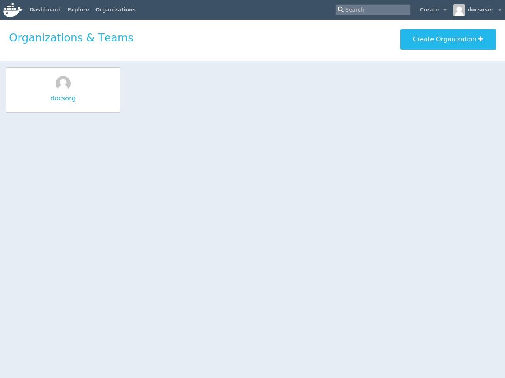
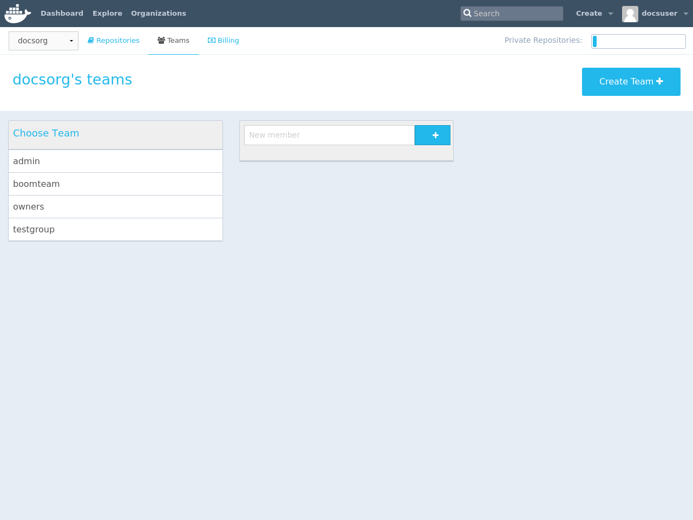
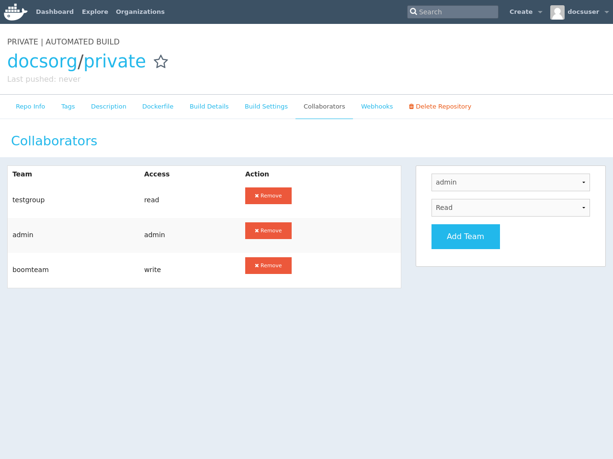

Docker Hub [organizations](https://hub.docker.com/organizations/) let you create
teams so you can give colleagues access to shared image repositories. A Docker
Hub organization can contain public and private repositories just like a user
account. Access to push or pull for these repositories is allocated by defining
teams of users and then assigning team rights to specific repositories.
Repository creation is limited to users in the organization owner's group. This
allows you to distribute limited access Docker images, and to select which
Docker Hub users can publish new images.

### Create and view organizations

You can see which organizations you belong to and add new organizations by
clicking **Organizations** in the top nav bar.

### Organization teams

Users in the "Owners" team of an organization can create and modify the
membership of all teams.

Other users can only see teams they belong to.

### Repository team permissions

Use teams to manage who can interact with your repositories.

You need to be a member of the organization's "Owners" team to create a new
team, Hub repository, or automated build. As an "Owner", you then delegate the
following repository access rights to a team using the "Collaborators" section
of the repository view.

Permissions are cumulative. For example, if you have Write permissions, you
automatically have Read permissions:

- `Read` access allows users to view, search, and pull a private repository in the same way as they can a public repository.
- `Write` access allows users to push to non-automated repositories on the Docker Hub.
- `Admin` access allows users to modify the repositories "Description", "Collaborators" rights, "Public/Private" visibility and "Delete".

> **Note**: A User who has not yet verified their email address only has
> `Read` access to the repository, regardless of the rights their team
> membership has given them.

