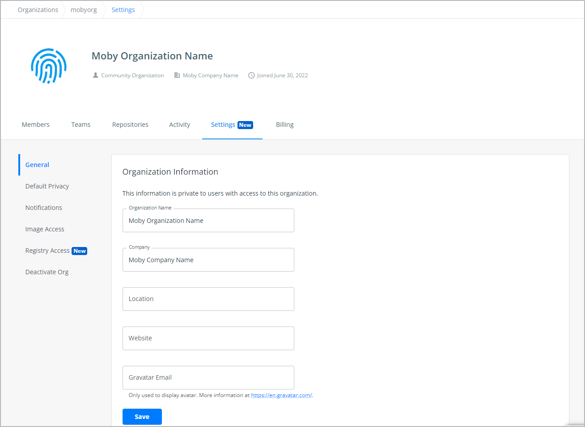

Docker Hub organizations let you create teams so you can give your team access
to shared image repositories.

An **Organization** is a collection of teams and repositories
that can be managed together. A **Team** is a group of Docker members that belong to an organization. 
An organization can have multiple teams. 

Docker users become members of an organization
when they are assigned to at least one team in the organization. When you first
create an organization, you’ll see that you have a team, the **owners** (Admins)
team, with a single member. An organization owner is someone that is part of the
owners team. They can create new teams and add
members to an existing team using their Docker ID or email address and by
selecting a team the user should be part of. An org owner can also add
additional org owners to help them manage users, teams, and repositories in the
organization.

## Create an organization

There are multiple ways to create an organization. You can create a brand new
organization using the **Create Organization** option in Docker Hub, or you can
convert an existing user account to an organization. The following section
contains instructions on how to create new organization. For prerequisites and
detailed instructions on converting an existing user account to an org, see
[Convert an account into an organization](convert-account.md).

To create an organization:

1. Sign into [Docker Hub](https://hub.docker.com/){: target="_blank"
rel="noopener" class="_"} using your [Docker ID](../docker-id/index.md) or your email address.
2. Select **Organizations**. Click **Create Organization** to create a new organization.
3. Choose a plan for your organization. See [Docker Pricing](https://www.docker.com/pricing/){: target="_blank" rel="noopener"
class="_" id="dkr_docs_subscription_btl"} for details on the features offered
in the Team and Business plan.
4. Enter a name for your organization. This is the official, unique name for
your organization in Docker Hub. Note that it is not possible to change the name
of the organization after you've created it.

      > **Note**
      >
      > The organization name cannot be the same as your Docker ID.

5. Enter the name of your company. This is the full name of your company.
This info is displayed on your organization page, and in the details of any
public images you publish. You can update the company name anytime by navigating
to your organization's **Settings** page. Click **Continue to Org size**.
6. On the Organization Size page, specify the number of users (seats) you'd
require and click **Continue to payment**.

You've now created an organization. Select the newly created organization from
the Organizations page. You'll now see that you have a team, the **owners** team
with a single member (you).

### View an organization

To view an organization:

1. Log into Docker Hub with a user account that is a member of any team in the
   organization. You must be part of the **owners** team to access the
   organization's **Settings** page.

      > **Note**
      >
      > You can't _directly_ log in to an organization. This is especially
      > important to note if you create an organization by
      [converting a user account](convert-account.md), as conversion means you lose the ability to log into that
      > "account", since it no longer exists. To view the organization you 
      > need to log in with the new owner account assigned during the
      > conversion or another account that was added as a member. If you 
      > don't see the organization after logging in,
      > then you are neither a member or an owner of it. An organization
      > administrator will need to add you as a member of the organization.

2. Click **Organizations** in the top navigation bar, then choose your
   organization from the list.

      {:width="700px"}

The Organization landing page displays various options that allow you to
configure your organization.

- **Members**: Displays a list of team members. You
  can invite new members using the **Invite members** button. See [Manage members](../docker-hub/members.md) for details.

- **Teams**: Displays a list of existing teams and the number of
  members in each team. See [Create a team](#create-a-team) for details.

- **Repositories**: Displays a list of repositories associated with the
  organization. See [Repositories](../docker-hub/repos/index.md) for detailed information about
  working with repositories.

- **Activity** Displays the audit logs, a chronological list of activities that
  occur at organization and repository levels. It provides the org owners a
  report of all their team member activities. See [Audit logs](audit-log.md) for
  details.

- **Settings**: Displays information about your
  organization, and allows you to view and change your repository privacy
  settings, configure org permissions such as
  [Image Access Management](image-access-management.md), configure notification settings, and [deactivate](deactivate-account.md#deactivating-an-organization) your
  organization. You can also update your organization name and company name that appear on your organization landing page.

- **Billing**: Displays information about your existing
[Docker subscription (plan)](../subscription/index.md) and your billing history.
You can also access your invoices from this tab.

## Create a team

A **Team** is a group of Docker users that belong to an organization. An
organization can have multiple teams. When you first create an organization,
you’ll see that you have a team, the **owners** team, with a single member. An
organization owner can then create new teams and add members to an existing team
using their Docker ID or email address and by selecting a team the user should be part of.

The org owner can add additional org owners to the owners team to help them
manage users, teams, and repositories in the organization. See [Owners
team](#the-owners-team) for details.

To create a team:

1. Go to **Organizations** in Docker Hub, and select your organization.
2. Open the **Teams** tab and click **Create Team**.
3. Fill out your team's information and click **Create**.

### The owners team

The **owners** team is a special team created by default during the org creation
process. The owners team has full access to all repositories in the organization.

An organization owner is an administrator who is responsible to manage
repositories and add team members to the organization. They have full access to
private repositories, all teams, billing information, and org settings. An org
owner can also specify [permissions](../docker-hub/repos/configure/index.md#permissions-reference) for each team in
the organization. Only an org owner can enable [SSO](../single-sign-on/index.md)
for
the organization. When SSO is enabled for your organization, the org owner can
also manage users. Docker can auto-provision Docker IDs for new end-users or
users who'd like to have a separate Docker ID for company use through SSO
enforcement.

The org owner can also add additional org owners to help them manage users, teams, and repositories in the organization.

## Configure repository permissions

Organization owners can configure repository permissions on a per-team basis.
For example, you can specify that all teams within an organization have Read and
Write access to repositories A and B, whereas only specific teams have Admin
access. Note that org owners have full administrative access to all repositories within the organization.

To give a team access to a repository

1. Navigate to **Organizations** in Docker Hub, and select your organization.
2. Click on the **Teams** tab and select the team that you'd like to configure  repository access to.
3. Click on the **Permissions** tab and select a repository from the
   **Repository** drop-down.
4. Choose a permission from the **Permissions** drop-down list and click
   **Add**.

    {:width="700px"}

### View a team's permissions for all repositories

To view a team's permissions across all repositories:

1. Open **Organizations** > **_Your Organization_** > **Teams** > **_Team Name_**.
2. Click on the **Permissions** tab, where you can view the repositories this team can access.

## Videos

You can also check out the following videos for information about creating Teams
and Organizations in Docker Hub.

- [Overview of organizations](https://www.youtube-nocookie.com/embed/G7lvSnAqed8){: target="_blank" rel="noopener" class="_"}
- [Create an organization](https://www.youtube-nocookie.com/embed/b0TKcIqa9Po){: target="_blank" rel="noopener" class="_"}
- [Working with Teams](https://www.youtube-nocookie.com/embed/MROKmtmWCVI){: target="_blank" rel="noopener" class="_"}
- [Create Teams](https://www.youtube-nocookie.com/embed/78wbbBoasIc){: target="_blank" rel="noopener" class="_"}