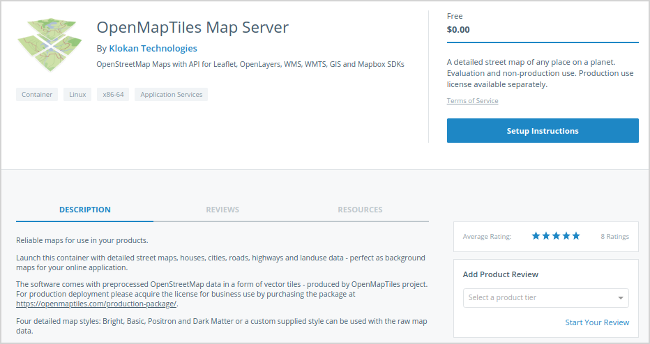

## Program basics

### What is the Docker Certified program?

The Docker Certification program for infrastructure, images, and plugins is for both technology partners and enterprise customers. It is designed to recognize
high-quality containers and plugins, provide collaborative support, and ensure
compatibility with Docker EE.

Docker Certification is aligned to the available Docker EE infrastructure and
gives enterprises a trusted way to run more technology in containers with
support from both Docker and the publisher.

The
[Docker Technology Partner guide](https://www.docker.com/partners/partner-program#/technology_partner)
explains the Technology Partner program and the Docker Certification program for
infrastructure, images, and plugins in more detail.

### What are the benefits of joining?

Docker Hub promotes Docker certified containers and plugins running on Docker
certified infrastructure trusted and high quality content.

With over 8 billion image pulls and access to Docker’s large customer base,
certifying your images and plugins differentiates your content.

With a revenue share agreement, Docker can be a channel for your content. The
Docker Certified badge can also be listed next to external references to your
product.

### How do I apply as a publisher?

Start by applying to be a Docker Technology Partner at https://goto.docker.com/partner and click on "Publisher".

* Requires acceptance of partnership agreement for completion.

* Identify content that can be listed on Hub and includes a support offering.

* Test your image against Docker certified infrastructure version 17.03 and
  above (plugins must run on 17.03 and above).

* Submit your image for certification through the publisher portal. Docker scans
  the image and work with you to address vulnerabilities. Docker also conducts a
  best practices review of the image.

* Be a TSAnet member or join the Docker Limited Group.

* Upon completion of certification criteria, and acceptance by Docker, a product
  page is updated to reflect certified status.

### What are official vs certified images?

Many official images transition to the Docker Certified program and are
maintained and updated by the original owner of the software. Docker continues
to maintain some of the base OS images and language frameworks.

### What is the application timeline?

1-2 weeks.

### Is certification optional or required?

Certification is recommended for most commercial and supported container images.
Free, community, and other commercial (non-certified) content may also be listed
on Docker Hub.

### How is certification of plugins handled?

The Docker certification program recognizes the need to apply special scrutiny
and testing to containers that access system level interfaces such as storage
volumes and networking.

Docker identifies these special containers as “plugins” which require additional
testing by the publisher or Docker. These plugins employ the V2 Plugin
Architecture that was first made available in 1.12 (experimental) and now
available in Docker Enterprise Edition 17.03.

## Licensing, pricing, & plans

### Is there a fee to join the program?

In the future, Docker may charge a small annual listing fee. This is waived for
the initial period.

### What are the customer pricing plans?

As a publisher you can charge a subscription fee every month in USD. The amount is determined by you. We are working on other pricing options. If you have feedback about pricing, send us an email at publisher-support@docker.com

### How do customers switch from a Trial to a Paid subscription?

Publishers can provide two different tokens or let customers use the same token
and internally map the customer to a paid plan vs a free trial.

### How am I paid if my commercial content is purchased?

Docker cuts you a check post a revenue share. Details are included in your vendor
agreement.

### Must subscribed users explicitly accept license terms?

Yes. Even if something is published as a free tier, subscribed users must
explicitly click **Accept** on the license terms before they can download the
image.

### Can I use the same repository for two plans with unique tags?

Publishers must use a different repository for each plan.

If a user is entitled to a plan in your product, the user is entitled to all tags in the relevant. For example, if you have a `Developer` plan that is mapped to repositories store/`mynamespace`/`myrepo1`:`mytag1`, another plan (say `Production`) **should** map to a different repository.

**_Any user who is entitled to the `Developer` plan will be able to pull all tags in store/`mynamespace`/`myrepo1`_**.

### How is export control handled? Can individual countries be specified?

Docker provides export control via blacklisting several countries, IPs and users
based on the national export compliance database. Any export control we do is
across all products, we do not selectively blacklist versions and products for
specific groups. If you have questions, contact us at
publisher-support@docker.com.

### Do you have a license enforcement system for docker images sold?

Currently, we have one licensing option -- Bring your own License or BYOL.

With BYOL, publishers take care of license keys within the container. The
license key can be presented to the customer on Docker Hub. We expect the
publisher to build short circuits into the container, so the container stops
running once the license key expires. Once a customer cancels, or if the
customer subscription expires, the customer cannot download updates from the
Hub.

### What happens if a customer stops paying for the image?

Users who cancel their subscription cannot download updates from the Hub. The
container may continue running. If you have a licensing scheme built into the
container, the licensing scheme can be a forcing function and stop the
container. (_We do not build anything into the container, it is up to the publisher_).

### What options are presented to users to pull an image?

We provide users the following options to access your software:

* Users who are logged-in.
* Users who have accepted ToS.
* All users (including users without Docker identity).

Here is a [screenshot](https://user-images.githubusercontent.com/2453622/32067299-00cf1210-ba83-11e7-89f8-15deed6fef62.png) to describe how publishers can update the options provided to customers.

### How do I distinguish free and paid subscribers?

The analytics reports contain information about the subscriber and the relevant
product plan. You can identify subscribers for each plan for each product.

### Where can I view customer insights?

Analytics reports are only available to publishers with certified or commercial
Content. Go to https://store.docker.com/publisher/center and click on "Actions"
for the product you'd like to view analytics for. Here is a
[screenshot](https://user-images.githubusercontent.com/2453622/32352202-6e87ce6e-bfdd-11e7-8fb0-08fe5a3e8930.png).

### How is customer/publisher support handled?

All Docker certified container images and plugins running on Docker certified
infrastructure come with SLA-based support provided by the publisher and Docker.

Normally, a customer contacts the publisher for container and application level
issues. Likewise, a customer contacts Docker for Docker Edition support.

In the case where a customer calls Docker (or vice versa) about an issue on the
application, Docker advises the customer about the publisher support process and
performs a handover directly to the publisher if required. TSAnet is required
for exchange of support tickets between the publisher and Docker.

## Product submission

### How long for an image to be approved?

2 Weeks.

### Can I preview my submission before publishing?

Yes. You can preview your submission including the image you've submitted, the look and feel of the detail page and any markdown descriptions you might have.

These screenshots illustrate the preview experience for markdown content:

Product Description preview [screenshot](https://user-images.githubusercontent.com/2453622/32344591-9cd6b456-bfc4-11e7-9505-1f7e8235f812.png).

Install instructions description preview [screenshot](https://user-images.githubusercontent.com/2453622/32344592-9cf2e234-bfc4-11e7-9e60-d773b62eae07.png).

### Can I have a "publish by" date for my content?

Not yet. Potential ETA Q2 2018.

### Can I publish multi-container apps?

Yes. Publishers can provide multiple images and add a compose file in the
install instructions to describe how the multi-container app can be used. For
now, we recommend asking publishers to look at this example from Microsoft
https://store.docker.com/images/mssql-server-linux where they have Supported
Tags listed in the Install instructions (you don't necessarily need to list it
in the readme).

### Can a team work on the same product and publish?

Yes. You can submit your content as a team.

### Are organization details propagated to new products?

Organization details need to be filled in only once. Updating organization info
once updates this for all images published by your organization.

### How do fields required when publishing map to data on the product page?

| Publishing field          |  Product data                |
|:--------------------------|:-----------------------------|
| Product description       | [Description](https://store.docker.com/images/openmaptiles-openstreetmap-maps?tab=description) |
| Support link              | Resources > License          |
| Documentation link        | Resources > Documentation    |
| Tier Description          | Entitlement text (top right) |
| Installation instructions | [Setup Instructions](https://store.docker.com/images/openmaptiles-openstreetmap-maps/plans/f1fc533a-76f0-493a-80a1-4e0a2b38a563?tab=instructions) (below tier description) |

* [Tier Description]() is what you see once users get entitled to a plan. For instance, this publisher entered: `A detailed street map of any place on a planet. Evaluation and non-production use. Production use license available separately`.

* [Installation instructions](https://store.docker.com/images/openmaptiles-openstreetmap-maps/plans/f1fc533a-76f0-493a-80a1-4e0a2b38a563?tab=instructions ) is documentation on installing your software. In this case the documentation is `Just launch the container and the map is going to be available on port 80 - ready-to-use - with instructions and list of available styles.` We recommend more details for any content thats a certification candidate.

### How is a certified image listed on Docker Hub?

These images are differentiated from other images on Hub through a
certification badge. A user can search specifically for CI’s by limiting their
search parameters to show only certified content.

### What is the process for pushing new updated builds?

Edit the same product and update with the newly tagged repos.

### How do we ensure customers download the latest version?

You can not submit "latest" tags through the certification publish workflow.

The reason we do this is so that users are aware of the exact version they
download. To make the user experience easy we have a copy widget that users can
use to copy the pull command and paste in their command line.

Here is a
[screenshot](https://user-images.githubusercontent.com/2453622/32354702-1bec633a-bfe8-11e7-9f80-a02c26b1b10c.png)
to provide additional clarity.

### How can I remove a submission?

To remove your submission, contact us at publisher-support@docker.com.

## Customer support

### What kind of access to customers have?

Customers can `docker pull` any tag associated with the source repo specified.

We recommend that you create a distinct repo per plan and only use tags for
different versions of that specific plan. For example, if you have a community,
pro, and enterprise plan of a single product, you should create three separate
repos, `namespace/community, namespace/pro, and namespace/enterprise`. Customers
who are entitled to your enterprise plan, will be able to pull
`store/namespace/enterprise:anytag`.

### Can customers view all tags for a specific repository?

We don't support the abiltiy to view available tags for published products
because published products usually require entitlement.

Official images and community images have available tags visible because anyone
can access any tag at any time anonymously.

We aim to have product listings published with the concept of versions, allowing
publishers to manage which versions of their products they expose to customers
for access. (Expected Q3 2018)

### Can publishers respond to product reviews?

Yes!
