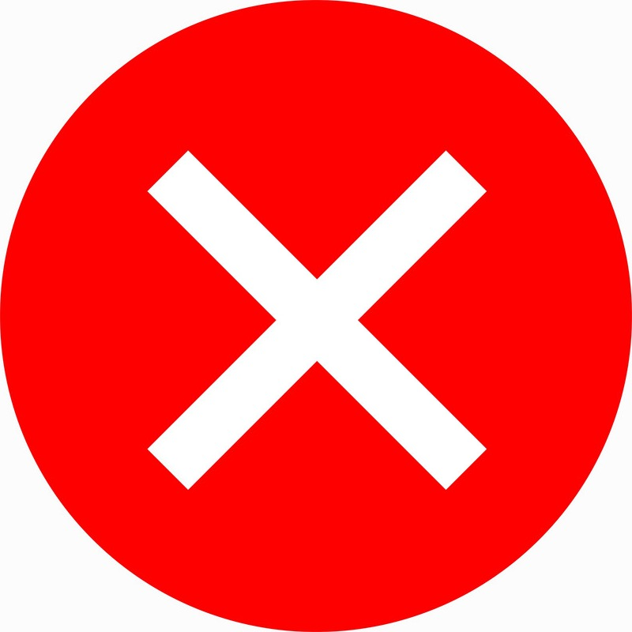
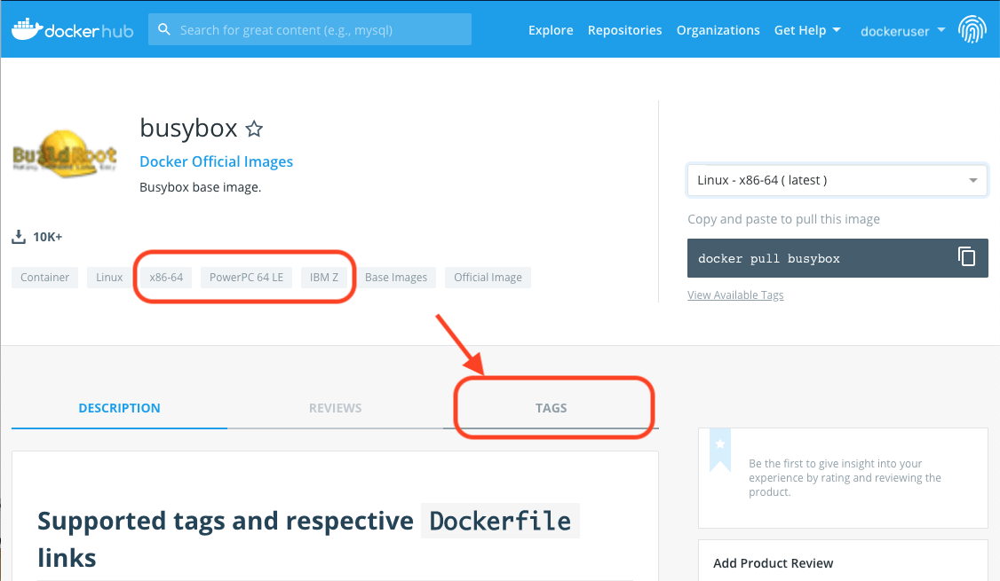
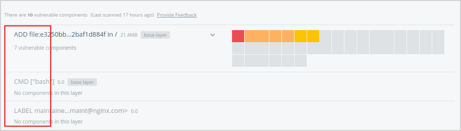
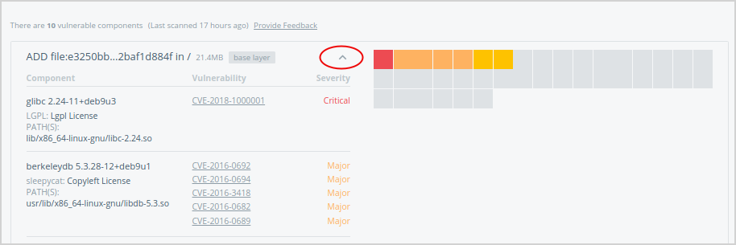
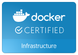

## Permitted content and support options




Docker Hub allows you to publish content that runs on:

* **Docker Enterprise Edition (Docker certified infrastructure)**. This
  content may also qualify to become a Docker Certified Container or Plugin
  image and be backed by collaborative Docker/Publisher support

* **Docker Community Edition**. Content on Docker CE is _not supported_ by
  Docker nor is it eligible for certification.

| If your content:                                   | You can publish on Hub  | Docker certifies & supports | Publisher supports        |
|:---------------------------------------------------|:------------------------|:----------------------------|:--------------------------|
| Works on Docker Enterprise Edition                 | {{ green-check }}       | {{ green-check }}           | {{ green-check }}         |
| Works on Docker Community Edition                  | {{ green-check }}       | {{ red-x }}                 | <center>Optional</center> |
| Does _not_ work on Docker certified infrastructure | {{ red-x }}             |<center>n/a</center>         | <center>n/a</center>      |

## Onboarding

The publishing process begins when you **sign into Docker Hub your Docker ID**.
Then **specify a product name (image source) from a private repository**. Your
product images must be stored in private repositories of Docker Hub as they
serve as an internal staging area from which you can revise and submit content
for review.

After specifying a source, **provide the content-manifest items** to populate your
product details page. These items include logos, descriptions, and licensing and
support links so that customers can make informed decisions about your image.
These items are submitted alongside the image itself for moderation.

**The Docker Hub team conducts a comprehensive review of your image and metadata.**
We evaluate the security of your product images with Docker Security Scanning,
and share results with you as the publisher. During the image-moderation phase,
we iterate back and forth with publishers to address outstanding vulnerabilities
and content-manifest issues until the image is ready for publication.

Commercial content and other supported images may qualify for the **Docker Certified quality mark**
(for containers or plugins). The testing for this program goes beyond the
vulnerability scan and also evaluates container images for Docker best practices
developed over years of experience. Collaborative support capability between
Docker and the publisher is also established.

Refer to the diagram below for a high-level summary:


## Create great content

Create your content, and follow our [Dockerfile best practices](/develop/develop-images/dockerfile_best-practices/)
to Dockerize it. Keep your images small, your layers few, and your components
secure. Refer to the links and guidelines listed below to build and deliver
great content:

* [Best practices for writing Dockerfiles](/develop/develop-images/dockerfile_best-practices/){: target="_blank" class="_"}

* [Official repositories on Docker Hub](/docker-hub/official_repos/){: target="_blank" class="_"}

* [Docker bench for security](https://github.com/docker/docker-bench-security){: target="_blank" class="_"}

Here are some best practices when it comes to building vulnerability-free Docker images:

### Choose a secure base image (See your Dockerfile `FROM:` directive)

Many base images have a strong record of being secure, including:

* [Alpine](https://hub.docker.com/_/alpine/){: target="_blank" class="_"} Linux:
  Alpine is a minimal linux distribution with an excellent security record.

* Alpine-based application images such as `python:alpine`, `ruby:alpine`,
  and `golang:alpine`. They are secure and minimal, while providing the
  convenience of their non-Alpine alternatives.

* [Debian](https://hub.docker.com/r/library/debian/tags/jessie/){: target="_blank" class="_"}
  Linux: both small and tightly-controlled, Debian-linux is a good alternative
  if you're currently using Ubuntu.

Docker strongly recommends **Alpine Linux**. The founder of this Linux
distribution is leading an initiative at Docker to provide safe, compact base
images for all container applications.

### Remove unused components

Often, vulnerabilities exist in components that aren't actually used in the
containerized application. To avoid this, you can:

* Follow best practices when using the `apt-get` command.

* Run `apt-get-remove` to destroy any components required to build but not
  actually run your application. Usually, this involves creating multi-line
  Dockerfile directives, as seen below. The following example shows how to remove
  `curl` and `python-pip` after they are used to install the Python `requests`
  package, all in a single Dockerfile directive:

  ```shell
  RUN apt-get update && \
           apt-get install -y --no-install-recommends curl python-pip && \
           pip install requests && \
           apt-get remove -y python-pip curl && \
           rm -rf /var/lib/apt/lists/
  ```

> Files introduced in one directive of your Dockerfile can only be removed in
> the same directive (and not in subsequent directives in your Dockerfile).

### Keep required components up-to-date

Your images are composed of open-source libraries and packages that amass
vulnerabilities over time and are consequently patched. To ensure the integrity
of your product, keep your images up-to-date:

* Periodically update your base image's version, especially if you’re using a
  version deemed to be vulnerable.

* Re-build your image periodically. Directives including commands such as
  `apt-get install ...` pull the latest versions of dependencies, which may
  include security fixes.

## Create and maintain your publisher profile in the Hub

Let the Docker community know who you are. Add your details, your company
story, and what you do. At the very minimum, we require:

* Legal entity name
* Company website
* Phone number
* Valid company email
* Company icon/logo (square; at least 512 x 512px

## Prepare your image-manifest materials

You must provide the namespace (including repository and tags) of a private
repository on Docker Hub that contains the source for your product. This
repository path is not shown to users, but the repositories you choose determine
the product tiers available for customers to download.

The following content information helps us make your product look great and
discoverable:

* Product Name
* Product icon/logo
* Short description: a one-to-two-sentence summary; up to 140 characters
* Category: Database, Networking, Business Software, etc. and any search tags
* Long description: includes product details/pitch
* Screenshot(s)
* Support link
* Product tier name
* Product tier description
* Product tier price
* Installation instructions
* Link to license agreements

### How the manifest information is displayed in the UI

This is an approximate representation. We frequently make enhancements to the
look and some elements might shift around.


## Support your users

Users who download your content from Docker Hub might need your help, so be
prepared for questions! The information you provide with your submission saves
support time in the future.

### Support information

If you provide support with your content, include that information. Is there a
support website? What email address can users contact for help? Are there
self-help or troubleshooting resources available?

### Support SLA

Include a Service Level Agreement (SLA) for each image you offerfon the Hub. An
SLA is your commitment to your users about the nature and level of support you
provide to them. Make sure your SLA includes support hours and response-time
expectations, where applicable.

## Security and audit policies

Docker Hub [scans](#docker-security-scanning) your official images for
vulnerabilities with the Docker Security Scanning tool, and
[audits](#usage-audit-and-reporting) consumer activity of your images to provide
you intelligence about the use of your product.

### Docker Security Scanning

Docker Security Scanning automatically and continuously assesses the intergity
of your products. The Docker Security Scanning tool deconstructs an image,
conducts a binary scan of the bits to identify the open-source components
present in each image layer, and associates those components with known
vulnerabilities and exposures.

Docker then shares the scan results with you as the publisher, so that you can
modify the content of your images as necessary. Your scan results are private,
and are never shared with end customers or other publishers.

#### Interpret results

To interpret the results of a scanned image:

1.  Log on to [Docker Hub](https://hub.docker.com){: target="_blank" class="_"}.

2.  Navigate to the repository details page (for example,
    [Nginx](https://hub.docker.com/_/nginx/){: target="_blank" class="_"}).

3.  Click **View Available Tags** under the pull command in the upper right of
    the UI.

    Displalyed is a list of each tag scan with its age. A solid green bar
    indicates a clean scan without known vulnerabilities. Yellow, orange, and
    red indicate minor, major, and critical vulnerabilities respectively.

    

    > Vulnerability scores
    >
    > Vulnerability scores are defined by the entity that issues the
    > vulnerability, such as [NVD](https://nvd.nist.gov/){: target="_blank" class="_"},
    > and are based on a
    > [Qualitative Severity Rating Scale](https://www.first.org/cvss/specification-document#5-Qualitative-Severity-Rating-Scale){: target="_blank" class="_"}
    > defined as part of the
    > [Common Vulnerability Scoring System (CVSS) specification](https://www.first.org/cvss/specification-document){: target="_blank" class="_"}.

4.  Click a scan summary to see a list of results for each layer of the image.

    Each layer may have one or more scannable components represented by colored
    squares in a grid.

    

    > Base layers
    >
    > Base layers contain components that are included in the parent image,
    > but that you did not build and may not be able to edit. If a base layer
    > has a vulnerability, switch to a version of the parent image that does not
    > have any vulnerabilities, or to a similar but more secure image.

5.  Hover over a square in the grid, then click to see the vulnerability report
    for that specific component.

    Only components that add software are scanned. If a layer has
    no scannable components, it shows a `No components in this layer` message.

    

6.  Click the arrow icon (twice) to expand the list and show all vulnerable
    components and their CVE report codes.

    

7.  Click one of the CVE codes to view the original vulnerability report.

#### Classification of issues

* All Scan results include the CVE numbers and a CVSS (Common Vulnerability
  Scoring System) Score.

* CVE Identifiers (also referred to by the community as "CVE names," "CVE
  numbers," "CVE entries," "CVE-IDs," and "CVEs") are unique identifiers for
  publicly-known, cyber-security vulnerabilities.

* The Common Vulnerability Scoring System (CVSS) provides an open
  framework for communicating the characteristics and impacts of
  IT vulnerabilities. Its quantitative model ensures repeatable,
  accurate measurement while enabling users to see the underlying
  vulnerability characteristics that were used to generate the scores.
  As a result, CVSS is well-suited as a standard measurement system
  for industries, organizations, and governments that need accurate
  and consistent vulnerability-impact scores. CVSS is commonly used
  to prioritize vulnerability-remediation activities, and calculate
  the severity of vulnerabilities discovered on systems. The
  National Vulnerability Database (NVD) provides CVSS scores for
  almost all known vulnerabilities.

* Docker classifies the severity of issues per CVSS range, Docker classification,
  and service level agreement (SLA) as follows.

| CVSS range  | Docker classification | SLA for fixing issues                         |
|:------------|:----------------------|:----------------------------------------------|
| 7.0 to 10.0 | Critical              | Within 72 hours of notification               |
| 4.0 to 6.9  | Major                 | Within 7 days of notification                 |
| 0.1 to 3.9  | Minor                 | No SLA. Best-effort to fix or address in docs |

* In addition to CVSS, the Docker Security team can identify or classify
  vulnerabilities that need to be fixed, and categorize them in the
  minor-to-critical range.

* The publisher is presented with initial scan results, including all components
  with their CVEs and their CVSS scores.

* If you use Docker’s Scanning Service, you can subscribe to a notification
  service for new vulnerabilities.

* Failure to meet above SLAs may cause the listing to be put on “hold”.

* A warning label shows up on the marketplace listing. An email is sent to the
  users who have downloaded and subscribed for notifications.

* A Repo’s listing can stay in the "hold" state for a maximum of 1 month, after
  which the listing is revoked.

### Usage audit and reporting

Unless otherwise negotiated, an audit of activity on publisher content is
retained for no less than 180 days.

A monthly report of said activity is provided to the publisher with the
following data: (1) report of content download by free and paid customers by
date and time; (2) report of purchase, cancellations, refunds, tax payments,
where applicable, and subscription length for paid customers of the content; and
(3) the consolidated amount to be received by the publisher.

### Certification

There are three types of certification that appear in Docker Hub -- Container,
Plugins, Infrastructure:


**Docker container certification** ensures that a Docker container image has
been tested, complies best practices guidelines, runs on a Docker xertified
infrastructure, has proven provenance, has been scanned for vulnerabilities, and
is supported by Docker and the content publisher.


**Docker plugin certification** is designed for volume, network, and other
plugins that access system level Docker APIs. Docker certified plugins provide
the same level of assurance as a Docker certified container, but go further by
having passed an additional suite of API compliance testing.



**Docker infrastructure certification** indicates that the release of the Docker
Enterprise Edition and the underlying platform have been tested together and are
supported in combination by both Docker and the partner.
