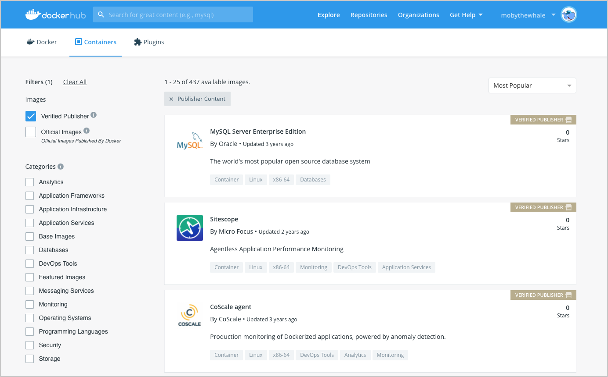

The Docker Verified and Publisher Program enables Independent Software Vendors (ISVs), development tools vendors, and platform providers to distribute  Dockerized content through Docker Hub.

Development teams rely on Docker Hub for application components to build new applications. The Docker differentiated content programs like the [Docker Official Images](../official_images.md) and the Docker Verified Publishers provide developers with validation that these images come from trusted sources, reducing the risk of pulling malicious images from the impostor repositories.

The **Verified Publisher** badge included on the Docker Hub repositories indicates that these repositories are published by Docker partners that are part of the Verified Publisher program, and are qualified to be included in the developer secure supply chain. You can limit your repository search, when you use the 'Verified Publisher' filter.

To find out more about the Docker Verified and Publisher Program and to sign up for a partnership with Docker, visit the [Docker Verified Publisher Program](https://www.docker.com/partners/programs){:target="_blank" rel="noopener" class="_"} page.

