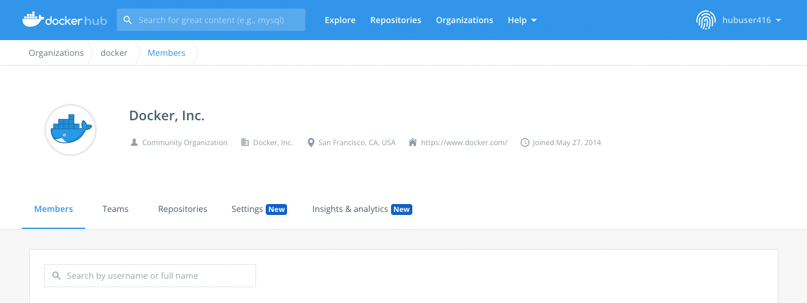
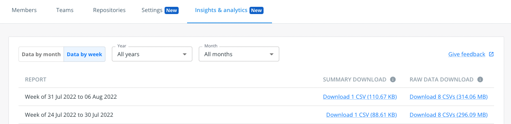

Insights & analytics provides usage analytics for your organization's images on
Docker Hub. With this tool, you have self-serve access to metrics as both raw
data and summary data for a desired time span. You can access the data either
from the Docker Hub website, at `hub.docker.com/orgs/{namespace}/insights`, or
using the [Verified Publisher API](/docker-hub/api/dvp/){: target="_blank"
rel="noopener" class="_"}. All members of an organization has access to the
analytics data.

You can view how many times your images have been pulled by tag or by digest,
and get breakouts by geolocation, cloud provider, and client (user agent). The
data is available as a downloadable CSV file, in a weekly (Monday through
Sunday) or monthly format (available on the first day of the following calendar
month). You can import this data into your own systems, or you can analyze it
manually as a spreadsheet. Review the [Data definitions](#data-definitions)
section for more information about how to read the data contained in the CSV
file.

Automated systems frequently check for new versions of your images. The insights
and analytics metrics show the number of pulls that were triggered by users, and
pulls by automated systems such as CI/CD tools, respectively. Automated "version
checks" and real image downloads are differentiated by inspecting the order and
timing of image pulls coming from the same IP address. Being able to distinguish
between different types of image pulls grants you more insight into your users'
behavior. You can inspect the rules for determining intent behind pulls in the
[Action classification rules](#action-classification-rules) section on this
page.

Please let us know if you have any
[feedback](https://forms.gle/nb7beTUQz9wzXy1b6){: target="_blank" rel="noopener"
class="_"} or questions on these rules.

## Export analytics data from the web

Here's how to export usage data for your organization's images using the Docker
Hub website.

1. Log in to [Docker Hub](https://hub.docker.com/){: target="_blank"
   rel="noopener" class="_"} and select **Organizations**.

2. Choose your organization and click **Insights and analytics**.

   

3. Set the time span for which you want to export analytics data. The
   downloadable CSV files for summary and raw data appear on the right-hand
   side.

   

## Raw data

The raw data format contains the following data points for the selected time
span. Each action is represented as a single row in the CSV file.

- Timestamp
- Namespace
- Repository
- Reference
- Digest
- Tag (included when available)
- Action day
- HTTP method
- Action, one of the following:
  - Pull by tag
  - Pull by digest
  - Version check
- Type
- Host
- Country
- User agent tool
- User agent version

## Summary data

The summary data format contains the following data points for each namespace,
repository, and reference (tag or digest), for the selected time span.

- Unique IP addresses
- Pulls by tag
- Pulls by digest
- Version checks

## Data definitions

| Data point         | Definition                                                                                                                                                                                                                                                                                                                                                                                                                                                                                                                                    |
| :----------------- | :-------------------------------------------------------------------------------------------------------------------------------------------------------------------------------------------------------------------------------------------------------------------------------------------------------------------------------------------------------------------------------------------------------------------------------------------------------------------------------------------------------------------------------------------- |
| Action             | An action represents the multiple request events associated with a `docker pull`. We have applied rules to these events so that the data is more meaningful in analyzing user behavior and intent. An action can be filtered into three distinct categories: version check, pull by tag, and pull by digest. Each action is represented as a single row in the raw data.                                                                                                                                                                      |
| Version check      | This is a filter on the action data point. It is a speculation of user intent. Includes: HEAD by tag not followed by a GET (from the same IP address within a 5-second window). Excludes: HEAD by digest                                                                                                                                                                                                                                                                                                                                      |
| Pull by tag        | This is a filter on the action data point. It is a speculation of user intent. Includes: GET (by digest or by tag). If the GET is immediately preceded by a HEAD by tag (from the same IP address within a 5-second window), then the GET and HEAD together are counted as a single Pull by Tag. If the GET by tag is immediately followed by another GET (from the same IP address within a 5-second window, but a different digest), then the two GETs are counted as a single Pull by Tag.                                                 |
| Pull by digest     | This is a filter on the action data point. It is a speculation of user intent. Includes: GET by digest. If the GET is immediately preceded by a HEAD by digest (from the same IP address within a 5-second window), then the GET and HEAD together are counted as a single pull by digest. If the GET is immediately followed by another GET (from the same IP address within a 5-second window, but a different digest), then the two GETs together are counted as a single pull by digest. Includes: HEAD by digest, not followed by a GET. |
| Type               | The industry from which the event originates. Industry types include `business`, `isp` (internet service provider), `hosting`, `education`, and `null` in cases where the industry could not be identified.                                                                                                                                                                                                                                                                                                                                   |
| Host               | The cloud service provider used in an event.                                                                                                                                                                                                                                                                                                                                                                                                                                                                                                  |
| Reference          | The digest or tag that was referenced in the action.                                                                                                                                                                                                                                                                                                                                                                                                                                                                                          |
| Digest             | The image version digest.                                                                                                                                                                                                                                                                                                                                                                                                                                                                                                                     |
| Tag                | The tag name. Only available if the pull referred to a tag, not available if the pull referred to a digest.                                                                                                                                                                                                                                                                                                                                                                                                                                   |
| Country            | The country from which the request originated.                                                                                                                                                                                                                                                                                                                                                                                                                                                                                                |
| Timestamp          | Date & time of an event in the following schema: YYYY-MM-DD 00:00:00                                                                                                                                                                                                                                                                                                                                                                                                                                                                          |
| Action day         | The date portion of the timestamp: YYYY-MM-DD                                                                                                                                                                                                                                                                                                                                                                                                                                                                                                 |
| Namespace          | The Docker organization that a repository is a part of.                                                                                                                                                                                                                                                                                                                                                                                                                                                                                       |
| Repository         | The repository that an image belongs to.                                                                                                                                                                                                                                                                                                                                                                                                                                                                                                      |
| Reference          | The tag or digest of any given image.                                                                                                                                                                                                                                                                                                                                                                                                                                                                                                         |
| HTTP method        | The HTTP method used in a request by the client. More information on Docker Registry HTTP API protocols can be found [here](/registry/spec/api/){: target="_blank" rel="noopener" class="_"}.                                                                                                                                                                                                                                                                                                                                                 |
| User agent tool    | The application a user used to pull an image (for example, `docker` or `containerd`). Extracted from the UA string.                                                                                                                                                                                                                                                                                                                                                                                                                           |
| User agent version | The version of the application used to pull an image.                                                                                                                                                                                                                                                                                                                                                                                                                                                                                         |
| Unique IP address  | As part of our privacy-preserving policy, Docker only shares the count of distinct unique IP addresses that request an image.                                                                                                                                                                                                                                                                                                                                                                                                                 |

## Action classification rules

| Starting event | Reference | Followed by                                                     | Resulting action | Use case(s)                                                                                                    | Notes                                                                                                                                                                                                                                                                                          |
| :------------- | :-------- | :-------------------------------------------------------------- | :--------------- | :------------------------------------------------------------------------------------------------------------- | :--------------------------------------------------------------------------------------------------------------------------------------------------------------------------------------------------------------------------------------------------------------------------------------------- |
| HEAD           | tag       | N/A                                                             | Version check    | User already has all layers existing on local machine                                                          | This is similar to the use case of a pull by tag when the user already has all the image layers existing locally, however, we are able to differentiate the user intent and classify accordingly.                                                                                              |
| GET            | tag       | N/A                                                             | Pull by tag      | User already has all layers existing on local machine and/or the image is single-arch                          |
| GET            | tag       | Get by different digest                                         | Pull by tag      | Image is multi-arch                                                                                            | Second GET by digests must be different from the first                                                                                                                                                                                                                                         |
| HEAD           | tag       | GET by same digest                                              | Pull by tag      | Image is multi-arch but some or all image layers already exist on the local machine.                           | The HEAD by tag will send the most current digest, the following GET must be by that same digest. There may occur an additional GET, if the image is multi-arch (see the next row in this table). If the user doesn't want the most recent digest, then the user would perform HEAD by digest. |
| HEAD           | tag       | GET by the same digest, then a second GET by a different digest | Pull by tag      | Image is multi-arch                                                                                            | The HEAD by tag will send the most recent digest, the following GET must be by that same digest. Since the image is multi-arch, there is a second GET by a different digest. If the user doesn't want the most recent digest, then the user would perform HEAD by digest.                      |
| HEAD           | tag       | GET by same digest, then a second GET by different digest       | Pull by tag      | Image is multi-arch                                                                                            | The HEAD by tag will send the most current digest, the following GET must be by that same digest. Since the image is multi-arch, there is a second GET by a different digest. If the user doesn't want the most recent digest, then the user would perform HEAD by digest.                     |
| GET            | digest    | N/A                                                             | Pull by digest   | User already has all layers existing on local machine and/or the image is single-arch                          |
| HEAD           | digest    | N/A                                                             | Pull by digest   | User already has all layers existing on their local machine.                                                   |
| GET            | digest    | GET by different digest                                         | Pull by digest   | Image is multi-arch                                                                                            | The second GET by digest must be different from the first                                                                                                                                                                                                                                      |
| HEAD           | digest    | GET by same digest                                              | Pull by digest   | Image is single arch and/or image is multi-arch but some part of the image already exists on the local machine |
| HEAD           | digest    | GET by same digest, then a second GET by different digest       | Pull by Digest   | Image is multi-arch                                                                                            |
