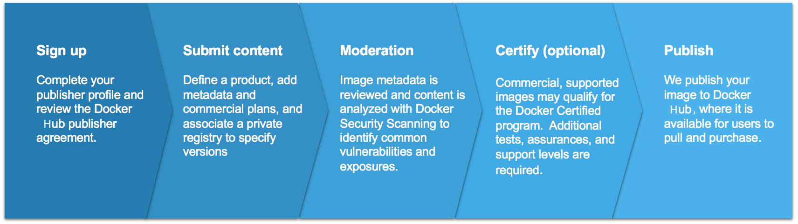
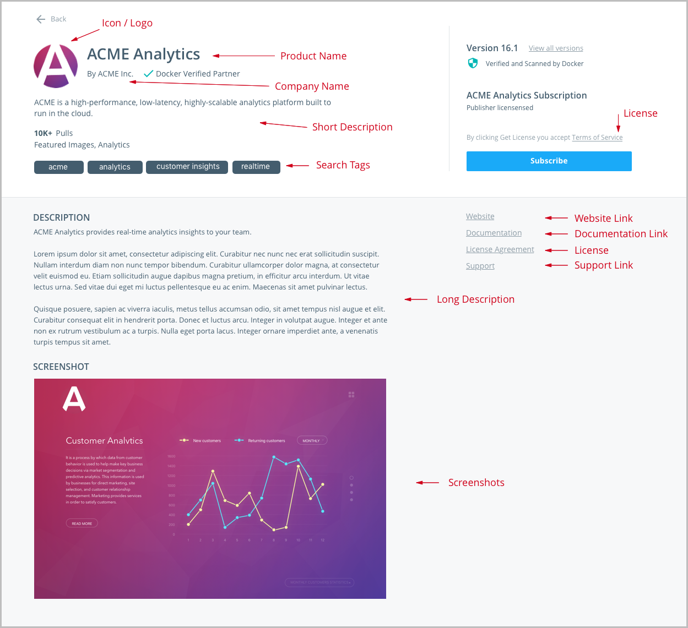

## Permitted content and support options

* Content that runs on Docker Enterprise may be published on Docker Hub under a
Verified Publisher profile. This content may also qualify to become a Docker
Certified Container or Plugin image, and thus become backed by collaborative
Docker/Publisher support.

* Content that runs on the Docker Community may be published in Docker Hub, but
is not supported by Docker nor is it eligible to become Certified.

* Content that requires a non-Certified Infrastructure environment may not be
  published.


| If your content: | Can publish  | Can be Certified | Supported by publisher |
|:-----|:--------|:------|:-----|
| Works on Docker Community  | YES | NO  |  Optional |
| Does not work on Docker Certified Infrastructure | NO                       |   N/A       |    N/A     |


## Onboarding

The Docker Hub publishing process begins from the landing page: sign in with
your Docker ID and specify a product name and image source from a private or public repository.

After specifying a source, provide the content-manifest items to populate your
product details page. These items include logos, descriptions, and licensing and
support links so that customers can make informed decisions about your image.
These items are submitted alongside the image itself for moderation.

The Docker Hub team then conducts a comprehensive review of your image and
metadata. We use Docker Security Scanning to evaluate the security of your
product images, and share results with you as the publisher. During the
image-moderation phase, we iterate back and forth with publishers to address
outstanding vulnerabilities and content-manifest issues until the image is ready
for publication.

Commercial content and other supported images may qualify for the Docker
Certified Container or Plugins quality mark. The testing for this program goes
beyond the vulnerability scan and also evaluates container images for Docker
best practices developed over years of experience. Collaborative support
capability between Docker and the publisher is also established. Refer to the
diagram below for a high-level summary:



## Create great content

Create your content, and follow our best practices to Dockerize it. Keep your
images small, your layers few, and your components secure. Refer to the links
and guidelines listed below to build and deliver great content:

* [Best practices for writing Dockerfiles](/engine/userguide/eng-image/dockerfile_best-practices/)

* [Official Images on Docker Hub](/docker-hub/official_images/)

* [Docker Bench for Security](https://github.com/docker/docker-bench-security){: target="_blank"
class="_"}

Here are some best practices when it comes to building vulnerability-free Docker images:

### Choose a secure base image (See your Dockerfile's `FROM:` directive)

Many base images have a strong record of being secure, including:

* [Debian](https://hub.docker.com/r/library/debian/tags/jessie/){: target="_blank" rel="noopener" class="_"}
  Linux: both small and tightly-controlled, Debian-linux is a good alternative
  if you're currently using Ubuntu.

* [Alpine](https://hub.docker.com/_/alpine/){: target="_blank" rel="noopener" class="_"} Linux:
  Alpine is a minimal linux distribution with an excellent security record.

* Alpine-based application images: these include `python:alpine`, `ruby:alpine`,
  and `golang:alpine`. They are secure and minimal, while providing the
  convenience of their non-Alpine alternatives.

Docker strongly recommends Alpine Linux. The founder of this Linux distribution
is leading an initiative at Docker to provide safe, compact base images for all
container applications.

### Remove unused components

Often, vulnerabilities exist in components that aren't actually used in the
containerized application. To avoid this, you can:

* Follow best practices when using the `apt-get` command.

* Run `apt-get-remove` to destroy any components required to build but not
  actually run your application. Usually, this involves creating multi-line
  Dockerfile directives, as seen below. The following example shows how to remove
  `curl` and `python-pip` after they are used to install the Python `requests`
  package, all in a single Dockerfile directive:

  ```dockerfile
  RUN apt-get update && \
           apt-get install -y --no-install-recommends curl python-pip && \
           pip install requests && \
           apt-get remove -y python-pip curl && \
           rm -rf /var/lib/apt/lists/
  ```

> Files introduced in one directive of your Dockerfile can only be removed in
> the same directive (and not in subsequent directives in your Dockerfile).

### Keep required components up-to-date

Your images are composed of open-source libraries and packages that amass
vulnerabilities over time and are consequently patched. To ensure the integrity
of your product, keep your images up-to-date:

* Periodically update your base image's version, especially if you’re using a
  version deemed to be vulnerable.

* Re-build your image periodically. Directives including commands such as
  `apt-get install ...` pull the latest versions of dependencies, which may
  include security fixes.

## Create and maintain your Verified Publisher profile

Let the Docker community know who you are. Add your details, your company
story, and what you do. At the very minimum, we require:

* Legal entity name
* Company website
* Phone number
* Valid company email
* Company icon/logo (square; at least 512x512px)


## Prepare your image-manifest materials

You must provide the namespace (including repository and tags) of a private or public
repository on Docker Hub that contains the source for your product.
This repository path is not shown to users, but the repositories you choose
determine the Product Tiers available for customers to download.

The following content information helps us make your product look great and
discoverable:

1.  Product Name
2.  Product icon/logo
3.  Short description: a one-to-two-sentence summary; up to 140 characters
4.  Category: Database, Networking, Business Software, etc. and any search tags
5.  Long description: includes product details/pitch
6.  Screenshot(s)
7.  Support link
8.  Product tier name
9.  Product tier description
10. Product tier price
11. Installation instructions
12. Link to, or text of, license agreements

### How the manifest information is displayed in the UI

This is an approximate representation, and some elements might shift around as we make enhancements.



## Support your users

Docker users who download your content might need help
later, so be prepared for questions! The information you provide with your
submission saves support time in the future.

### Support information

If you provide support along with your content, include that information. Is
there a support website? What email address can users contact for help? Are
there self-help or troubleshooting resources available?

### Support SLA

Include a Service Level Agreement (SLA) for each image you're offering. An SLA is your commitment to your users about the nature and level of
support you provide to them. Make sure your SLA includes support hours and
response-time expectations, where applicable.

## Security and audit policies

Docker Hub
[audits](#usage-audit-and-reporting) consumer activity of your images to provide
you intelligence about the use of your product.

### Usage audit and reporting

Unless otherwise negotiated, an audit of activity on publisher content is
retained for no less than 180 days.

A monthly report of said activity is provided to the publisher with the
following data: (1) report of content download by free and paid customers by
date and time; (2) report of purchase, cancellations, refunds, tax payments,
where applicable, and subscription length for paid customers of the content; and
(3) the consolidated amount to be received by the publisher.

### Certification

There are three types of certification that appear in Docker Hub.


Certifies that a container image on Docker Hub has been tested; complies best
practices guidelines; runs on Docker Certified Infrastructure; has proven
provenance; been scanned for vulnerabilities; and is supported by Docker and the
content publisher


This certification is designed for volume, network, and other plugins that
access system level Docker APIs. Docker Certified Plugins provide the same level
of assurance as a Docker Certified Container, but go further by having passed an
additional suite of API compliance testing.

### Docker Certified Publisher FAQ

#### What is the Docker Certified program?

Docker Certified Container images and plugins are meant to differentiate high
quality content on Docker Hub. Customers can consume Certified Containers with
confidence knowing that both Docker and the publisher stands behind the
solution. Further details and an application can be [found here.](https://goto.docker.com/2019-Partner-Program-Technology.html){: target="_blank" rel="noopener" class="_"}.

#### What are the benefits of Docker Certified?

Docker Hub promotes Docker Certified Containers and Plugins running on Docker
Certified Infrastructure trusted and high quality content. The Docker Certified badge
can also be listed alongside external references to your product.


#### How is support handled?

All Docker Certified Container images and plugins running on Docker Enterprise come with support provided directly by the publisher, under your existing SLA.
Normally, a customer contacts the publisher for container and application level
issues. Likewise, a customer contacts Docker for Docker Enterprise support. In the
case where a customer calls Docker (or vice versa) about an issue on the
application, Docker advises the customer about the publisher support process and
performs a handover directly to the publisher if required. TSAnet is required
for exchange of support tickets between the publisher and Docker.

#### How does a publisher apply to the Docker Certified program?

Start by applying to be a [Docker Technology
Partner](https://goto.docker.com/2019-Partner-Program-Technology.html){: target="_blank" rel="noopener" class="_"}

#### What is the difference between Official Images and Docker Certified?

Official Images is a program sponsored by Docker for the curation and packaging of Open Source Software. While upstream vendors are sometimes involved, this is not always the case. Docker Certified content is explicitly provided, maintained, and supported directly by the ISV.

#### How is certification of plugins handled?

Docker Certification program recognizes the need to apply special scrutiny and
testing to containers that access system level interfaces like storage volumes
and networking. Docker identifies these special containers as “Plugins” which
require additional testing by the publisher or Docker.
