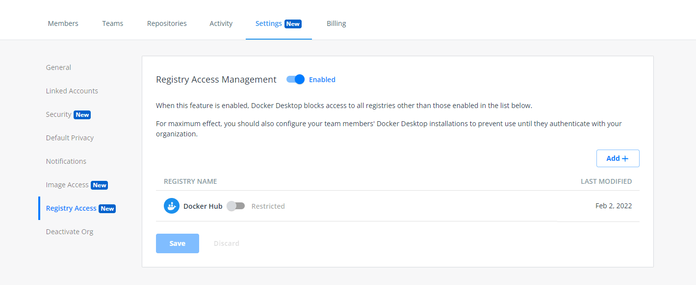

Registry Access Management is a feature available to organizations with a Docker Business subscription. This feature lets organization owners manage the registries that their developers can access while using Docker Desktop.  When using this feature, organization owners can ensure that their developers can only access their trusted registries, such as a secure private registry on Artifactory, thereby reducing the security risks that can occur when developers interact with public registries.

## Configure Registry Access Management permissions

To configure Registry Access Management permissions, perform the following steps:

1. Sign into your [Docker Hub](https://hub.docker.com){: target="_blank" rel="noopener" class="_"} account as an organization owner.
2. Select an organization, navigate to the **Settings** tab on the **Organizations** page and click **Registry Access**.
3. Enable Registry Access Management to set the permissions for your registry.

     > **Note**
     >
     > When enabled, the Docker Hub registry is set by default, however you can also restrict this registry for your developers.

4. Click **Add** and enter your registry details in the applicable fields, and click **Create** to add the registry to your list.
5. Verify that the registry appears in your list and click **Save & Apply**.  You can verify that your changes are saved in the Activity tab.

      > **Note**
      >
      > Once you add a registry, it can take up to 24 hours for the changes to be enforced on your developers’ machines. If you want to apply the changes sooner, you must force a Docker logout on your developers’ machine and have the developers re-authenticate for Docker Desktop.  Also, there is no limit on the number of registries you can add. See the [Caveats](#caveats) section to learn more about limitations when using this feature.

{:width="700px"}

## Enforce authentication

To ensure that each org member uses Registry Access Management on their local machine, you can perform the steps below to enforce sign-in under your organization. To do this:

1. Download the latest version of Docker Desktop, and then
2. Create a `registry.json` file.

Download Docker Desktop 4.8 or a later release.

- [Download and install for Windows](/desktop/windows/install/)
- [Download and install for Mac](/desktop/mac/install/)

## Creating a registry.json file

When creating a registry.json file, ensure that the developer is a member of at least one organization in Docker Hub. If the registry.json file matches at least one organization the developer is a member of, they can sign in to Docker Desktop and access all their organizations. Learn more on how to create a registry.json file on [Windows](/docker-hub/configure-sign-in/#windows) or [Mac](docker-hub/configure-sign-in/#mac).

{## Verify the restrictions

   The new Registry Access Management policy should be in place after the developer successfully authenticates to Docker Desktop using their organization credentials. The developer can attempt to pull an image from a disallowed registry via the Docker CLI. They will then receive an error message that your organization disallows this container registry.

### Caveats

  There are certain limitations when using Registry Access Management; they are as follows:

  * Windows image pulls, and image builds are not restricted
  * Builds such as `docker buildx` using a Kubernetes driver are not restricted
  * Builds such as `docker buildx` using a custom docker-container driver are not restricted
  * Blocking is DNS-based; you must use a registry's access control mechanisms to distinguish between “push” and “pull”
  * WSL 2 requires at least a 5.4 series Linux kernel  (this does not apply to earlier Linux kernel series)
 * Under the WSL 2 network, traffic from all Linux distributions is restricted (this will be resolved in the updated 5.15 series Linux kernel)

  Also, Registry Access Management operates on the level of hosts, not IP addresses. Developers can bypass this restriction within their domain resolution, for example by running Docker against a local proxy or modifying their operating system's `sts` file. Blocking these forms of manipulation is outside the remit of Docker Desktop.

