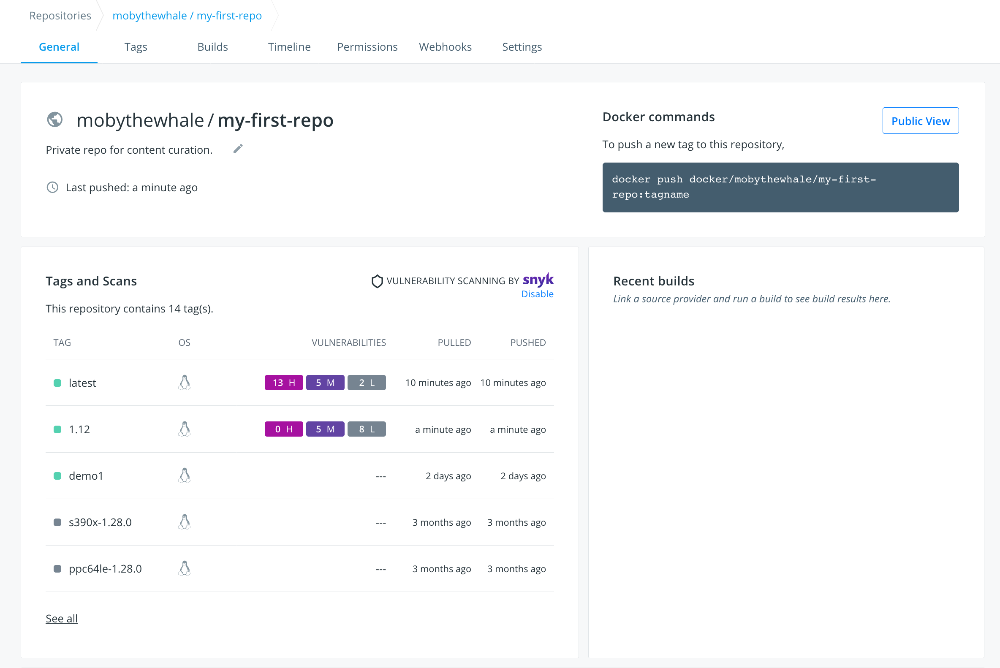
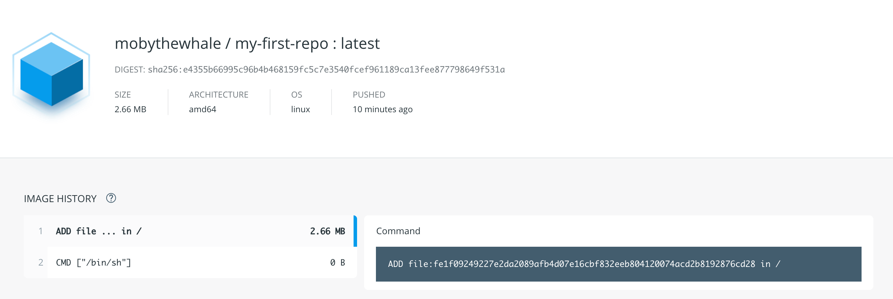

 Within your repository, you can give others access to push and pull to your repository, and you can assign permissions. You can also view your repository tags and the associated images.

## Collaborators and their role

A collaborator is someone you want to give access to a private repository. Once
designated, they can `push` and `pull` to your repositories. They're not
allowed to perform any administrative tasks such as deleting the repository or
changing its status from private to public.

> **Note**
>
> A collaborator can't add other collaborators. Only the owner of
> the repository has administrative access.

You can also assign more granular collaborator rights ("Read", "Write", or
"Admin") on Docker Hub by using organizations and teams. For more information
see the [organizations documentation](../../../docker-hub/orgs.md#create-an-organization).

## Viewing repository tags

Docker Hub's individual repositories view shows you the available tags and the
size of the associated image. Go to the **Repositories** view and select repository to see its tags. To view individual tags, select the **Tags** tab.



Image sizes are the cumulative space taken up by the image and all its parent
images. This is also the disk space used by the contents of the `.tar` file
created when you `docker save` an image. An image is stale if there has been no push/pull activity for more than one month. For example:

* It hasn't been pulled for more than one month
* And it hasn't been pushed for more than one month

A multi-architecture image is stale if all single-architecture images
part of its manifest are stale.

To delete a tag, select the corresponding checkbox and select **Delete** from the **Action** drop-down list.

> **Note**
>
> Only a user with administrative access (owner or team member with Admin
> permission) over the repository can delete tags.

You can select a tag's digest to view more details.



## Searching for repositories

You can search the [Docker Hub](https://hub.docker.com) registry through its
search interface or by using the command line interface. Searching can find
images by image name, username, or description:

```console
$ docker search centos

NAME                                 DESCRIPTION                                     STARS     OFFICIAL   AUTOMATED
centos                               The official build of CentOS.                   1034      [OK]
ansible/centos7-ansible              Ansible on Centos7                              43                   [OK]
tutum/centos                         Centos image with SSH access. For the root...   13                   [OK]
...
```

There you can see two example results: `centos` and `ansible/centos7-ansible`.
The second result shows that it comes from the public repository of a user,
named `ansible/`, while the first result, `centos`, doesn't explicitly list a
repository which means that it comes from the top-level namespace for
[Docker Official Images](../../official_images.md). The `/` character separates
a user's repository from the image name.

Once you've found the image you want, you can download it with `docker pull <imagename>`:

```console
$ docker pull centos

latest: Pulling from centos
6941bfcbbfca: Pull complete
41459f052977: Pull complete
fd44297e2ddb: Already exists
centos:latest: The image you are pulling has been verified. Important: image verification is a tech preview feature and should not be relied on to provide security.
Digest: sha256:d601d3b928eb2954653c59e65862aabb31edefa868bd5148a41fa45004c12288
Status: Downloaded newer image for centos:latest
```

You now have an image from which you can run containers.

## Starring repositories

Your can star your repositories. Stars are a way to show that you like a repository. They're also an easy way of bookmarking your favorites.
