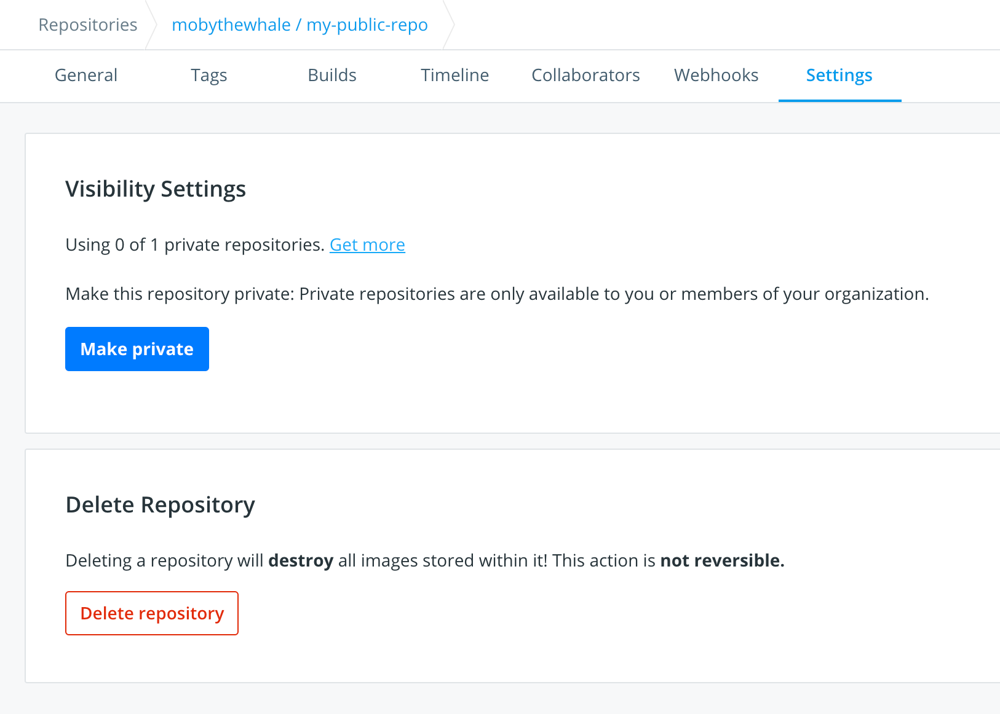

When configuring repositories, your private repositories let you keep your container images private, to your personal account or within an organization or team. You can also view your permissions or manage your users' access to those repositories.

## Private repositories

You can make an existing repository private by going to its **Settings** tab and select **Make private**.

{: style="max-width: 60%"}

You get one free private repository with your Docker Hub user account (not
available for organizations you're a member of). If you need more private
repositories for your user account, upgrade your Docker Hub subscription from your [Billing Information](https://hub.docker.com/billing/plan){: target="_blank" rel="noopener" class="_"} page.

Once you've created a private repository, you can `push` and `pull` images to and
from it using Docker.

> **Note**: You must sign in and have access to work with a
> private repository. Private repositories aren't available to search through
> the top-level search or `docker search`.

You can choose collaborators and manage their access to a private
repository from that repository's **Settings** page. You can also toggle the
repository's status between public and private, if you have an available
repository slot open. Otherwise, you can upgrade your
[Docker Hub](https://hub.docker.com/account/billing-plans/){: target="_blank" rel="noopener" class="_"} subscription.

### Permissions reference

Permissions are cumulative. For example, if you have Read & Write permissions,
you automatically have Read-only permissions:

- `Read-only` access lets users view, search, and pull a private repository in the same way as they can a public repository.
- `Read & Write` access lets users pull, push, and view a repository. In addition, it lets users view, cancel, retry or trigger builds
- `Admin` access lets users pull, push, view, edit, and delete a
  repository. You can also edit build settings, and update the repositories description, collaborators rights, public/private visibility, and delete.

> **Note**
>
> A user who hasn't verified their email address only has
> `Read-only` access to the repository, regardless of the rights their team
> membership has given them.

