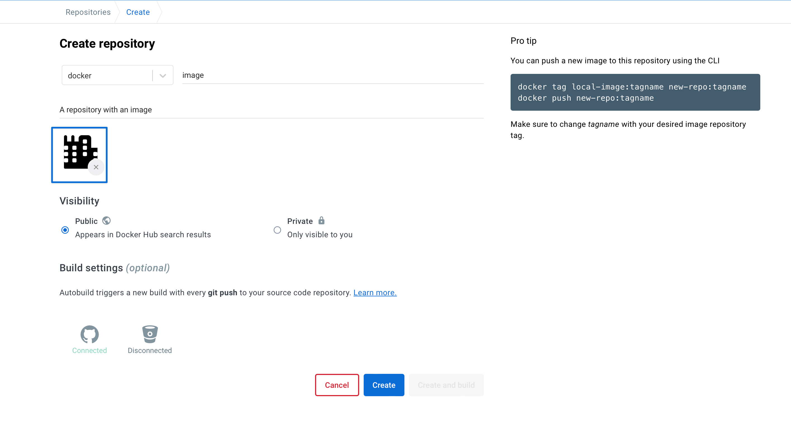

Docker Hub repositories allow you share container images with your team,
customers, or the Docker community at large.

Docker images are pushed to Docker Hub through the [`docker push`](/engine/reference/commandline/push/)
command. A single Docker Hub repository can hold many Docker images (stored as
**tags**).

## Creating a repository

To create a repository, sign into Docker Hub, select **Repositories** then
**Create Repository**:


When creating a new repository:

* You can choose to put it in your Docker ID namespace, or in any
  [organization](../../docker-hub/orgs.md) where you are an [owner](../../docker-hub/orgs.md#the-owners-team).
* The repository name needs to be unique in that namespace, can be two
  to 255 characters, and can only contain lowercase letters, numbers, hyphens (`-`), and underscores (`_`).

  > **Note:**
  >
  > You can't rename a Docker Hub repository once it's created.

* The description can be up to 100 characters and used in the search result.
* You can link a GitHub or Bitbucket account now, or choose to do it later in
  the repository settings.



After you select **Create**, you can start using `docker push` to push
images to this repository.

## Creating a private repository

To create a private repository, navigate to Docker Hub and select **Repositories** and **Private**.

{: style="max-width: 60%"}

## Deleting a repository

1. Navigate to [Docker Hub](https://hub.docker.com){: target="_blank" rel="noopener" class="_"} and select **Repositories**.

2. Select a repository from the list, select **Settings**, and then Delete Repository.

    > **Note:**
    >
    > Deleting a repository deletes all the images it contains and its build settings. This action can't be undone.

3. Enter the name of the repository to confirm the deletion and select **Delete**.

## Consolidating a repository

### Personal to personal

When consolidating personal repositories, you can pull private images from the initial repository and push them into another repository owned by you. To avoid losing your private images, perform the following steps:

1. Navigate to [Docker Hub](https://hub.docker.com){: target="_blank" rel="noopener" class="_"} create a Docker ID and select the personal subscription.
2. Using `docker login` from the CLI, sign in using your original Docker ID and pull your private images.
3. Tag your private images with your newly created Docker ID using:
`docker tag namespace1/docker101tutorial new_namespace/docker101tutorial`
4. Using `docker login` from the CLI, sign in with your newly created Docker ID, and push your newly tagged private images to your new Docker ID namespace.
`docker push new_namespace/docker101tutorial`
5. The private images that existed in your previous namespace are now available in your new Docker ID namespace.

### Personal to an organization

To avoid losing your private images, you can pull your private images from your personal namespace and push them to an organization that's owned by you.

1. Navigate to [Docker Hub](https://hub.docker.com){: target="_blank" rel="noopener" class="_"} and select **Organizations**.
2. Select the applicable organization and verify that your user account is a member of the organization.
3. Sign in to [Docker Hub](https://hub.docker.com){: target="_blank" rel="noopener" class="_"} using your original Docker ID, and pull your images from the initial namespace.
`docker pull namespace1/docker101tutorial`
4. Tag your images with your new organization namespace.
`docker tag namespace1/docker101tutorial <new_org>/docker101tutorial`
5. Push your newly tagged images to your new org namespace.
`docker push new_org/docker101tutorial`

The private images that existed in the initial namespace are now available for your organization.

## Pushing a Docker container image to Docker Hub

To push an image to Docker Hub, you must first name your local image using your
Docker Hub username and the repository name that you created through Docker Hub
on the web.

You can add multiple images to a repository by adding a specific `:<tag>` to
them (for example `docs/base:testing`). If it's not specified, the tag defaults
to `latest`.

Name your local images using one of these methods:

* When you build them, using `docker build -t <hub-user>/<repo-name>[:<tag>]`
* By re-tagging an existing local image `docker tag <existing-image> <hub-user>/<repo-name>[:<tag>]`
* By using `docker commit <existing-container> <hub-user>/<repo-name>[:<tag>]`
  to commit changes

Now you can push this repository to the registry designated by its name or tag.

```console
$ docker push <hub-user>/<repo-name>:<tag>
```

The image is then uploaded and available for use by your teammates and/or
the community.