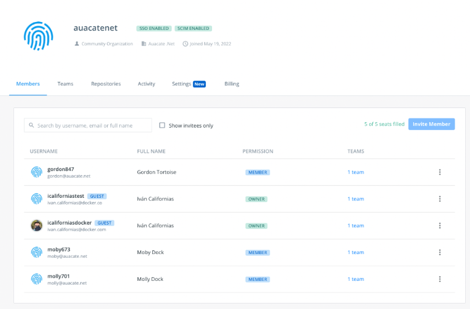

> **Important**
>
> SCIM for Okta is now available for early access. SCIM support for Azure AD is
> coming soon.
{: .important}

This section is for administrators who want to enable System for Cross-domain Identity Management (SCIM) 2.0 for their business. SCIM is a provisioning system that lets you manage users within your identity provider (IdP). You can enable SCIM on organizations that are part of the Docker Business subscription. To upgrade your existing account to a Docker Business subscription, see [Upgrade your subscription](../subscription/upgrade.md){:target="blank" rel="noopener" class=""}.

SCIM provides automated user provisioning and de-provisioning for your Docker organization through your Identity Provider (IdP). The SCIM-synced changes apply to newly assigned users. The status of those already under your subscription will be supplemented but might not be overwritten in that the changes are applied. For instance, other members are unaffected if your IDP sends an update containing changes to User1.

We currently support the following provisioning features: creating new users, pushing user profile updates, removing users, deactivating users, reactivating users, and updating emails.

## Configure

SAML-based SSO must be properly set up and functional for your organization before you start configuring automated provisioning. In addition, you must verify your company domain and have the appropriate connectors in your IdP. Your user email domain must be the same company domain you use for Single Sign-on (SSO). Enforcing SSO is not required to enable SCIM. However, you must [configure SAML SSO](../single-sign-on/index.md){: target="_blank" rel="noopener" class="_"} before you enable SCIM.

### Okta IdP

Before making SCIM configuration changes in your IdP, navigate to [Docker Hub](https://hub.docker.com){: target="_blank" rel="noopener" class="_"} and select **Organizations** > **Settings** > **Security**. SCIM is locked until you complete the SSO configuration and verify your company domain. Enable SCIM and access your **Base URL** and **API Token** ( the same as Bearer Token in Okta).

{:width="700px"}

1. In Okta, navigate to **Applications** > **Create App Integration**, **SAML 2.0**, and click **Next**.
2. In the **General** tab, select **Edit App Settings** to enable SCIM provisioning and click **Save**.
3. In the Provisioning tab, edit the SCIM Connection and complete the following:

    * **SCIM connector base URL**: SCIM Base URL from Docker Hub
    * **Unique identifier field for users**: enter **email**
    * **Supported Provisioning actions**: select **Push New Users**, **Push Profile Updates**
    * **Authorization/Bearer**: SCIM API Token from Docker Hub

4. Click **Test Connection Configuration** to complete the configuration and **Save**.
5. Navigate to **Provisioning** > **To App** > **Edit** and enable **Create Users**, **Update User Attributes** and **Deactivates Users**, and click **Save**.

{:width="700px"}

The synchronization of user data is now automated, and the members in your Docker organization will now be automatically provisioned, updated, and de-provisioned based on the access control managed through your identity provider, Okta.

### Generate a full-sync

You must run full-sync after enabling SCIM, if you already have users assigned to the Docker Hub app when you enable SCIM. The full sync provisions the users that are assigned in the IdP Directory to  Docker Hub.

1. Navigate to **Applications** > **Applications** and select the Docker Hub app.
2. In the **Assignments** tab, click **Provision User** if you have pending users.
3. Click **Apply to All** > **Reapply Mappings** and **Confirm**.

    > **Note**
    >
    > Any user that was not previously provisioned is now provisioned in Docker Hub.

{:width="700px"}

## Disabling SCIM

If SCIM is disabled, any user provisioned through SCIM will remain in the organization. Future changes for your users will not sync from your IdP. Users provisioning is through just-in-time provisioning from SSO.

{:width="700px"}
