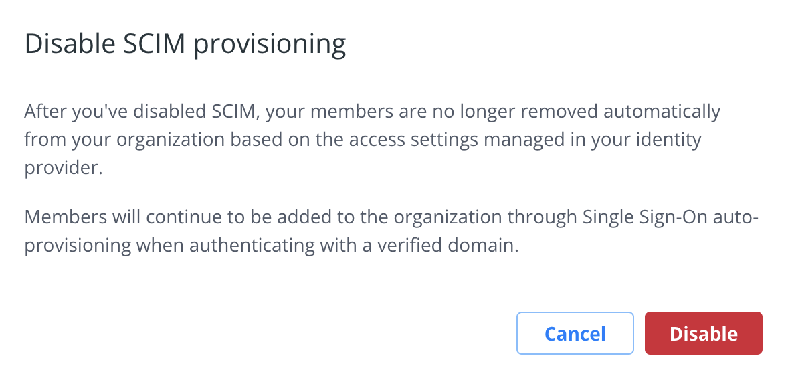

This section is for administrators who want to enable System for Cross-domain Identity Management (SCIM) 2.0 for their business. SCIM is a provisioning system that lets you manage users within your identity provider (IdP). You can enable SCIM on organizations that are part of the Docker Business subscription. To upgrade your existing account to a Docker Business subscription, see [Upgrade your subscription](../subscription/upgrade.md){:target="blank" rel="noopener" class=""}.

SCIM provides automated user provisioning and de-provisioning for your Docker organization through your identity provider (IdP).  Once you enable SCIM in your IdP, any user assigned to the Docker application in the IdP, is automatically provisioned in Docker Hub and added to the organization. Also, if a user gets unassigned from the Docker application in the IdP, the user is removed from the organization in Docker Hub. SCIM also synchronizes changes made to users’ attributes in the IdP, for instance the user’s first name and last name.

The following provisioning features are supported: creating new users, push user profile updates, remove users, deactivate users and reactivate users. Group management is not supported.

The table below lists the supported attributes. Note, that your attribute mappings must match for SSO to prevent duplicating your members.

| Attribute    | Description
|:---------------------------------------------------------------|:-------------------------------------------------------------------------------------------|
| username             | Unique identifier of the user (email)                                   |
| givenName                            | User’s first name |
| familyName |User’s surname                                              |

## Configure

SSO must be set up and be functional for your organization before you start configuring automated provisioning. In addition, you must verify your company domain and have the appropriate connectors in your IdP. Your user email domain must be the same company domain you use for Single Sign-on (SSO). Enforcing SSO is not required to enable SCIM. However, you must [configure SSO](../single-sign-on/index.md){: target="_blank" rel="noopener" class="_"} before you enable SCIM.

Before you make SCIM configuration changes in your IdP, navigate to [Docker Hub](https://hub.docker.com){: target="_blank" rel="noopener" class="_"} and select **Organizations** > **Settings** > **Security**. SCIM is locked until you complete the SSO configuration and verify your company domain. Enable SCIM and access your Base URL and API Token. You can also generate a new API token.

{:width="700px"}

### Okta

1. In Okta, navigate to **Applications** > **Create App Integration** > **SAML 2.0**, and **Next**.
2. In the **General** tab, on your new application page, select **Edit App Settings** to enable SCIM provisioning and **Save**.
3. In the **Provisioning** tab, edit the SCIM Connection and complete the following:

    * **SCIM connector base URL**: SCIM Base URL from Docker Hub
    * **Unique identifier field for users**: enter **email**
    * **Supported Provisioning actions**: select **Push New Users**, **Push Profile Updates**
    * **Authorization/Bearer**: SCIM API Token from Docker Hub

    {:width="700px"}

4. Click **Test Connection Configuration** to complete the configuration and **Save**.
5. Once configured, you must enable synchronization. Navigate to **Provisioning** > **To App** > **Edit**, and enable **Create Users**, **Update User Attributes** and **Deactivates Users**, and **Save**.

    {:width="700px"}

6. Remove all fields that aren't supported from your **Docker Hub Attributes Mappings**.

    {:width="700px"}

The synchronization of user data is now automated, and the members in your Docker organization will now be automatically provisioned, updated, and de-provisioned based on the access control managed through your identity provider, Okta.

#### Generate a full-sync

You must run a full-sync after enabling SCIM, if you already have users assigned to the Docker Hub app. This provisions the users that are assigned in the IdP Directory to Docker Hub.

1. Navigate to **Applications** > **Applications** and select the Docker Hub app.
2. In the **Assignments** tab, select **Provision User** if you have pending users.
3. Click **Apply to All** > **Reapply Mappings** and **Confirm**.

    > **Note**
    >
    > This will generate a full-sync and any user that wasn't previously provisioned is now provisioned in Docker Hub.

{:width="700px"}

### Azure AD

1. Navigate to Azure AD and select **AzureAD admin**.
2. In the **Default Directory**, select **Add** > **Enterprise Application** > **Create your own application**.

    > **Note**
    >
    > When you create an Enterprise Application you can configure SCIM with
    > Security Assertion Markup Language (SAML).

3. Type **Docker** for application name, select **non-gallery**, and **Create**.
4. In your Docker application, navigate to **Provisioning**, and select **Get Started**.
5. Select **Automatic** for the provisioning mode and enter your SCIM credentials.

    > **Note**
    >
    > You can access and copy your SCIM URL (Tenant URL) and API Token (Secret
    > Token) in Docker Hub.

6. Select **Test Connection** to enable and authorize the provisioning.
7. In **Mappings**, select **Provision Azure Active Directory Groups** to disable Groups and **Save**.

    > **Note**
    >
    > You must turn off group sync to avoid having your configuration
    > quarantined.
8. Select **Provision Azure Active Directory Users**, in **Attribute Mappings**, and keep the **userName**, **Active**, **givenName**, **familyName**. Delete the other attributes listed.

    {:width="700px"}

9. Select **Start Provisioning** to begin the full synchronization.

     > **Note**
     >
     > It can take up to 30 minutes to begin provisioning. You can also
     > provision on demand provisioning with one user that's already assigned
     > to the application.

### Onelogin

1. In Onelogin, navigate to **Applications** > **Applications** > **Add app**.
2. In the search field, enter **SCIM Provisioner with SAML (SCIM v2 Core)** and select the item in the results.
3. Enter **Docker Hub** as the display name and **Save**.
4. Navigate to the left navigation, and select **Configuration**.
5. In a separate tab, navigate to **Docker Hub** > **Settings** > **Security** > **SSO** > **SAML**.
6. Copy the following fields from Docker Hub, in to OneLogin:

    * Entity ID: SAML Audience URL
    * ACS URL:  SAML Consumer URL
    * SCIM Base URL: SCIM Base URL
    * Custom Headers:

    ```console
     Content-Type: application/scim+json
     User-Agent: OneLogin SCIM
    ```
    * SCIM Bearer Token: SCIM Bearer Token
    * SCIM JSON Template:

    ```console
    {
    "schemas": [
        "urn:ietf:params:scim:schemas:core:2.0:User"
    ],
    "userName": "{$parameters.scimusername}",
    "name": {
        "givenName": "{$user.firstname}",
        "familyName": "{$user.lastname}"
    },
    "emails": [
        {
            "value": "{$user.email}",
            "primary": true
        }
    ]
}
    ```

   {:width="700px"}

7. Select **API Connection** > **Enable** and **Save**.
8. Navigate to the **Parameters** tab, click **scimusername**, select **Email** and **Save**.

    {:width="700px"}

9. Navigate to the SSO tab, and copy the **SAML 2.0 Endpoint (HTTP)** url and paste it in to [**Docker Hub**](https://hub.docker.com){: target="_blank" rel="noopener" class="_"} > **Settings** > **Security** > **SSO** > **SAML Sign-in URL**.
10. In the **X.509 Certificate** field, click **View Details**.
11. Copy the **PEM certificate**, and paste it in to [**Docker Hub**](https://hub.docker.com){: target="_blank" rel="noopener" class="_"} > **Settings** > **Security** > **SSO** > **Key x509 Certificate** and **Save**.
12. In Onelogin, navigate to the **Access** tab, enable the app for `ol_role` that was already created and **Save**.
13. Navigate to the **Provisioning** tab and select **Enable provisioning**, and deselect the other options.
14. In the drop-down, select **Suspend** and **Save**.


#### Generate a full-sync

1. In Onelogin, navigate to **Applications** and select the Docker Hub application.
2. In **Users**, click **Apply to All** and **Reapply Mappings**.
3. Select **Confirm** to provision your users in Docker Hub.

> **Note**
>
> This creates a full-sync and any user that was not previously
> provisioned is now provisioned in Docker Hub.

{:width="700px"}

## Disabling SCIM

If SCIM is disabled, any user provisioned through SCIM will remain in the organization. Future changes for your users will not sync from your IdP. User de-provisioning is only possible when manually removing the user from the organization.

{:width="700px"}
