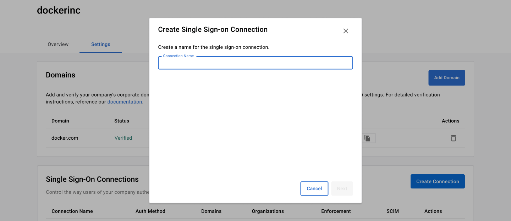
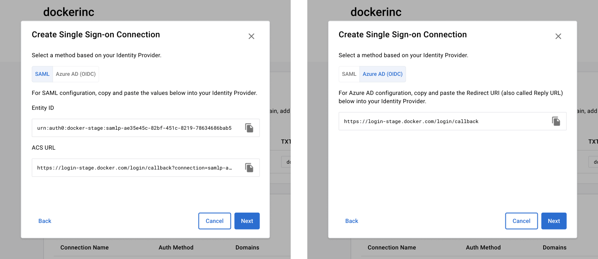
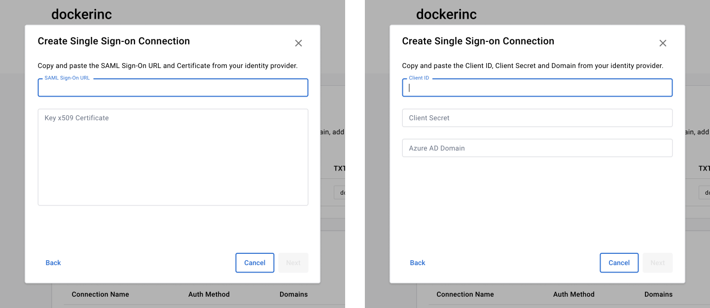
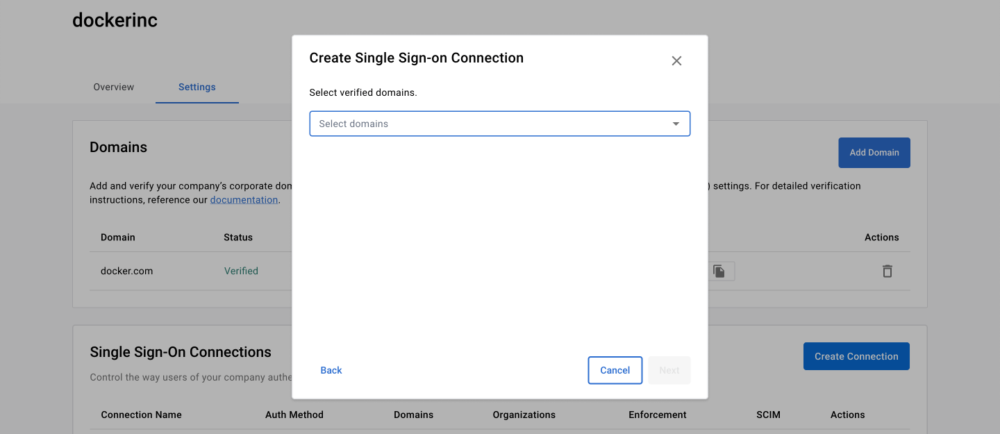
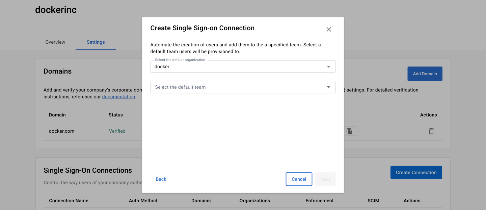
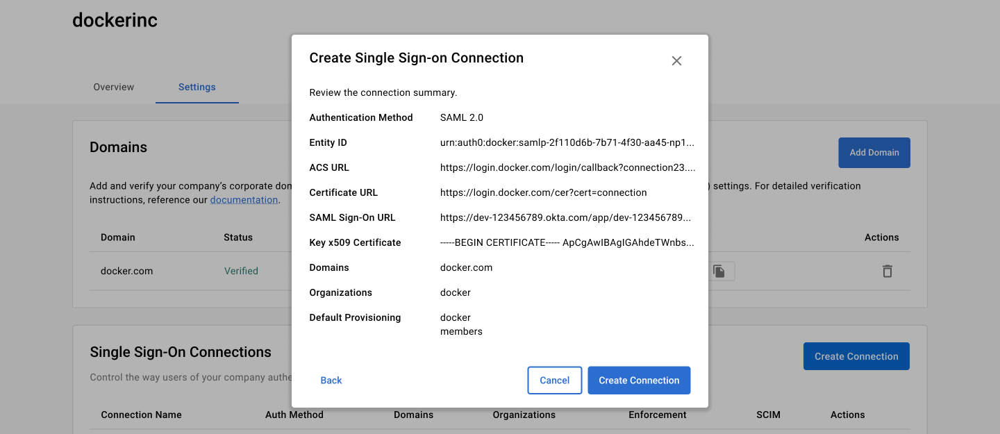
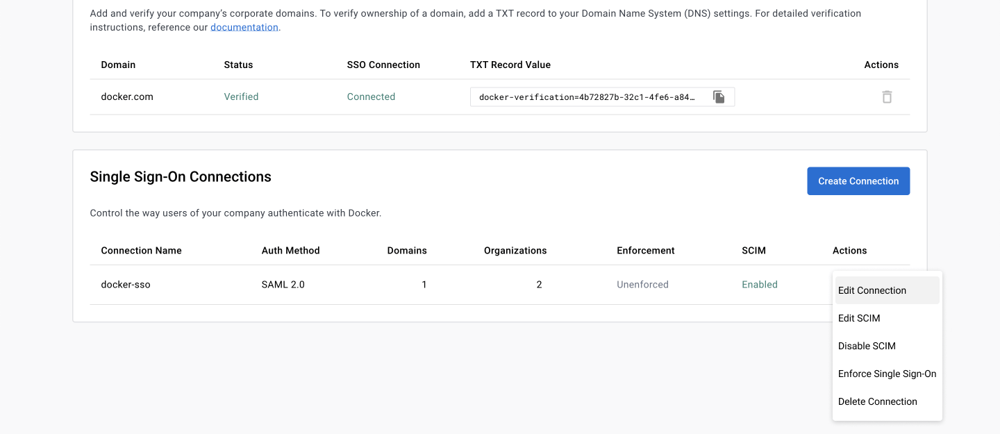

> **Note**
>
> The following features are only available to [Early Access](../release-lifecycle.md/#early-access-ea) participants.

## Create a connection

1. Once your domain is verified, continue to **Single Sign-on Connections** and select **Create Connections**, and create a name for the connection. 

    > **Note**
    >
    > You have to verify at least one domain before creating the connections.

    {: width="700px" }

2. Select an authentication method, **SAML** or **Azure AD (OIDC)**.
3. Copy the following fields and add them to your IdP:

   - SAML: **Entity ID**, **ACS URL**
   - Azure AD (OIDC): **Redirect URL**

   {: width="700px" }

4. From your IdP, copy and paste the following values into the Docker **Settings** fields:

    - SAML: **SAML Sign-on URL**, **x509 Certificate**
    - Azure AD (OIDC): **Client ID**, **Client Secret**, **Azure AD Domain**

    {: width="700px" }

5. Select the Docker organization and verified domains you want to apply the connection.

    {: width="700px" }

6. Select the organization and team you want to provision your users.

    > **Note**
    >
    > This is the default organization if you have more than one organization in your SSO connection. Users are added to the specified organization and team.
7. Review your summary and select **Create Connection**.

**SSO connection is now created**. You can continue to set up SSO Group Mapping and SCIM without enforcing SSO log-in.

## Connect a domain

1. In the **Single Sign-on Connections** section, select the **Action** icon and **Edit**.
2. Select **Next** to navigate to the section where connected domains are listed.
3. In the **Domain** drop-down, select the domain you want to add to the connection.

    {: width="700px" }

4. Select **Next** to confirm or change the connected organizations.
5. Select **Next** to confirm or change the default organization and team provisioning selections.

    {: width="700px" }

6. Review the connection summary and select **Create Connection**.

## Connect an organization

You must have a company to connect an organization.

1. In the **Single Sign-on Connections** section, select the **Action** icon and **Edit**.
2. Select **Next** to navigate to the section where connected organizations are listed.
3. In the **Organizations** drop-down, select the organization to add to the connection.

    {: width="700px" }

4. Select **Next** to confirm or change the default organization and team provisioning.
5. Review the **Connection Summary** and select **Save**.

    {: width="700px" }

## Delete a connection

1. In the **Single Sign-On Connections**, select the **Action** icon.
2. Select **Delete** and **Delete Connection**.
3. Continue with the on-screen instructions.

## Edit a connection

1. In the **Single Sign-On Connections**, select the **Action** icon.
2. Select **Edit Connection** to edit you connection.
3. Continue with the on-screen instructions.

 {: width="700px" }

## Remove a domain

1. In the **Single Sign-On Connection**, select the **Action** icon and **Edit**.
2. Select **Next** to navigate to the section where the connected domains are listed.
3. In the **Domain** drop-down, select the **Remove** icon next to the domain that you want to remove.
4. Select **Next** to confirm or change the connected organizations.
5. Select **Next** to confirm or change the default organization and team provisioning selections.
6. Review the **Connection Summary** and select **Save**.

## Remove an organization

1. In the **Single Sign-on Connection** section, select the **Action** icon and **Edit**.
2. Select **Next** to navigate to the section where connected organizations are listed.
3. In the **Organizations** drop-down, select **Remove** to remove the connection.
4. Select **Next** to confirm or change the default organization and team provisioning.
5. Review the **Connection Summary** and select **Save**.