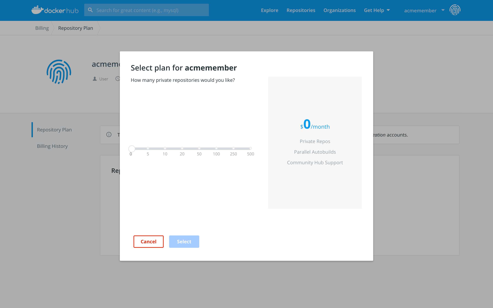

User and organization accounts maintain separate Docker Hub billing profiles.

## Upgrade your personal plan

Docker Hub includes one private Docker Hub repository for free. If you need
more private repositories, you can upgrade from your free account to a paid
plan.

To upgrade your personal plan:

1. Open the [billing page](https://hub.docker.com/billing/plan) for your
account.

2. Click **Upgrade Plan**.

3. Select your plan and provide your payment information to upgrade.

    

## Upgrade your organization's plan

To upgrade an organization's plan:

1. Visit the [Plans Page](https://hub.docker.com/account/billing-plans/).

2. Change the selected account to your Organization whose plan you'd like to upgrade. 

3. Click **Change Plan**. 

## Docker Hub repo plan billing FAQ

### What forms of payment do you accept?

The Docker Hub accepts Visa, MasterCard, American Express, and Discover credit
cards. We do not accept ACH, EFT, or PIN-based debit card transactions at this
time.

### What currencies do you accept?

Docker is a US-based company, and bills in US Dollars (USD). This keeps our
pricing stable and consistent, rather than fluctuating with exchange rates.

### When do you charge my credit card?

We automatically charge your credit card on the first day of your billing cycle
each month, and the charge comes from Docker, Inc. Your billing cycle is a
30-day period starting on the day you subscribe.

### What do I do if my payment fails?

If your payment failed because the card expired or was canceled, you need to
update your credit card information or add an additional card.

Click the user icon menu in the upper right corner, and click
**Billing**. Click the **Payment methods** tab to update your credit card and
contact information.

If you are updating the card details for an organization, be sure to select the
organization name from the **Account** menu before updating the information.

### How does cancellation work? Do you offer refunds?

You can cancel a subscription at any time, however you are still billed
for the full month, and have access to the subscription content until the end of
that billing period.

We do not offer refunds. If you believe that you've been billed in error,
contact our [Billing Support team](mailto:billing@docker.com).

### How do I download the licenses my organization has purchased?

You can view and download all you active licenses for an organization from the
**Subscriptions** page.

Click the user icon menu at the top right, choose **My Content** and then
select the organization from the **Accounts** drop down menu.
