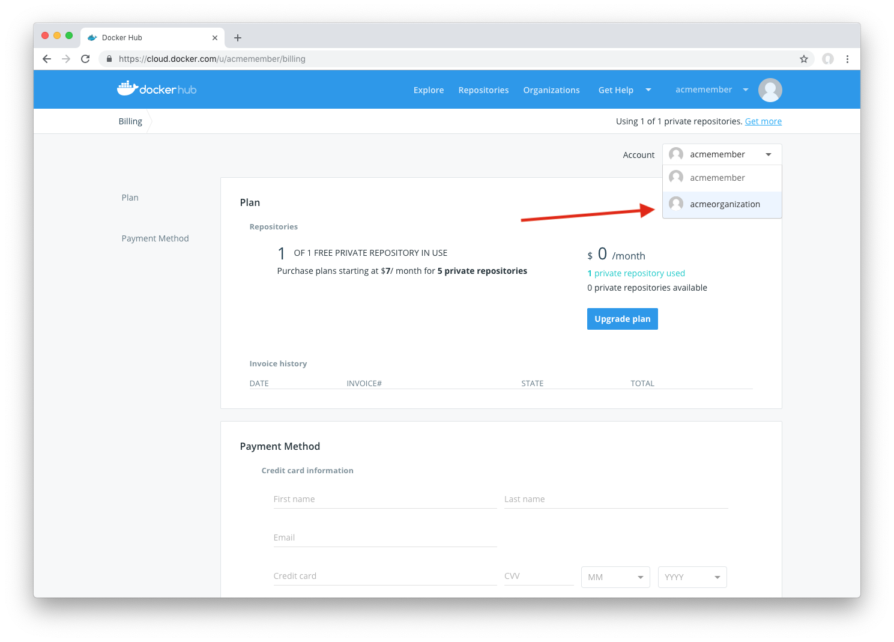

User and organization accounts maintain separate Docker Hub billing profiles.

### Upgrade your personal plan

Docker Hub includes one private Docker Hub repository for free. If you need
more private repositories, you can upgrade from your free account to a paid
plan.

To upgrade:
1. Visit the [Plans Page](https://hub.docker.com/account/billing-plans/)
2. Click Change Plan
3. Select your plan and provide your payment information to upgrade 

### Upgrade your organization's plan

To upgrade an Organization's plan:

1. Visit the [Plans Page](https://hub.docker.com/account/billing-plans/)
2. Change the selected account to your Organization whose plan you'd like to upgrade 

3. Click Change Plan 
