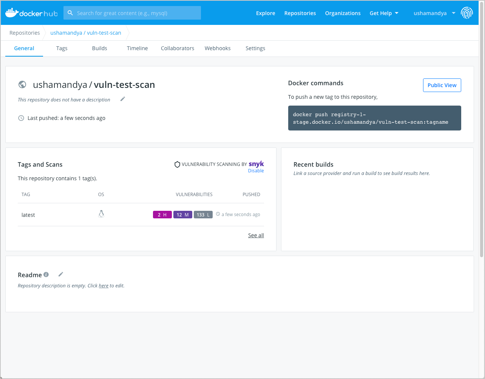
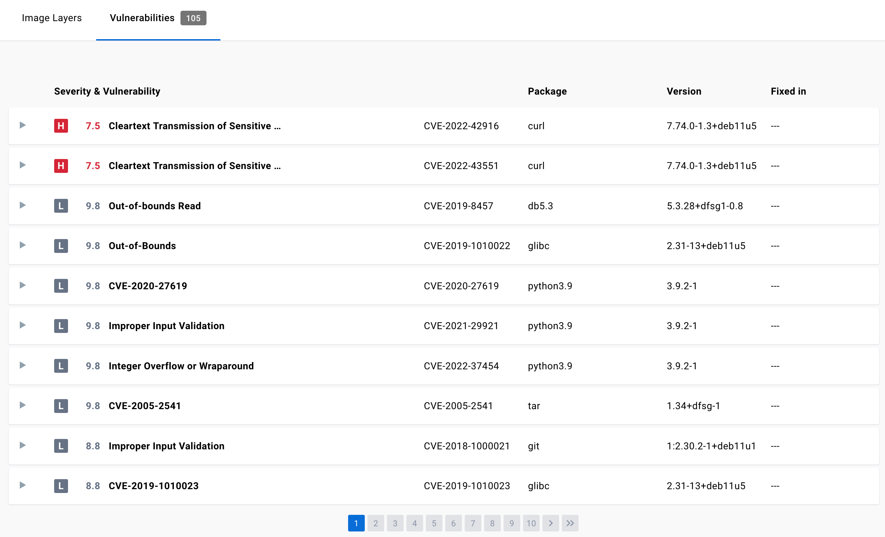



Docker Hub Vulnerability Scanning enables you to automatically scan Docker
images for vulnerabilities using Snyk. This uses the same technology as the
[docker scan](../engine/scan/index.md) command.

> When you enable Hub Vulnerability Scanning, you can also see whether your
> images are affected by Log4Shell (CVE-2021-44228). For more information, see
> [Scan images](#scan-images-on-docker-hub).

When you push an image to Docker Hub after enabling vulnerability scanning, Docker Hub automatically scans the image to identify vulnerabilities in your container images. Vulnerability Scanning allows developers and development teams to review the security state of the container images and take actions to fix issues identified during the scan, resulting in more secure deployments. The scan result includes the source of the vulnerability, such as OS packages and libraries, version in which it was introduced, and a recommended fixed version (if available) to remediate the vulnerabilities discovered.

## Scan images on Docker Hub

> **Log4j 2 CVE-2021-44228**
>
> Docker Hub security scans triggered after **1700 UTC 13 December 2021** are
> now correctly identifying the Log4j2 CVE. Scans before this date **do not**
> currently reflect the status of this vulnerability. Therefore, we recommend
> that you trigger scans by pushing the image to Docker Hub to view the status
> of Log4j2 CVE in the vulnerability report.
{: .important}

Hub Vulnerability scanning allows repository owners and administrators of a
Docker Pro, Team, or a Business tier to enable and disable scanning. When scanning is enabled on a specific repository, anyone with push access can trigger a scan by pushing an image to Docker Hub.

In addition, repository owners in a Docker Pro subscription and team members in a Team, or a Business subscription can view the detailed scan reports, including
information about whether or not an image is affected by the **Log4j 2 CVE**.
You must push the image to Docker Hub to trigger a scan that
allows you to view the Log4j 2 CVE results.

> **Note**
>
> Docker Hub currently supports scanning images which are of AMD64 architecture, Linux OS, and are less than 10 GB in size.

### Enable vulnerability scanning

Repository owners and administrators can enable vulnerability scanning on a repository. If you are a member of a Team or a Business subscription, ensure the repository you would like to enable scanning on is part of the Team or a Business tier.

To enable vulnerability scanning:

1. Log into your [Docker Hub](https://hub.docker.com){: target="_blank" rel="noopener" class="_"} account.
2. Click **Repositories** from the main menu and select a repository from the list.
3. By default, scanning is disabled for all repositories. You can enable scanning separately for each repository. Go to the **Settings** tab and click **Enable Image Scanning**.

### Scan an image for vulnerabilities

To scan an image for vulnerabilities, push the image to Docker Hub:

1. Ensure you have installed Docker locally. See [Get Docker](../get-docker.md) to download and install Docker on your local machine.
2. Use the command line to log into your Docker account. See [docker login](../engine/reference/commandline/login.md) for more information.
3. Tag the image that you’d like to scan. For example, to tag a Redis image, run:

    ```console
    $ docker tag redis <your-Docker-ID>/<your-repo-name>:latest
    ```

4. Push the image to Docker Hub to trigger vulnerability scanning on the image:

    ```console
    $ docker push <your-Docker-ID>/<your-repo-name>:latest
    ```

## View the vulnerability report

> **Scan report retention period**
>
> Docker retains the vulnerability scan report for one year. If you'd like a new, up-to-date vulnerability scan report after this period, you can rescan the image by pushing the image to Docker Hub.

To view the vulnerability report:

1. Go to [Docker Hub](https://hub.docker.com){: target="_blank" rel="noopener" class="_"} and open the repository to view a summary of the vulnerability scanning report.

    It can take a couple of minutes for the vulnerability report to appear in your repository.

    {:width="700px"}

2. Click on the **Tags** tab > **Digest** > **Vulnerabilities** to view the detailed scan report.

    The scan report displays vulnerabilities identified by the scan, sorting them according to their severity, with highest severity listed at the top. It displays information about the package that contains the vulnerability, the version in which it was introduced, and whether the vulnerability is fixed in a later version.

    {:width="700px"}

    > **Note**
    >
    > You can also click the ‘open in browser’ icon  on each row to view detailed information about the vulnerability on the Snyk website.

### Disable vulnerability scanning

Repository owners and administrators can disable vulnerability scanning on a repository. To disable scanning:

1. Log into your [Docker Hub](https://hub.docker.com){: target="_blank" rel="noopener" class="_"} account.
2. Click **Repositories** from the main menu and select a repository from the list.
3. Go to the **Settings** tab and click **Disable Image Scanning**.

### Inspect the vulnerabilities

The vulnerability report sorts vulnerabilities based on their severity. It displays information about the package that contains the vulnerability, the version in which it was introduced, and whether the vulnerability has been fixed in a later version.

The vulnerability scan report also allows development teams and security leads to compare the vulnerability counts across tags to see whether the vulnerabilities are decreasing or increasing over time.

### Fixing vulnerabilities

Once a list of vulnerabilities have been identified, there are a couple of actions you can take to remediate the vulnerabilities. For example, you can:

1. Specify an updated base image in the Dockerfile, check your application-level dependencies, rebuild the Docker image and then push the new image to Docker Hub.
2. Rebuild the Docker image, run an update command on the OS packages, and push a newer version of image to Docker Hub.
3. Edit the dockerfile to manually remove or update specific libraries that contain vulnerabilities, rebuild the image, and push the new image to Docker Hub

After you have followed the steps suggested above, browse the new vulnerability report to view the updated scan result.

## Feedback

Thank you for trying out the Hub Vulnerability Scanning feature. Your feedback is very important to us. Let us know your feedback by creating an issue in the [hub-feedback](https://github.com/docker/hub-feedback/issues){: target="_blank" rel="noopener" class="_"} GitHub repository.
