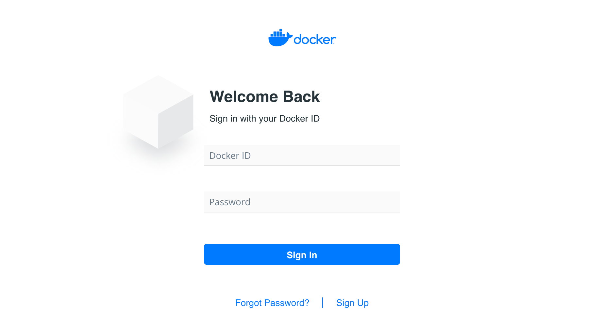

Your free Docker ID grants you access to Docker Hub repositories, and some beta programs. All you need is an email address.

This account also allows you to log in to services such as the Docker Support
Center, the Docker Forums, and the Docker Success portal.

## Register for a Docker ID

Your Docker ID becomes your user namespace for hosted Docker services, and becomes your username on the Docker Forums.

1. Go to the [Docker Hub signup page](https://hub.docker.com/signup/).

2. Enter a username that is also your Docker ID.

    Your Docker ID must be between 4 and 30 characters long, and can only contain numbers and lowercase letters.

3. Enter a unique, valid email address.

4. Enter a password between 6 and 128 characters long.

3. Click **Sign up**.

   Docker sends a verification email to the address you provided.

4. Click the link in the email to verify your address.

> **Note**: You cannot log in with your Docker ID until you verify your email address.

## Log in

Once you register and verify your Docker ID email address, you can log in
to [Docker Hub](https://hub.docker.com) and [Docker Support](https://support.docker.com).

You can also log in using the `docker login` command. (You can read more about `docker login` [here](../engine/reference/commandline/login.md).)

> **Warning**:
> When you use the `docker login` command, your credentials are
stored in your home directory in `.docker/config.json`. The password is base64-encoded in this file.
>
> For extra security, you can use a [personal access token](../docker-hub/access-tokens.md) to log in instead, which is still encoded in this file but doesn't allow admin actions (such as changing the password). If you require secure storage for this password or personal access token, use the [Docker credential helpers](https://github.com/docker/docker-credential-helpers).
{:.warning}
