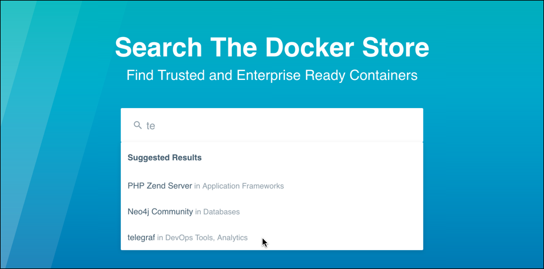
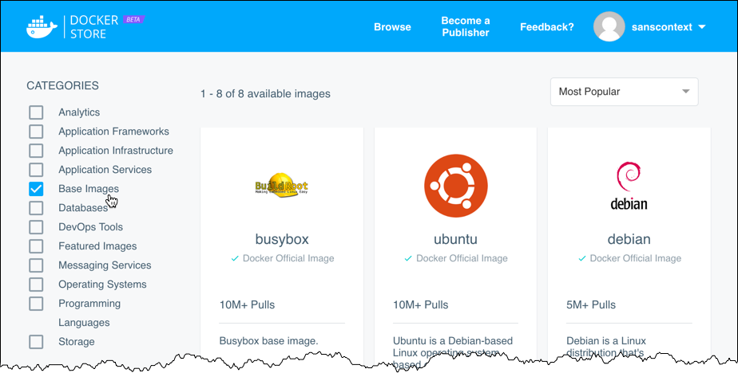
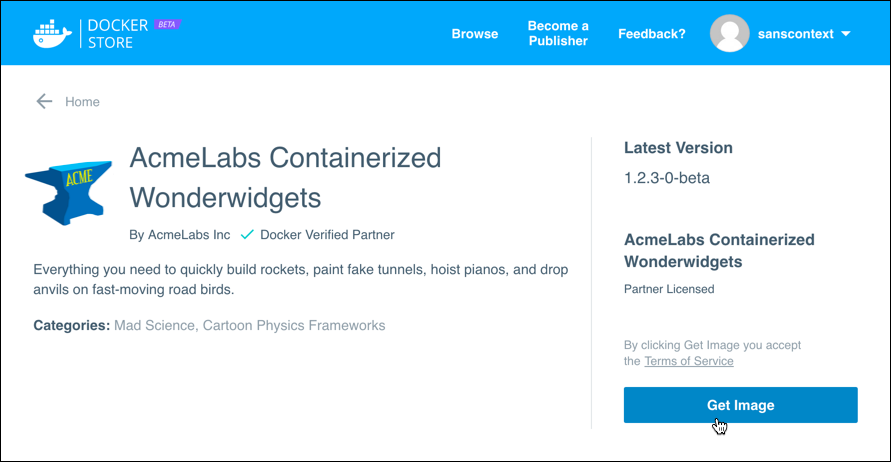

**The Docker Store is now generally available!**

You can [learn more about publishing](https://success.docker.com/Store),
or [apply to be a publisher](https://store.docker.com/publisher/signup).

-----------------

The Docker Store is the place to find the best trusted commercial and free
software distributed as Docker Images.

## Search and Browse

Type a search in the search bar. Click one of the suggested matches, or press
`Enter` to run a full search.

The search returns any results that match in the image name, description, or
publisher name. If you run a complete search, you can also limit your results by
category.

You can also click **Browse** from the top menu to see all of the images
available in the Store, and filter them by category.

## Get an image from the Docker Store

Once you find an image you want, click **Get Image** to agree to the end-user
agreement, then use the `docker pull` command from the image's Store listing to
download it.

Some images may require that you accept the end user agreement or terms of
service before you can pull them, and paid and subscription images may require
that you provide billing information if you have not already done so.

Once you've accepted the terms and provided billing information, you'll see a
link to your list of subscriptions, and the `docker pull` command for the image.
Copy this and paste it into your command shell.

## Types of images

You can download two types of images from the Docker Store:

* **Docker Verified images**. (Recommended) These images are verified by Docker, have a high level of security, and generally subscribe to Docker best practices.
* **Community/Hub images**. When you choose this option, you see images directly from Docker Hub. These images are not verified by Docker.

## What version do I need?

In many cases there will be multiple versions of an image available. Some
versions may offer smaller base image sizes, or address specific security
vulnerabilities.

To see a list of an image's versions, click **View all versions**.
