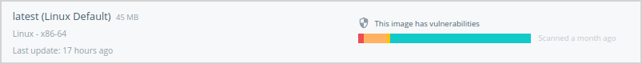
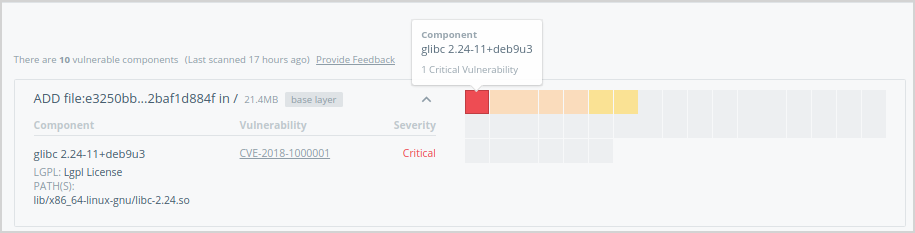

## Permitted content and support options

* Content that runs on a Docker Enterprise Edition (Docker Certified
  Infrastructure) may be published in the Store. This content may also qualify
  to become a Docker Certified Container or Plugin image and be backed by
  collaborative Docker/Publisher support

* Content that runs on the Docker Community Edition may be published in the
  Store, but is not supported by Docker nor is it eligible for certification.

* Content that requires a non Certified Infrastructure environment may not be
  published in the Store.


| If your content: | Can publish on Store  | Can be certified and supported by Docker | Supported by publisher |
|:-----|:--------|:------|:-----|
| Works on Docker Enterprise Edition  | YES | YES |  Required |
| Works on Docker Community Edition  | YES | NO  |  Optional |
| Does not work on Docker Certified Infrastructure | NO                       |   N/A       |    N/A     |


## Onboarding

The Docker Store publishing process begins from the landing page: sign in with
your Docker ID and specify a product name and image source from a private
repository. Your product images must be stored in private repositories of Docker
Cloud and/or Hub as they serve as an internal staging area from which you can
revise and submit content for review.

After specifying a source, provide the content-manifest items to populate your
product details page. These items include logos, descriptions, and licensing and
support links so that customers can make informed decisions about your image.
These items are submitted alongside the image itself for moderation.

The Docker Store team then conducts a comprehensive review of your image and
metadata. We use Docker Security Scanning to evaluate the security of your
product images, and share results with you as the publisher. During the
image-moderation phase, we iterate back and forth with publishers to address
outstanding vulnerabilities and content-manifest issues until the image is ready
for publication.

Commercial content and other supported images may qualify for the Docker
Certified Container or Plugins quality mark. The testing for this program goes
beyond the vulnerability scan and also evaluates container images for Docker
best practices developed over years of experience. Collaborative support
capability between Docker and the publisher is also established. Refer to the
diagram below for a high-level summary:


## Create great content

Create your content, and follow our best practices to Dockerize it. Keep your
images small, your layers few, and your components secure. Refer to the links
and guidelines listed below to build and deliver great content:

* [Best practices for writing Dockerfiles](/engine/userguide/eng-image/dockerfile_best-practices/)

* [Official repositories on Docker Hub](/docker-hub/official_repos/)

* [Docker Bench for Security](https://github.com/docker/docker-bench-security){: target="_blank"
class="_"}

Here are some best practices when it comes to building vulnerability-free Docker images:

### Choose a secure base image (See your Dockerfile's `FROM:` directive)

Many base images have a strong record of being secure, including:

* [Debian](https://hub.docker.com/r/library/debian/tags/jessie/){: target="_blank" class="_"}
  Linux: both small and tightly-controlled, Debian-linux is a good alternative
  if you're currently using Ubuntu.

* [Alpine](https://hub.docker.com/_/alpine/){: target="_blank" class="_"} Linux:
  Alpine is a minimal linux distribution with an excellent security record.

* Alpine-based application images: these include `python:alpine`, `ruby:alpine`,
  and `golang:alpine`. They are secure and minimal, while providing the
  convenience of their non-Alpine alternatives.

Docker strongly recommends Alpine Linux. The founder of this Linux distribution
is leading an initiative at Docker to provide safe, compact base images for all
container applications.

### Remove unused components

Often, vulnerabilities exist in components that aren't actually used in the
containerized application. To avoid this, you can:

* Follow best practices when using the `apt-get` command.

* Run `apt-get-remove` to destroy any components required to build but not
  actually run your application. Usually, this involves creating multi-line
  Dockerfile directives, as seen below. The following example shows how to remove
  `curl` and `python-pip` after they are used to install the Python `requests`
  package, all in a single Dockerfile directive:

  ```shell
  RUN apt-get update && \
           apt-get install -y --no-install-recommends curl python-pip && \
           pip install requests && \
           apt-get remove -y python-pip curl && \
           rm -rf /var/lib/apt/lists/
  ```

> Files introduced in one directive of your Dockerfile can only be removed in
> the same directive (and not in subsequent directives in your Dockerfile).

### Keep required components up-to-date

Your images are composed of open-source libraries and packages that amass
vulnerabilities over time and are consequently patched. To ensure the integrity
of your product, keep your images up-to-date:

* Periodically update your base image's version, especially if you’re using a
  version deemed to be vulnerable.

* Re-build your image periodically. Directives including commands such as
  `apt-get install ...` pull the latest versions of dependencies, which may
  include security fixes.

## Create and maintain your publisher profile in the Store

Let the Docker community know who you are. Add your details, your company
story, and what you do. At the very minimum, we require:

* Legal entity name
* Company website
* Phone number
* Valid company email
* Company icon/logo (square; at least 512x512px


## Prepare your image-manifest materials

You must provide the namespace (including repository and tags) of a private
repository on Docker Cloud or Hub that contains the source for your product.
This repository path is not shown to users, but the repositories you choose
determine the Product Tiers available for customers to download.

The following content information helps us make your product look great and
discoverable:

1.  Product Name
2.  Product icon/logo
3.  Short description: a one-to-two-sentence summary; up to 140 characters
4.  Category: Database, Networking, Business Software, etc. and any search tags
5.  Long description: includes product details/pitch
6.  Screenshot(s)
7.  Support link
8.  Product tier name
9.  Product tier description
10. Product tier price
11. Installation instructions
12. Link to license agreements

### How the manifest information is displayed in the UI

This is an approximate representation. We frequently make enhancements to the
look and some elements might shift around.


## Support your users

Docker users who download your content from the Store might need your help
later, so be prepared for questions! The information you provide with your
submission saves support time in the future.

### Support information

If you provide support along with your content, include that information. Is
there a support website? What email address can users contact for help? Are
there self-help or troubleshooting resources available?

### Support SLA

Include a Service Level Agreement (SLA) for each image you're offering for the
Store. An SLA is your commitment to your users about the nature and level of
support you provide to them. Make sure your SLA includes support hours and
response-time expectations, where applicable.

## Security and audit policies

Docker Store [scans](#docker-security-scanning) your official images for
vulnerabilities with the Docker Security Scanning tool, and
[audits](#usage-audit-and-reporting) consumer activity of your images to provide
you intelligence about the use of your product.

### Docker Security Scanning

Docker Security Scanning automatically and continuously assesses the intergity
of your products. The Docker Security Scanning tool deconstructs an image,
conducts a binary scan of the bits to identify the open-source components
present in each image layer, and associates those components with known
vulnerabilities and exposures.

Docker then shares the scan results with you as the publisher, so that you can
modify the content of your images as necessary. Your scan results are private,
and are never shared with end customers or other publishers.

#### Interpret results

To interpret the results of a scanned image:

1.  Log on to [Docker Store](https://store.docker.com){: target="_blank" class="_"}.

2.  Navigate to the repository details page (for example,
    [Nginx](https://store.docker.com/images/nginx){: target="_blank" class="_"}).

3.  Click **View Available Tags** under the pull command in the upper right of
    the UI.

    Displalyed is a list of each tag scan with its age. A solid green bar
    indicates a clean scan without known vulnerabilities. Yellow, orange, and
    red indicate minor, major, and critical vulnerabilities respectively.

    

    > Vulnerability scores
    >
    > Vulnerability scores are defined by the entity that issues the
    > vulnerability, such as [NVD](https://nvd.nist.gov/){: target="_blank" class="_"},
    > and are based on a
    > [Qualitative Severity Rating Scale](https://www.first.org/cvss/specification-document#5-Qualitative-Severity-Rating-Scale){: target="_blank" class="_"}
    > defined as part of the
    > [Common Vulnerability Scoring System (CVSS) specification](https://www.first.org/cvss/specification-document){: target="_blank" class="_"}.

4.  Click a scan summary to see a list of results for each layer of the image.

    Each layer may have one or more scannable components represented by colored
    squares in a grid.

    

    > Base layers
    >
    > Base layers contain components that are included in the parent image,
    > but that you did not build and may not be able to edit. If a base layer
    > has a vulnerability, switch to a version of the parent image that does not
    > have any vulnerabilities, or to a similar but more secure image.

5.  Hover over a square in the grid, then click to see the vulnerability report
    for that specific component.

    Only components that add software are scanned. If a layer has
    no scannable components, it shows a `No components in this layer` message.

    

6.  Click the arrow icon (twice) to expand the list and show all vulnerable
    components and their CVE report codes.

    

7.  Click one of the CVE codes to view the original vulnerability report.

#### Classification of issues

* All Scan results include the CVE numbers and a CVSS (Common Vulnerability
  Scoring System) Score.

* CVE Identifiers (also referred to by the community as "CVE names," "CVE
  numbers," "CVE entries," "CVE-IDs," and "CVEs") are unique identifiers for
  publicly-known, cyber-security vulnerabilities.

* The Common Vulnerability Scoring System (CVSS) provides an open
  framework for communicating the characteristics and impacts of
  IT vulnerabilities. Its quantitative model ensures repeatable,
  accurate measurement while enabling users to see the underlying
  vulnerability characteristics that were used to generate the scores.
  As a result, CVSS is well-suited as a standard measurement system
  for industries, organizations, and governments that need accurate
  and consistent vulnerability-impact scores. CVSS is commonly used
  to prioritize vulnerability-remediation activities, and calculate
  the severity of vulnerabilities discovered on systems. The
  National Vulnerability Database (NVD) provides CVSS scores for
  almost all known vulnerabilities.

* Docker classifies the severity of issues per CVSS range, Docker classification,
  and service level agreement (SLA) as follows.

| CVSS range | Docker classification | SLA for fixing issues |
|:-----|:--------|:------|
| 7.0 to 10.0  | Critical | Within 72 hours of notification |
| 4.0 to 6.9  | Major | Within 7 days of notification |
| 0.1 to 3.9 | Minor | No SLA. Best-effort to fix or address in documentation. |

* In addition to CVSS, the Docker Security team can identify or classify
  vulnerabilities that need to be fixed, and categorize them in the
  minor-to-critical range.

* The publisher is presented with initial scan results, including all components
  with their CVEs and their CVSS scores.

* If you use Docker’s Scanning Service, you can subscribe to a notification
  service for new vulnerabilities.

* Failure to meet above SLAs may cause the listing is put on “hold”.

* A warning label shows up on the marketplace listing. An email is sent to the
  users who have downloaded and subscribed for notifications.

* A Repo’s listing can stay in the "hold" state for a maximum of 1 month, after
  which the listing is revoked.

### Usage audit and reporting

Unless otherwise negotiated, an audit of activity on publisher content is
retained for no less than 180 days.

A monthly report of said activity is provided to the publisher with the
following data: (1) report of content download by free and paid customers by
date and time; (2) report of purchase, cancellations, refunds, tax payments,
where applicable, and subscription length for paid customers of the content; and
(3) the consolidated amount to be received by the publisher.

### Certification

There are three types of certification that appear in Docker Store.


Certifies that a container image on Docker Store has been tested; complies best
practices guidelines; runs on a Docker Certified Infrastructure; has proven
provenance; been scanned for vulnerabilities; and is supported by Docker and the
content publisher


This certification is designed for volume, network, and other plugins that
access system level Docker APIs. Docker Certified Plugins provide the same level
of assurance as a Docker Certified Container, but go further by having passed an
additional suite of API compliance testing.


Indicates that the release of the Docker Edition and the underlying platform
have been tested together and are supported in combination by both Docker and
the partner.

### Docker Certified Publisher FAQ

#### What is the Docker Certified program?

Docker Certified Container images and plugins are meant to differentiate high
quality content on Docker Store. Customers can consume Certified Containers with
confidence knowing that both Docker and the publisher stands behind the
solution. Further details can be found in the
[Docker Partner Program Guide](https://www.docker.com/partnerprogramguide){: target="_blank" class="_"}.

#### What are the benefits of Docker Certified?

Docker Store promotes Docker Certified Containers and Plugins running on Docker
Certified Infrastructure trusted and high quality content. With over 8B image
pulls and access to Docker’s large customer base, a publisher can differentiate
their content by certifying their images and plugins. With a revenue share
agreement, Docker can be a channel for your content. The Docker Certified badge
can also be listed alongside external references to your product.

#### How is the Docker Certified Container image listed on Docker Store?

These images are differentiated from other images on store through a
certification badge. A user can search specifically for CI’s by limiting their
search parameters to show only certified content.


#### Is certification optional or required to be listed on Store?

Certification is recommended for most commercial and supported container images.
Free, community, and other commercial (non-certified) content may also be listed
on Docker Store.


#### How is support handled?

All Docker Certified Container images and plugins running on Docker Certified
Infrastructure come with SLA based support provided by the publisher and Docker.
Normally, a customer contacts the publisher for container and application level
issues. Likewise, a customer contacts Docker for Docker Edition support. In the
case where a customer calls Docker (or vice versa) about an issue on the
application, Docker advises the customer about the publisher support process and
performs a handover directly to the publisher if required. TSAnet is required
for exchange of support tickets between the publisher and Docker.

#### How does a publisher apply to the Docker Certified program?

Start by applying to be a [Docker Technology
Partner](https://goto.docker.com/partners){: target="_blank" class="_"}

* Requires acceptance of partnership agreement for completion

* Identify commercial content that can be listed on Store and includes a support
  offering

* Test your image against the Docker CS Engine 1.12+ or on a Docker Certified
  Infrastructure version 17.03 and above (Plugins must run on 17.03 and above)

* Submit your image for Certification through the publisher portal. Docker
  scans the image and works with you to address vulnerabilities. Docker also
  conducts a best practices review of the image.

* Be a [TSAnet](https://www.tsanet.org/){: target="_blank" class="_"} member or
  join the Docker Limited Group.

* Upon completion of Certification criteria, and acceptance by
  Docker, the Publisher’s product page is updated to reflect Certified status.

#### Is there a fee to join the program?

In the future, Docker may charge a small annual listing fee. This is waived for
the initial period.

#### What is the difference between Official Images and Docker Certified?

Many Official images transition to the Docker Certified program and are
maintained and updated by the original owner of the software. Docker
continues to maintain some of the base OS images and language frameworks.

#### How is certification of plugins handled?

Docker Certification program recognizes the need to apply special scrutiny and
testing to containers that access system level interfaces like storage volumes
and networking. Docker identifies these special containers as “Plugins” which
require additional testing by the publisher or Docker. These plugins employ the
V2 Plugin Architecture that was first made available in 1.12 (experimental) and
now available in Docker Enterprise Edition 17.03
