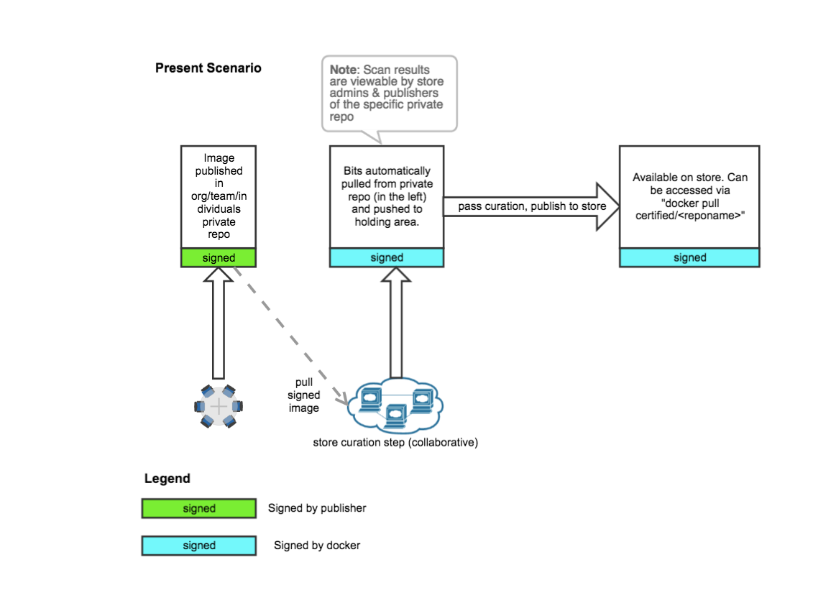

## For consumers

Docker ensures that all content is securely received and verified from original producers, and additionally vets images before adding them to the Docker Store.  Docker will cryptographically sign the images upon completion of a satisfactory image check, so that you can verify and trust certified content from the Docker Store.

Here’s the full trust chain in detail, along with how you can cryptographically verify completion of the process when pulling an image from Docker Store:

1.  Producers sign and push their images using Docker Content Trust to a private staging area

2.  Docker pulls the image, verifies the signatures to guarantee authenticity, integrity, and freshness of the image

3.  Docker performs a thorough review of the image for vulnerabilities and best practices for image hygiene, such as using minimal images and health-checks

4.  Upon a successful review, Docker signs the image and makes it officially available on Docker Store.  As a consumer, you can confirm that Docker signed the image by pulling and running with Docker Content Trust:

    ```
    DOCKER_CONTENT_TRUST=1 docker pull <image>

    DOCKER_CONTENT_TRUST=1 docker run <image>
    ```

## For producers

The Docker Store has a thorough and well-defined certification process to ensure top-quality content from producers is delivered to consumers in a trusted manner.  As a producer of content, you will be required to sign your images so that Docker can verify that your content is not tampered with upon starting the image certification and publishing process as outlined below:

1.  Producers sign and push their images using Docker Content Trust to a private staging area.  To do this, simply run a docker push command with Content Trust enabled:

    ```
    DOCKER_CONTENT_TRUST=1 docker pull <image>
    ```

2.  Docker verifies the signatures to guarantee authenticity, integrity, and freshness of the image.  All of the individual layers of your image, and the combination thereof, are encompassed as part of this verification check.  For more detail about Content Trust, please read more here: [https://docs.docker.com/engine/security/trust/content_trust/#understand-trust-in-docker](https://docs.docker.com/engine/security/trust/content_trust/#understand-trust-in-docker)

3.  Upon a successful signature verification, Docker pulls the original image to a private, internal staging area only accessible to the Docker Store certification team

4.  The Docker Store certification team performs a thorough review of the image for vulnerabilities and best practices for image hygiene, such as using minimal images and health-checks

5.  Upon a successful review, Docker signs the image and makes it officially available on Docker Store.  Similar to artifacts on the Apple Store, this is the final and only signature on the image.  Your consumers that the full certification process was completed by checking Docker’s signature by pulling and running with Docker Content Trust:

    ```
    DOCKER_CONTENT_TRUST=1 docker pull <image>

    DOCKER_CONTENT_TRUST=1 docker run <image>
    ```


