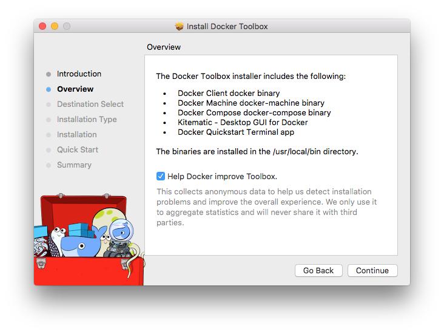

<!--[metadata]>
+++
title = "Toolbox Overview"
description = "Documentation that provides an overview of Toolbox"
keywords = ["docker, documentation, about, technology, kitematic, gui, toolbox"]
[menu.main]
parent="workw_toolbox"
weight=-10
+++
<![end-metadata]-->

# Docker Toolbox Overview

Docker Toolbox is an installer for quick setup and launch of a Docker environment on older Mac and Windows systems that do not meet the requirements of the new [Docker for Mac](/docker-for-mac/index.md) and [Docker for Windows](/docker-for-windows/index.md) apps.

## What's in the box

Toolbox includes these Docker tools:

* Docker Machine for running `docker-machine` commands

* Docker Engine for running the `docker` commands

* Docker Compose for running the `docker-compose` commands

* Kitematic, the Docker GUI

* a shell preconfigured for a Docker command-line environment

* Oracle VirtualBox

## Ready to get started?

Go to the <a href="https://www.docker.com/products/docker-toolbox" target="_blank">Docker Toolbox</a> product page and download Toolbox for Mac or Windows.

Choose the install instructions for your platform, and follow the steps:

* [Install Docker Toolbox on Mac OS X](toolbox_install_mac.md)

* [Install Docker Toolbox for Windows](toolbox_install_windows.md)

## Next Steps

* Try out the examples in the [Getting Started](/engine/getstarted/index.md) tutorial.

* Dig in deeper with [more tutorials and examples](/engine/tutorials/index.md) on building images, runnning containers, networking, managing data, and storing images on Docker Hub.

* [Learn about Kitematic](/kitematic/userguide.md)

* [Learn about Docker Machine](/machine/overview.md)

* [Learn about Docker Compose](/compose/overview.md)
