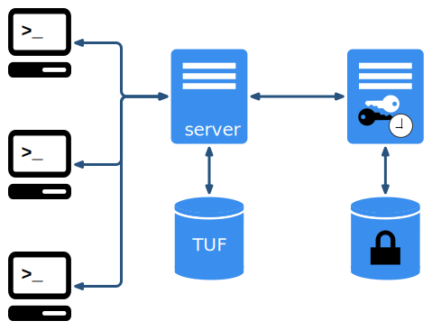
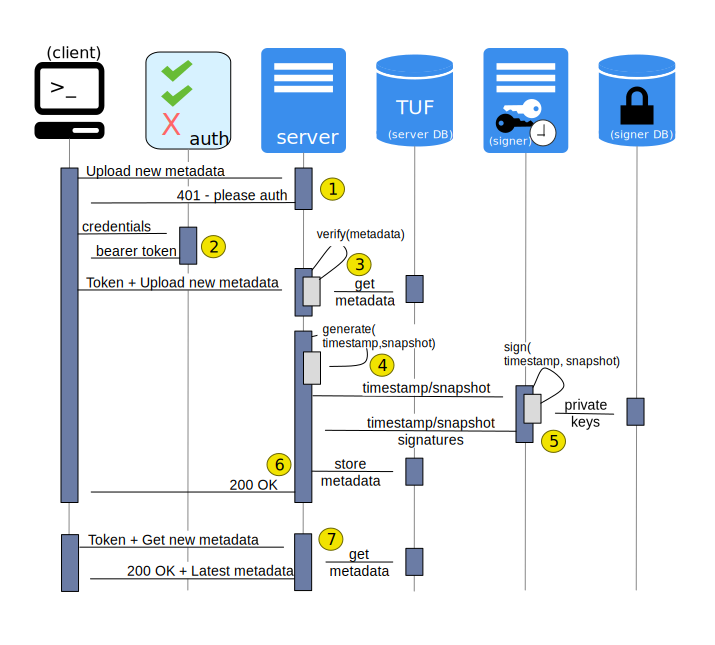

<!--[metadata]>
+++
title = "Understand the service architecture"
description = "How the three requisite notary components interact"
keywords = ["docker, notary, notary-client, docker content trust, content trust, notary-server, notary server, notary-signer, notary signer, notary architecture"]
[menu.main]
parent="mn_notary"
weight=3
+++
<![end-metadata]-->

# Understand the Notary service architecture

On this page, you get an overview of the Notary service architecture. This
document assumes a prior understanding of [The Update
Framework](https://theupdateframework.github.io/).

## Architecture and components

A Notary service consists of a Notary server, which stores and updates the
signed [TUF metadata files](
https://github.com/theupdateframework/tuf/blob/develop/docs/tuf-spec.txt#L348)
for multiple trusted collections in an associated database, and a Notary signer, which
stores private keys for and signs metadata for the Notary server. The following
diagram illustrates this architecture:

Root, targets, and (sometimes) snapshot metadata are generated and signed by
clients, who upload the metadata to the Notary server. The server is
responsible for:

- ensuring that any uploaded metadata is valid, signed, and self-consistent
- generating the timestamp (and sometimes snapshot) metadata
- storing and serving to clients the latest valid metadata for any trusted collection

The Notary signer is responsible for:

- storing the private signing keys
[wrapped](
https://tools.ietf.org/html/draft-ietf-jose-json-web-algorithms-31#section-4.4)
and [encrypted](
https://tools.ietf.org/html/draft-ietf-jose-json-web-algorithms-31#section-4.8)
using [Javascript Object Signing and Encryption](
https://github.com/dvsekhvalnov/jose2go) in a database separate from the
Notary server database
- performing signing operations with these keys whenever the Notary server requests

## Example client-server-signer interaction

The following diagram illustrates the interactions between the Notary client,
sever, and signer:

1. Notary server optionally supports authentication from clients using
   [JWT](http://jwt.io/) tokens. This requires an authorization server that
   manages access controls, and a cert bundle from this authorization server
   containing the public key it uses to sign tokens.

   If token authentication is enabled on Notary server, then any connecting
   client that does not have a token will be redirected to the authorization
   server.

   Please see the docs for [Docker Registry v2 authentication](
   https://github.com/docker/distribution/blob/master/docs/spec/auth/token.md)
   for more information.

2. The client will log in to the authorization server via basic auth over HTTPS,
   obtain a bearer token, and then present the token to Notary server on future
   requests.

3. When clients uploads new metadata files, Notary server checks them against
   any previous versions for conflicts, and verifies the signatures, checksums,
   and validity of the uploaded metadata.

4. Once all the uploaded metadata has been validated, Notary server
   generates the timestamp (and maybe snapshot) metadata. It sends this
   generated metadata to the Notary signer to be signed.

5. Notary signer retrieves the necessary encrypted private keys from its database
   if available, decrypts the keys, and uses them to sign the metadata. If
   successful, it sends the signatures back to Notary server.

6. Notary server is the source of truth for the state of a trusted collection of
   data, storing both client-uploaded and server-generated metadata in the TUF
   database. The generated timestamp and snapshot metadata certify that the
   metadata files the client uploaded are the most recent for that trusted collection.

   Finally, Notary server will notify the client that their upload was successful.

7. The client can now immediately download the latest metadata from the server,
   using the still-valid bearer token to connect. Notary server only needs to
   obtain the metadata from the database, since none of the metadata has expired.

   In the case that the timestamp has expired, Notary server would go through
   the entire sequence where it generates a new timestamp, request Notary signer
   for a signature, stores the newly signed timestamp in the database. It then
   sends this new timestamp, along with the rest of the stored metadata, to the
   requesting client.

## Threat model

Both the server and the signer are potential attack vectors. This section
discusses how our architecture is designed to deal with compromises.

### Notary server compromise

In the event of a Notary server compromise, an attacker would have direct access to
the metadata stored in the database as well as well as access to the credentials
used to communicate with Notary signer, and therefore, access to arbitrary signing
operations with any key the Signer holds.

- **Denial of Service** - An attacker could reject client requests and corrupt
    or delete metadata from the database, thus preventing clients from being
    able to download or upload metadata.

- **Malicious Content** - An attacker can create, store, and serve arbitrary
    metadata content for one or more trusted collections. However, they do not have
    access to any client-side keys, such as root, targets, and potentially the
    snapshot keys for the existing trusted collections.

    Only clients who have never seen the trusted collections, and who do not have any
    form of pinned trust, can be tricked into downloading and
    trusting the malicious content for these trusted collections.

    Clients that have previously interacted with any trusted collection, or that have
    their trust pinned to a specific certificate for the collections will immediately
    detect that the content is malicious and would not trust any root, targets,
    or (maybe) snapshot metadata for these collections.

- **Rollback, Freeze, Mix and Match** - The attacker can request that
    the Notary signer sign any arbitrary timestamp (and maybe snapshot) metadata
    they want. Attackers can lauch a freeze attack, and, depending on whether
    the snapshot key is available, a mix-and-match attack up to the expiration
    of the targets file.

    Clients both with and without pinned trust would be vulnerable to these
    attacks, so long as the attacker ensures that the version number of their
    malicious metadata is higher than the version number of the most recent
    good metadata that any client may have.

 Note that the timestamp and snapshot keys cannot be compromised in a server-only
 compromise, so a key rotation would not be necessary.  Once the Server
 compromise is mitigated, an attacker will not be
 able to generate valid timestamp or snapshot metadata and serve them on a
 malicious mirror, for example.

### Notary signer compromise

In the event of a Notary signer compromise, an attacker would have access to
all the private keys stored in a database. If the keys are stored in an HSM,
they would have the ability to sign arbitrary content with, and to delete, the
keys in the HSM, but not to exfiltrate the private material.

- **Denial of Service** - An attacker could reject all Notary server requests
  and corrupt or delete keys from the database (or even delete keys from an
  HSM), and thus prevent Notary servers from being able to sign generated
  timestamps or snapshots.

- **Key Compromise** - If the Notary signer uses a database as its backend,
  an attacker can exfiltrate all the private material.  Note that the capabilities
  of an attacker are the same as of a Notary server compromise in terms of
  signing arbitrary metadata, with the important detail that in this particular
  case key rotations will be necessary to recover from the attack.

## Related information

* [Run a Notary service](running_a_service.md)
* [Notary configuration files](reference/index.md)
