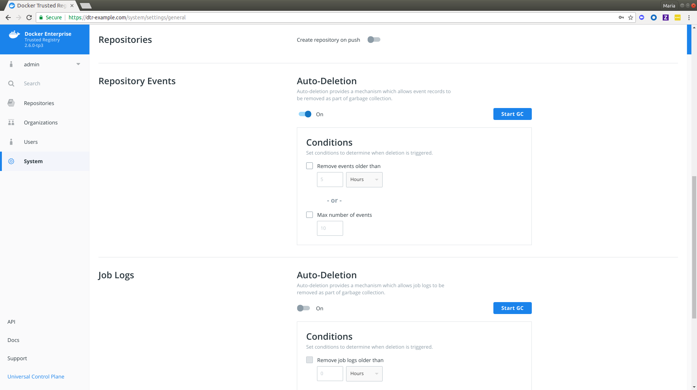
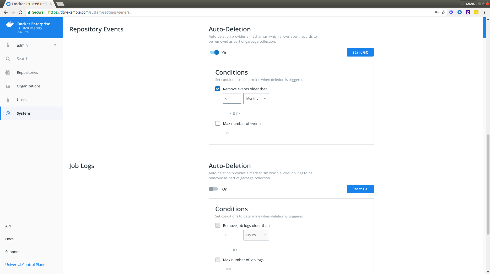
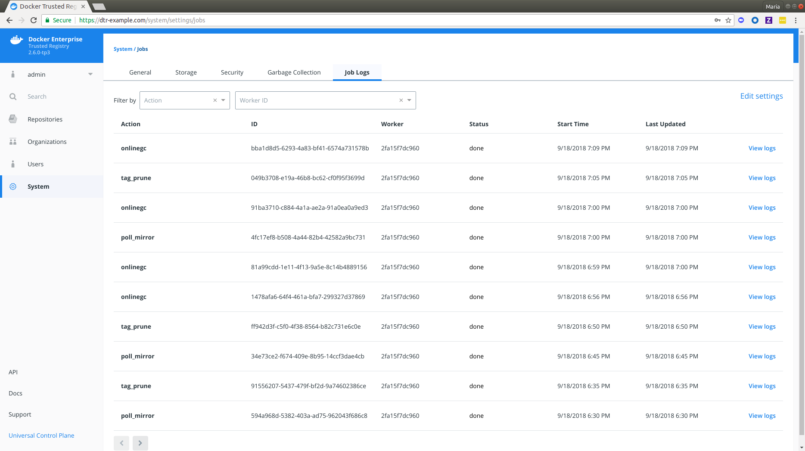

## Overview 

Docker Trusted Registry has a global setting for repository event auto-deletion. This allows event records to be removed as part of [garbage collection](../admin/configure/garbage-collection.md). DTR administrators can enable auto-deletion of repository events in DTR 2.6 based on specified conditions which are covered below.

## Steps

1. In your browser, navigate to `https://<dtr-url>` and log in with your UCP credentials. 

2. Select **System** on the left navigation pane which will display the **Settings** page by default.

3. Scroll down to **Repository Events** and turn on ***Auto-Deletion***.

     {: .img-fluid .with-border}

4. Specify the conditions with which an event auto-deletion will be triggered.

     {: .img-fluid .with-border}

     DTR allows you to set your auto-deletion conditions based on the following optional repository event attributes:

     | Name            | Description                                        | Example           |
     |:----------------|:---------------------------------------------------| :----------------|
     | Age        | Lets you remove events older than your specified number of  hours, days, weeks or months| `2 months` |
     | Max number of events  | Lets you specify the maximum number of events allowed in the repositories.  | `6000` |

If you check and specify both, events in your repositories will be removed during garbage collection if either condition is met. You should see a confirmation message right away.

5. Click **Start GC** if you're ready. Read more about [garbage collection](../admin/configure/garbage-collection/#under-the-hood) if you're unsure about this operation.

6. Navigate to **System > Job Logs** to confirm that `onlinegc` has happened.

   {: .img-fluid .with-border}

## Where to go next

- [Manage job logs](/ee/dtr/admin/manage-jobs/audit-jobs-via-ui/)
 
