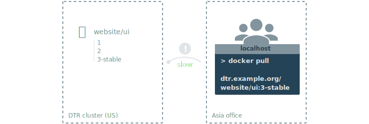
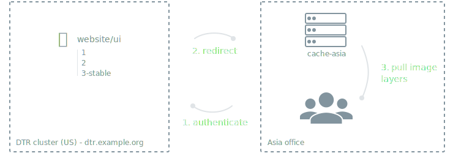

The further away you are from the geographical location where DTR is deployed,
the longer it will take the pull and push images.
This happens because the files being transferred from DTR to your machine
need to travel a longer distance, across multiple networks.



To decrease the time to pull an image, you can deploy DTR caches geographically
closer to users.

Caches are transparent to users, since users still login and pull images using
the DTR url address.
DTR checks if users are authorized to pull the image, and redirects the
request to the cache.



In this example, DTR is deployed on a datacenter in the United States, and
a cache is deployed in the Asia office.

Users in the Asia office updated their user profile in DTR to fetch from
the cache in their office. They pull an image using:

```
# Log in to DTR
docker login dtr.example.org

# Pull image
docker image pull dtr.example.org/website/ui:3-stable
```

DTR authenticates the request and checks if the user has permission to pull the
image they're requesting. If they have permissions, they'll get an image
manifest containing the list of image layers to pull and redirecting them
to pull them from the Asia cache.

When users request those images layers from the Asia cache, the cache pulls
them from DTR and keeps a copy that can be used to serve to other users without
having to pull the image layers from DTR again.

## Caches or mirroring policies

Use caches if you:

* Want to make image pulls faster for users in different geographical regions.
* Want to manage user permissions from a central place.

If you need users to be able to push images faster, or you want to implement
RBAC policies based on different regions, don't use caches.
Instead, deploy multiple DTR clusters and implement mirroring policies between
them.


With mirroring policies you can set up a development pipeline where images
are automatically pushed between different DTR repositories, or across
DTR deployments.

As an example you can set up a development pipeline with three different stages.
Developers can push and pull images from the development environment,
only pull from QA, and have no access to Production.

With multiple DTR deployments you can control the permissions developers have
for each deployment, and you can create policies to automatically push images
from one deployment to the next.
[Learn more about deployment policies](../../../user/promotion-policies/index.md).
