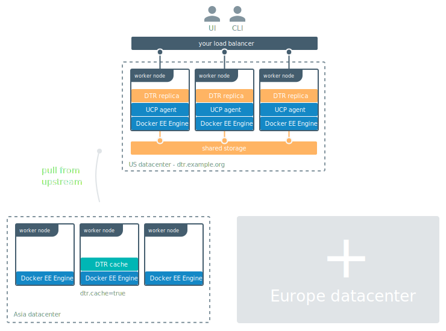
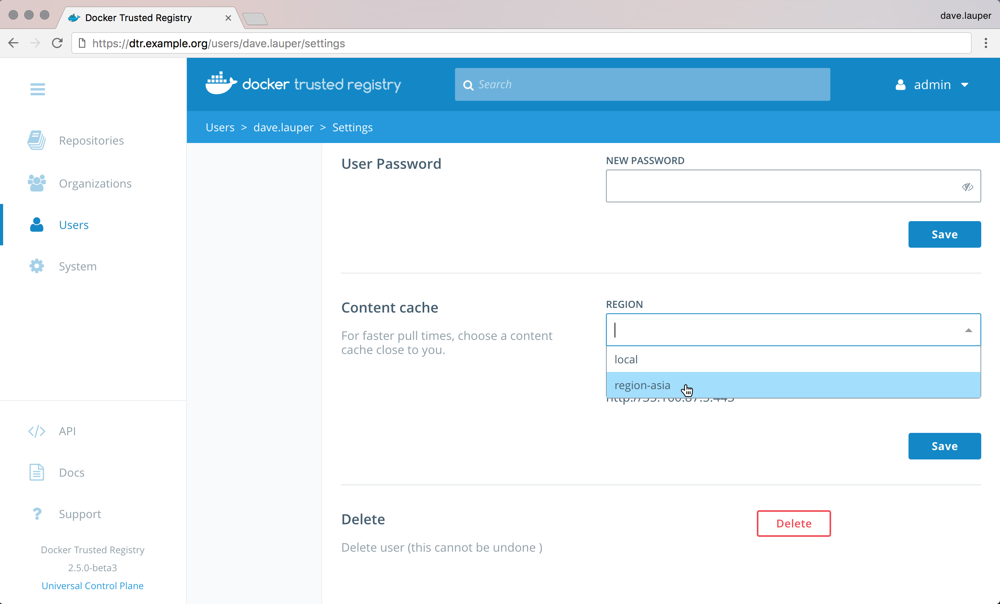

This example guides you in deploying a DTR cache, assuming that you've got
a DTR deployment up and running. It also assumes that you've provisioned
[multiple nodes and joined them into a swarm](strategy.md#system-requirements).



The DTR cache is going to be deployed as a Docker service, so that Docker
automatically takes care of scheduling and restarting the service if
something goes wrong.

We'll manage the cache configuration using a Docker configuration, and the TLS
certificates using Docker secrets. This allows you to manage the configurations
securely and independently of the node where the cache is actually running.

## Dedicate a node for the cache

To make sure the DTR cache is performant, it should be deployed on a node
dedicated just for it. Start by labelling the node where you want
to deploy the cache, so that you target the deployment to that node.

Use SSH to log in to a manager node of the swarm where you want to deploy
the DTR cache. If you're using UCP to manage that swarm, use a client bundle to
configure your Docker CLI client to connect to the swarm.

```
docker node update --label-add dtr.cache=true <node-hostname>
```

[Learn more about labelling nodes](/engine/swarm/manage-nodes.md#add-or-remove-label-metadata).


## Prepare the cache deployment

Create a file structure that looks like this:

```
├── docker-stack.yml    # Stack file to deploy cache with a single command
├── config.yml          # The cache configuration file
└── certs
    ├── cache.cert.pem  # The cache public key certificate
    ├── cache.key.pem   # The cache private key
    └── dtr.cert.pem    # DTR CA certificate
```

Then add the following content to each of the files:

<ul class="nav nav-tabs">
  <li class="active"><a data-toggle="tab" data-target="#tab1">docker-stack.yml</a></li>
  <li><a data-toggle="tab" data-target="#tab2">config.yml</a></li>
  <li><a data-toggle="tab" data-target="#tab3">cache.cert.pem</a></li>
  <li><a data-toggle="tab" data-target="#tab4">cache.key.pem</a></li>
  <li><a data-toggle="tab" data-target="#tab5">dtr.cert.pem</a></li>
</ul>
<div class="tab-content">
  <div id="tab1" class="tab-pane fade in active">
    <pre class="highlight">
      <code>
version: "3.3"
services:
  cache:
    image: {{ page.dtr_org }}/{{ page.dtr_repo }}-content-cache:{{ page.dtr_version }}
    entrypoint:
      - /start.sh
      - "/config.yml"
    ports:
      - 443:443
    deploy:
      replicas: 1
      placement:
        constraints: [node.labels.dtr.cache == true]
      restart_policy:
        condition: on-failure
    configs:
      - config.yml
    secrets:
      - dtr.cert.pem
      - cache.cert.pem
      - cache.key.pem
configs:
  config.yml:
    file: ./config.yml
secrets:
  dtr.cert.pem:
    file: ./certs/dtr.cert.pem
  cache.cert.pem:
    file: ./certs/cache.cert.pem
  cache.key.pem:
    file: ./certs/cache.key.pem
    </code>
  </pre>
  <hr>
  </div>

  <div id="tab2" class="tab-pane fade">
    <pre class="highlight">
      <code>
version: 0.1
log:
  level: info
storage:
  delete:
    enabled: true
  filesystem:
    rootdirectory: /var/lib/registry
http:
  addr: 0.0.0.0:443
  secret: generate-random-secret
  host: https://&lt;cache-url&gt;
  tls:
    certificate: /run/secrets/cache.cert.pem
    key: /run/secrets/cache.key.pem
middleware:
  registry:
      - name: downstream
        options:
          blobttl: 24h
          upstreams:
            - https://&lt;dtr-url&gt;:&lt;dtr-port&gt;
          cas:
            - /run/secrets/dtr.cert.pem
    </code>
  </pre>
  <hr>
  </div>
  <div id="tab3" class="tab-pane fade" markdown="1">

Add the public key certificate for the cache here. If the certificate has been
signed by an intermediate certificate authority, append it's public key
certificate at the end of the file.

  <hr>
  </div>

  <div id="tab4" class="tab-pane fade" markdown="1">

Add the unencrypted private key for the cache here.

  <hr>
  </div>

  <div id="tab5" class="tab-pane fade" markdown="1">

The cache communicates with DTR using TLS. If you've customized DTR
to use TLS certificates issued by a globally trusted certificate authority,
the cache automatically trusts DTR.

But if you're using the default DTR configuration, or DTR is using TLS
certificates signed by your own certificate authority, you need to configure
the cache to trust DTR.

Add the DTR CA certificate to the `certs/dtr.cert.pem` file. You can
do this by running:

```
curl -sk https://<dtr-url>/ca > certs/dtr.cert.pem
```

  <hr>
  </div>
</div>

With this configuration, the cache fetches image layers from DTR and keeps
a local copy for 24 hours. After that, if a user requests that image layer,
the cache fetches it again from DTR.

The cache is configured to persist data inside its container.
If something goes wrong with the cache service, Docker automatically redeploys a
new container, but previously cached data is not persisted.
You can [customize the storage parameters](/registry/configuration.md#storage),
if you want to store the image layers using a persistent storage backend.

Also, the cache is configured to use port 443. If you're already using that
port in the swarm, update the deployment and configuration files to use another
port. Don't forget to create firewall rules for the port you choose.

## Deploy the cache

Now that everything is set up, you can deploy the cache by running:

```
docker stack deploy --compose-file docker-stack.yml dtr-cache
```

You can check if the cache has been successfully deployed by running:

```
docker stack ps dtr-cache
```

Docker should show the dtr-cache stack is running.

## Register the cache with DTR

Now that you've deployed a cache, you need to configure DTR to know about it.
This is done using the `POST /api/v0/content_caches` API. You can use the
DTR interactive API documentation to use this API.

In the DTR web UI, click the top-right menu, and choose **API docs**.

{: .with-border}

Navigate to the `POST /api/v0/content_caches` line and click it to expand.
In the **body** field include:

```
{
  "name": "region-asia",
  "host": "https://<cache-url>:<cache-port>"
}
```

Click the **Try it out!** button to make the API call.

{: .with-border}

## Configure your user account

Now that you've registered the cache with DTR, users can configure
their user profile to pull images from DTR or the cache.

In the DTR web UI, navigate to your **Account**, click the **Settings**
tab, and change the **Content Cache** settings to use the cache you deployed.

{: .with-border}

If you need to set this for multiple users at the same time, use the
`/api/v0/accounts/{username}/settings` API endpoint.

Now when you pull images, you'll be using the cache.

## Test that the cache is working

To validate that the cache is working as expected:

1. [Push an image to DTR](../../../user/manage-images/pull-and-push-images.md).
2. Make sure your user account is configured to use the cache.
3. Delete the image from your local system.
4. Pull the image from DTR.


To validate that the cache is actually serving your request, and to
troubleshoot misconfigurations, check the logs for the cache service
by running:

```
docker service logs --follow dtr-cache_cache
```

The most common causes of configuration are due to TLS authentication:
* DTR not trusting the cache TLS certificates.
* The cache not trusting DTR TLS certificates.
* Your machine not trusting DTR or the cache.

When this happens, check the cache logs to troubleshoot the
misconfiguration.

## Clean up sensitive files

The certificates and private keys are now managed by Docker in a secure way.
Don't forget to delete sensitive files you've created on disk, like the
private keys for the cache:

```
rm -rf certs
```
