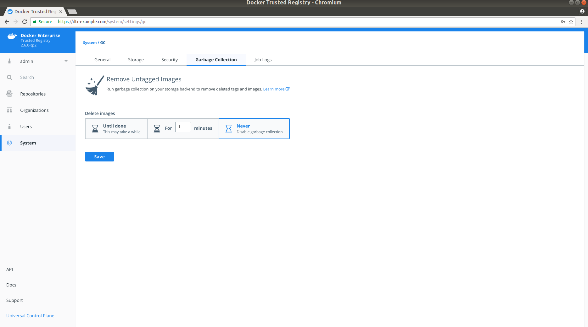
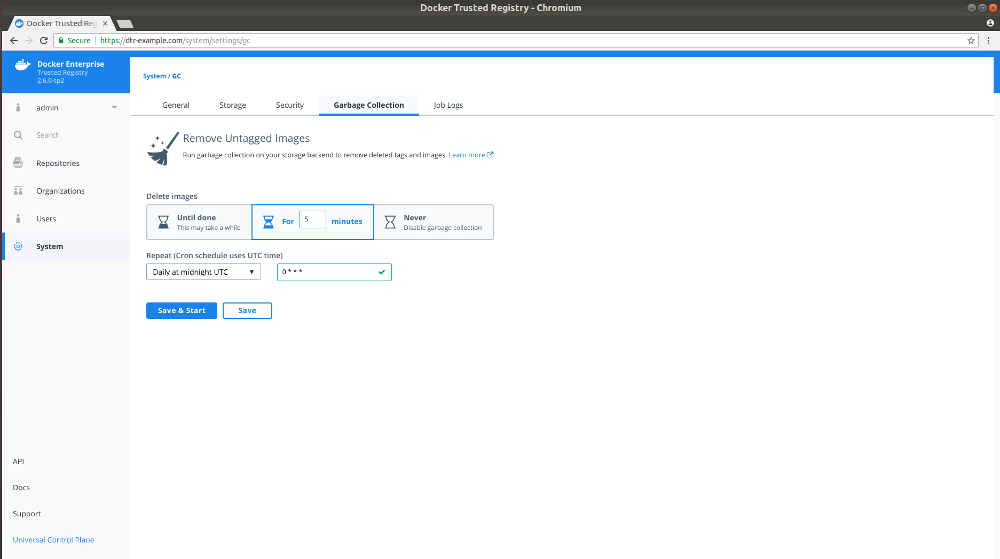

You can configure Docker Trusted Registry to automatically delete unused image
layers, thus saving you disk space. This process is also known as garbage collection.

## How DTR deletes unused layers

First you configure DTR to run a garbage collection job on a fixed schedule. At
the scheduled time DTR:

2. Identifies and marks unused image layers.
3. Deletes the marked image layers.

By default, when the garbage collection job starts DTR is put in read-only mode.

Starting in DTR 2.5, you can configure DTR to run garbage collection jobs
without putting DTR in read-only. This feature is still experimental.

To enable this, navigate to the **DTR web UI**, go to **Settings** and
choose **Garbage collection**.

{: .with-border}

Once enabled this setting can't be changed back. The upgrade process might
take a while depending on the amount of Docker images that you have stored.

During this upgrade users can still push and pull images from DTR, but
the garbage collection job will be temporarily disabled.

## Schedule garbage collection

Navigate to the **Settings** page, and choose **Garbage collection**.

{: .with-border}

Select for how long the garbage collection job should run:
* Until done: Run the job until all unused image layers are deleted.
* For x minutes: Only run the garbage collection job for a maximum of x minutes
at a time.
* Never: Never delete unused image layers.

Once you select for how long to run the garbage collection job, you can
configure its schedule (in UTC time) using the cron format.

{: .with-border}

Once everything is configured you can chose to **Save & start** to immediately
run the garbage collection job, or just **Save** to run the job on the next
scheduled interval.

## Stop the garbage collection job

Once the garbage collection job starts running, a banner is displayed on the
web UI explaining that users can't push images. If you're an administrator, you can click the banner to stop the garbage
collection job.

{: .with-border}

## Under the hood

Each image stored in DTR is made up of multiple files:

* A list of image layers that represent the image filesystem.
* A configuration file that contains the architecture of the image and other
metadata.
* A manifest file containing the list of all layers and configuration file for
an image.

All these files are stored in a content-addressable way in which the name of
the file is the result of hashing the file's content. This means that if two
image tags have exactly the same content, DTR only stores the image content
once, even if the tag name is different.

As an example, if `wordpress:4.8` and `wordpress:latest` have the same content,
they will only be stored once. If you delete one of these tags, the other won't
be deleted.

This means that when users delete an image tag, DTR can't delete the underlying
files of that image tag since it's possible that there are other tags that
also use the same files.

To delete unused image layers, DTR:
1. Becomes read-only to make sure that no one is able to push an image, thus
changing the underlying files in the filesystem.
2. Check all the manifest files and keep a record of the files that are
referenced.
3. If a file is never referenced, that means that no image tag uses it, so it
can be safely deleted.

## Where to go next

- [Deploy DTR caches](deploy-caches/index.md)
