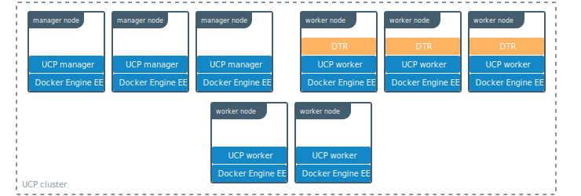
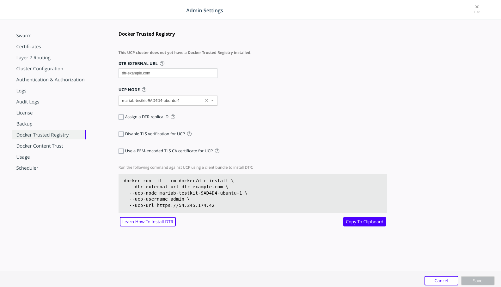
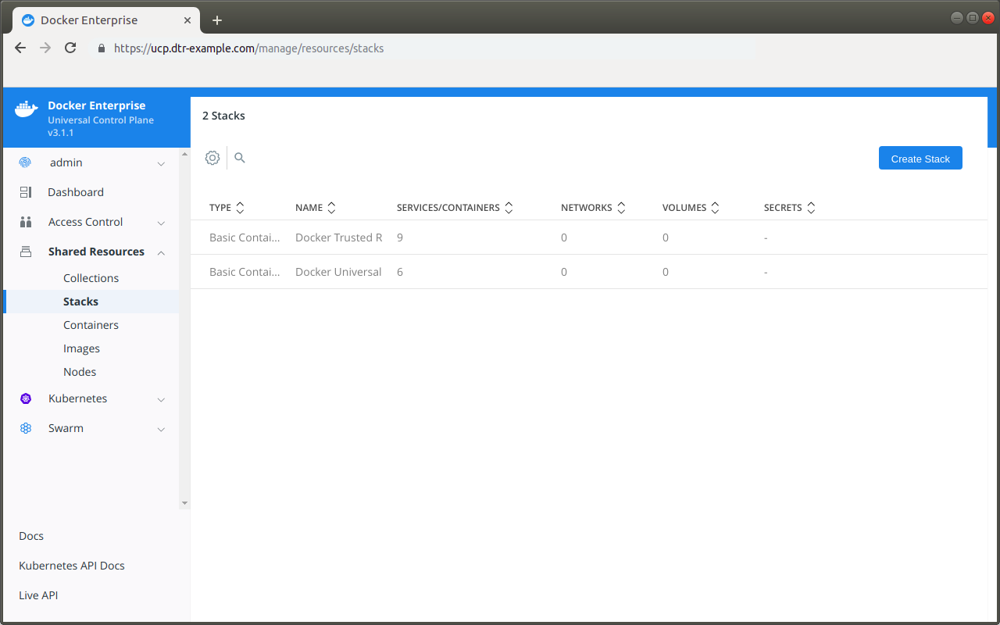
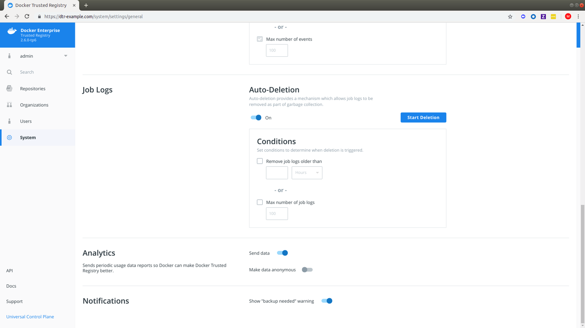
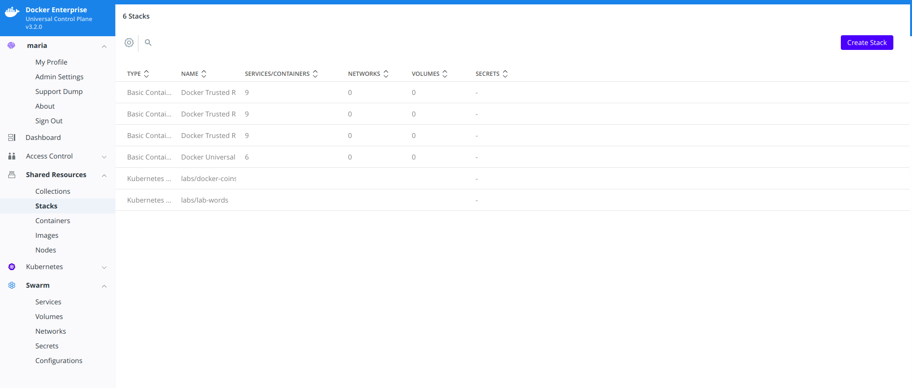

Docker Trusted Registry (DTR) is a containerized application that runs on a
swarm managed by the Universal Control Plane (UCP). It can be installed
on-premises or on a cloud infrastructure.

## Step 1. Validate the system requirements

Before installing DTR, make sure your
infrastructure meets the [system requirements](./system-requirements) that DTR needs to run.

## Step 2. Install UCP

Since DTR requires Docker Universal Control Plane (UCP)
to run, you need to [install UCP](/ee/ucp/admin/install/) on all the nodes where you plan to install DTR.

DTR needs to be installed on a worker node that is being managed by UCP.
You cannot install DTR on a standalone Docker Engine.




## Step 3. Install DTR

Once UCP is installed, navigate to the **UCP web UI**. In the **Admin Settings**,
choose **Docker Trusted Registry**.

{: .with-border}

After you configure all the options, you'll have a snippet that you can use
to deploy DTR. It should look like this:

```bash
# Pull the latest version of DTR
$ docker pull {{ page.dtr_org }}/{{ page.dtr_repo }}:{{ page.dtr_version }}

# Install DTR
$ docker run -it --rm \
  {{ page.dtr_org }}/{{ page.dtr_repo }}:{{ page.dtr_version }} install \
  --ucp-node <ucp-node-name> \
  --ucp-insecure-tls
```

You can run that snippet on any node where Docker is installed. As an example
you can SSH into a UCP node and run the DTR installer from there. By default
the installer runs in interactive mode and prompts you for any additional
information that is necessary.
[Learn more about the installer](/reference/dtr/2.6/cli/install/).

By default DTR is deployed with self-signed certificates, so your UCP deployment
might not be able to pull images from DTR.
Use the `--dtr-external-url <dtr-domain>:<port>` optional flag while deploying
DTR, so that UCP is automatically reconfigured to trust DTR. Since [HSTS (HTTP Strict-Transport-Security)
header](https://en.wikipedia.org/wiki/HTTP_Strict_Transport_Security) is included in all API responses, 
make sure to specify the FQDN (Fully Qualified Domain Name) of your DTR, or your browser may refuse 
to load the web interface.

## Step 4. Check that DTR is running

In your browser, navigate to the Docker **Universal Control Plane**
web interface, and navigate to **Shared Resources > Stacks**. DTR should be listed
as an application.


{: .with-border}

You can also access the **DTR web interface**, to make sure it is working. In your
browser, navigate to the address where you installed DTR.

{: .with-border}


## Step 5. Configure DTR

After installing DTR, you should configure:

  * The certificates used for TLS communication. [Learn more](../configure/use-your-own-tls-certificates.md).
  * The storage backend to store the Docker images. [Lean more](../configure/external-storage/index.md).

  To perform these configurations, navigate to the **Settings** page of DTR.

  {: .with-border}


## Step 6. Test pushing and pulling

Now that you have a working installation of DTR, you should test that you can
push and pull images to it:

* [Configure your local Docker Engine](../../user/access-dtr/index.md)
* [Create a repository](../../user/manage-images/index.md)
* [Push and pull images](../../user/manage-images/pull-and-push-images.md)

## Step 7. Join replicas to the cluster

This step is optional.

To set up DTR for high availability,
you can add more replicas to your DTR cluster. Adding more replicas allows you
to load-balance requests across all replicas, and keep DTR working if a
replica fails.

For high-availability you should set 3, 5, or 7 DTR replicas. The nodes where
you're going to install these replicas also need to be managed by UCP.

To add replicas to a DTR cluster, use the `docker/dtr join` command:

1. Load your [UCP user bundle](/ee/ucp/user-access/cli/#use-client-certificates).

2.  Run the join command.

    When you join a replica to a DTR cluster, you need to specify the
    ID of a replica that is already part of the cluster. You can find an
    existing replica ID by going to the **Shared Resources > Stacks** page on UCP.

    Then run:

    ```bash
    docker run -it --rm \
      {{ page.dtr_org }}/{{ page.dtr_repo }}:{{ page.dtr_version }} join \
      --ucp-node <ucp-node-name> \
      --ucp-insecure-tls
    ```
    
    > --ucp-node
    >
    > The <ucp-node-name> following the --ucp-node flag is the target node to
    > install the DTR replica. This is NOT the UCP Manager URL.
    {: .important}
    
3. Check that all replicas are running.

    In your browser, navigate to the Docker **Universal Control Plane**
    web interface, and navigate to **Shared Resources > Stacks**. All replicas should
    be displayed.

    {: .with-border}

## Where to go next

- [Install DTR offline](install-offline.md)
- [Upgrade DTR](../upgrade.md)
