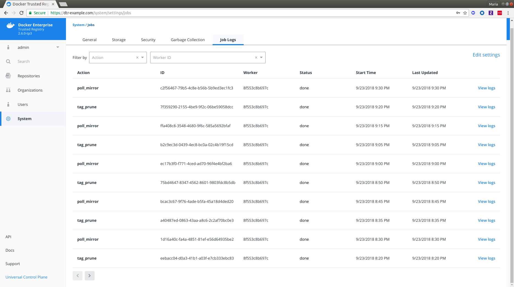
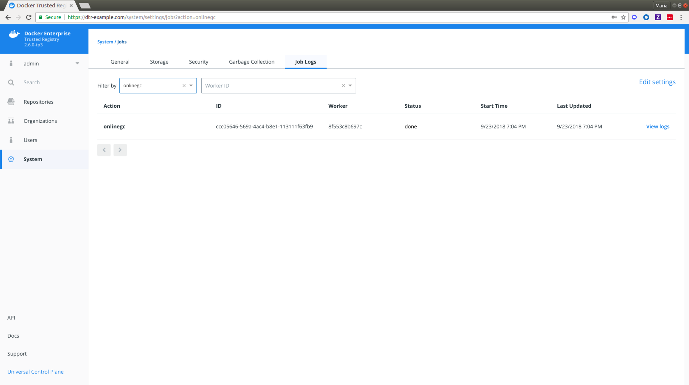
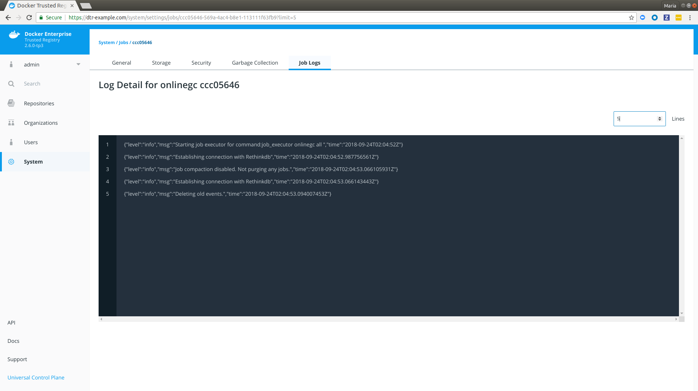

As of DTR 2.2, admins were able to [view and audit jobs within DTR](audit-jobs-via-api) using the API. DTR 2.6 enhances those capabilities by adding a **Job Logs** tab under **System** settings on the user interface. The tab displays a sortable and paginated list of jobs along with links to associated job logs. 

## Prerequisite
   * [Job Queue](job-queue.md)

## View Jobs List

To view the list of jobs within DTR, do the following:

1. Navigate to `https://<dtr-url>`and log in with your UCP credentials. 

2. Select **System** from the left navigation pane, and then click **Job Logs**. You should see a paginated list of past, running, and queued jobs. By default, **Job Logs** shows the latest `10` jobs on the first page.

    {: .img-fluid .with-border}

 	
3. Specify a filtering option. **Job Logs** lets you filter by:

	* Action: See [Audit Jobs via the API: Job Types](job-queue/#job-types) for an explanation on the different actions or job types.

	* Worker ID: The ID of the worker in a DTR replica that is responsible for running the job.

    {: .img-fluid .with-border}

4. Optional: Click **Edit Settings** on the right of the filtering options to update your **Job Logs** settings. See [Enable auto-deletion of job logs](auto-delete-job-logs) for more details.

### Job Details 
 
The following is an explanation of the job-related fields displayed in **Job Logs** and uses the filtered `online_gc` action from above.

| Job Detail          | Description                                        | Example |
|:----------------|:-------------------------------------------------|:--------|
| Action        |  The type of action or job being performed. See [Job Types](./job-queue/#job-types) for a full list of job types. | `onlinegc`
| ID  | The ID of the job. | `ccc05646-569a-4ac4-b8e1-113111f63fb9` |
| Worker        | The ID of the worker node responsible for running the job. | `8f553c8b697c`| 
| Status | Current status of the action or job. See [Job Status](./job-queue/#job-status) for more details.  | `done` |
| Start Time | Time when the job started. | `9/23/2018 7:04 PM` |
| Last Updated | Time when the job was last updated. | `9/23/2018 7:04 PM` |
| View Logs | Links to the full logs for the job.  | `[View Logs]` |  

## View Job-specific Logs

To view the log details for a specific job, do the following:

1. Click **View Logs** next to the job's **Last Updated** value. You will be redirected to the log detail page of your selected job.

    {: .img-fluid .with-border}

    
    Notice how the job `ID` is reflected in the URL while the `Action` and the abbreviated form of the job `ID` are reflected in the heading. Also, the JSON lines displayed are job-specific [DTR container logs](https://success.docker.com/article/how-to-check-the-docker-trusted-registry-dtr-logs). See [DTR Internal Components](../../architecture/#dtr-internal-components) for more details.

2. Enter or select a different line count to truncate the number of lines displayed. Lines are cut off from the end of the logs.

    {: .img-fluid .with-border}

## Where to go next

- [Enable auto-deletion of job logs](./auto-delete-job-logs.md)
