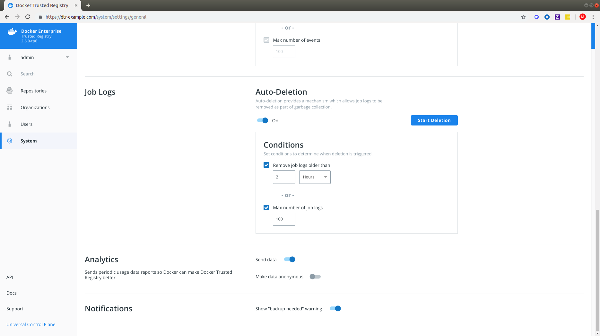
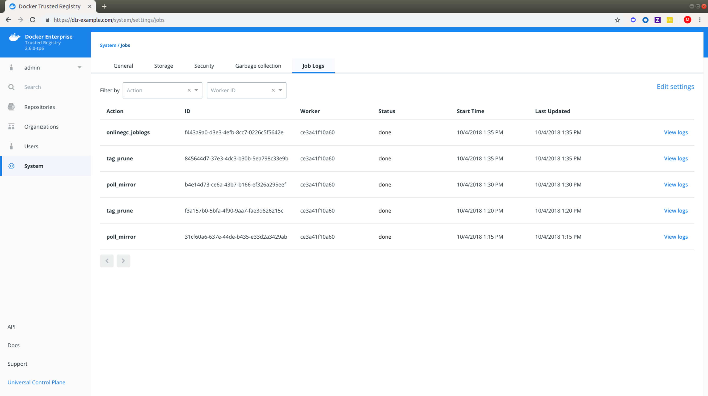

## Overview 

Docker Trusted Registry has a global setting for auto-deletion of job logs which allows them to be removed as part of [garbage collection](../configure/garbage-collection.md). DTR admins can enable auto-deletion of repository events in DTR 2.6 based on specified conditions which are covered below.

## Steps

1. In your browser, navigate to `https://<dtr-url>` and log in with your UCP credentials. 

2. Select **System** on the left navigation pane which will display the **Settings** page by default.

3. Scroll down to **Job Logs** and turn on **Auto-Deletion**.

    {: .img-fluid .with-border}

4. Specify the conditions with which a job log auto-deletion will be triggered.

    DTR allows you to set your auto-deletion conditions based on the following optional job log attributes:

    | Name            | Description                                        | Example           |
    |:----------------|:---------------------------------------------------| :----------------|
    | Age        | Lets you remove job logs which are older than your specified number of  hours, days, weeks or months| `2 months` |
    | Max number of events  | Lets you specify the maximum number of job logs allowed within DTR.  | `100` |

    {: .img-fluid .with-border}

    If you check and specify both, job logs will be removed from DTR during garbage collection if either condition is met. You should see a confirmation message right away.

5. Click **Start Deletion** if you're ready. Read more about [garbage collection](../configure/garbage-collection/#under-the-hood) if you're unsure about this operation.

6.  Navigate to **System > Job Logs** to confirm that [**onlinegc_joblogs**](job-queue/#job-types) has started. For a detailed breakdown of individual job logs, see [View Job-specific Logs](audit-jobs-via-ui/#view-job-specific-logs) in "Audit Jobs via the Web Interface."

{: .img-fluid .with-border}

> Job Log Deletion
>
> When you enable auto-deletion of job logs, the logs will be permanently deleted during garbage collection. See [Configure logging drivers](../../../../config/containers/logging/configure/) for a list of supported logging drivers and plugins.

## Where to go next

- [Monitor Docker Trusted Registry](/ee/dtr/admin/monitor-and-troubleshoot/)
 
