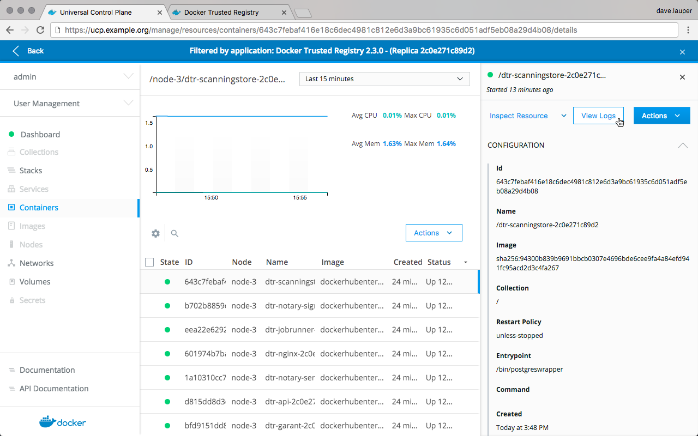

Docker Trusted Registry is a Dockerized application. To monitor it, you can
use the same tools and techniques you're already using to monitor other
containerized applications running on your cluster. One way to monitor
DTR is using the monitoring capabilities of Docker Universal Control Plane.

In your browser, log in to **Docker Universal Control Plane** (UCP), and
navigate to the **Stacks** page.
If you have DTR set up for high-availability, then all the DTR replicas are
displayed.

{: .with-border}

To check the containers for the DTR replica, **click the replica** you want
to inspect, click **Inspect Resource**, and choose **Containers**.

{: .with-border}

Now you can drill into each DTR container to see its logs and find the root
cause of the problem.

{: .with-border}

## Health check endpoints

DTR also exposes several endpoints you can use to assess if a DTR replica
is healthy or not:

* `/_ping`: Checks if the DTR replica is healthy, and
returns a simple json response. This is useful for load balancing or other
automated health check tasks.
* `/nginx_status`: Returns the number of connections being handled by the
NGINX front-end used by DTR.
* `/api/v0/meta/cluster_status`: Returns extensive information about all DTR
replicas.

## Cluster status

The `/api/v0/meta/cluster_status` [endpoint](/reference/dtr/2.5/api/)
requires administrator credentials, and returns a JSON object for the entire
cluster as observed by the replica being queried. You can authenticate your
requests using HTTP basic auth.

```bash
curl -ksL -u <user>:<pass> https://<dtr-domain>/api/v0/meta/cluster_status
```

```json
{
  "current_issues": [
   {
    "critical": false,
    "description": "... some replicas are not ready. The following servers are
                    not reachable: dtr_rethinkdb_f2277ad178f7",
  }],
  "replica_health": {
    "f2277ad178f7": "OK",
    "f3712d9c419a": "OK",
    "f58cf364e3df": "OK"
  },
}
```

You can find health status on the `current_issues` and `replica_health` arrays.
If this endpoint doesn't provide meaningful information when trying to
troubleshoot, try [troubleshooting using logs](troubleshoot-with-logs.md).

## Where to go next

- [Troubleshoot with logs](troubleshoot-with-logs.md)