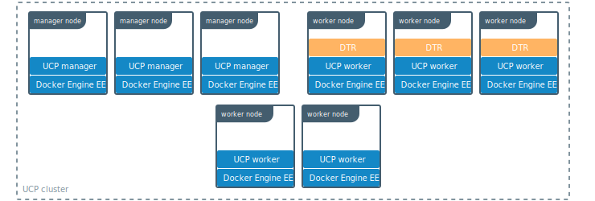
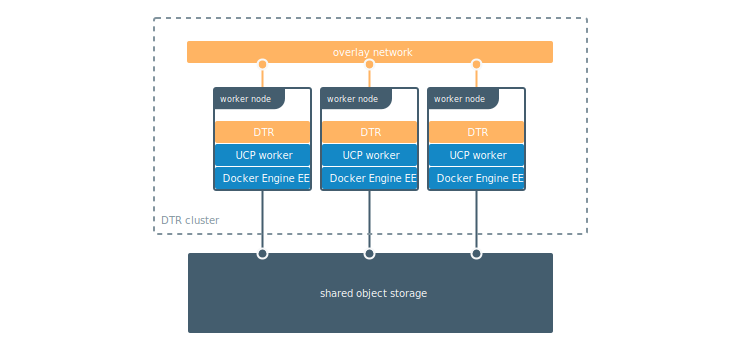
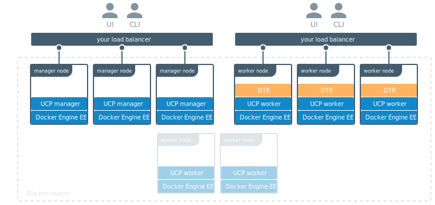

>

Docker Trusted Registry (DTR) is a containerized application that runs on a
Docker Universal Control Plane cluster.

Following DTR deployment use the Docker CLI client to login, push, and pull images.

## High availability

To ensure high-availability, deploy multiple DTR replicas, one on each UCP
worker node.

All DTR replicas run the same set of services, and any changes made to the configuration of one replica is automatically propagated to the other replicas.

## DTR internal components

Installing DTR on a node starts a selection of containers. Be aware that these containers are for the **internal DTR use ONLY** and are not intended for application use.

| Container Name                                 | Description                                                                                                                        |
|:-------------------------------------|:-----------------------------------------------------------------------------------------------------------------------------------|
| dtr-api-&lt;replica_id&gt;           | Executes DTR business logic;  serves the DTR web application and API                                                        |
| dtr-garant-&lt;replica_id&gt;        | Manages DTR authentication                                                                                                         |
| dtr-jobrunner-&lt;replica_id&gt;     | Runs cleanup jobs in the background                                                                                                |
| dtr-nginx-&lt;replica_id&gt;         | Receives http and https requests and proxies these requests to other DTR components; listens to ports 80 and 443 of the host, by default   |
| dtr-notary-server-&lt;replica_id&gt; | Receives, validates, and serves content trust metadata; is consulted when pushing or pulling to DTR with content trust enabled |
| dtr-notary-signer-&lt;replica_id&gt; | Performs server-side timestamp and snapshot signing for content trust metadata                                                     |
| dtr-registry-&lt;replica_id&gt;      | Implements the functionality for pulling and pushing Docker images; handles how images are stored                          |
| dtr-rethinkdb-&lt;replica_id&gt;     | Database for persisting repository metadata                                                                                      |
| dtr-scanningstore-&lt;replica_id&gt; | Stores security scanning data                                                                                                      |

## DTR networks

The *dtr-ol* overlay network is created when DTR is installed. This network allows DTR containers running on different nodes to connect for data replication purposes.

## DTR volumes

DTR uses a selection of volumes for persisting data.

| Volume Name                         | Description                                                                      |
|:------------------------------------|:---------------------------------------------------------------------------------|
| dtr-ca-&lt;replica_id&gt;           | Root key material for the DTR root CA that issues certificates                   |
| dtr-notary-&lt;replica_id&gt;       | Certificate and keys for the Notary components                                   |
| dtr-postgres-&lt;replica_id&gt;     | Vulnerability scans data                                                         |
| dtr-registry-&lt;replica_id&gt;     | Docker images data (if DTR is configured to store images on the local filesystem) |
| dtr-rethink-&lt;replica_id&gt;      | Repository metadata                                                              |
| dtr-nfs-registry-&lt;replica_id&gt; | Docker images data (if DTR is configured to store images on NFS)                  |

To customize the volume driver for these volumes, create the volumes prior to installing DTR. Then, during the installation, DTR will determine which existing volumes do not yet exist on the node and create them there using the default volume driver.

By default, the data for these volumes can be found at
`/var/lib/docker/volumes/<volume-name>/_data`.

## Image storage

By default, Docker Trusted Registry stores images on the filesystem of the node on which it is running. It should, though, be configured to use a centralized storage backend.

DTR supports the following storage backends:

* NFS
* Amazon S3
* Cleversafe
* Google Cloud Storage
* OpenStack Swift
* Microsoft Azure

## How to interact with DTR

DTR offers a web UI for managing settings and user permissions.

The Docker CLI client can be used to push and pull images, as can any other tool that is able to interact with a Docker registry.

## Where to go next

* [System requirements](admin/install/system-requirements.md)
* [Install DTR](admin/install/index.md)
