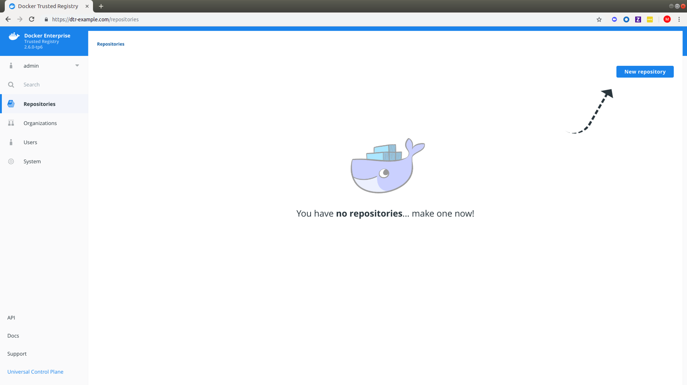

Since DTR is secure by default, you need to create the image repository before
being able to push the image to DTR.

In this example, we'll create the 'golang' repository in DTR.

## Create a repository

To create a new repository, navigate to the **DTR web application**, and click
the **New repository** button.

{: .with-border}

Add a **name and description** for the repository, and choose whether your
repository is public or private:

  * Public repositories are visible to all users, but can only be changed by
  users granted with permission to write them.
  * Private repositories can only be seen by users that have been granted
  permissions to that repository.

{: .with-border}

Click **Save** to create the repository.

When creating a repository in DTR, the full name of the repository becomes
`<dtr-domain-name>/<user-or-org>/<repository-name>`. In this example, the full
name of our repository will be `dtr.example.org/dave.lauper/golang`.

## Where to go next

- [Pull and push images](pull-and-push-images.md)
