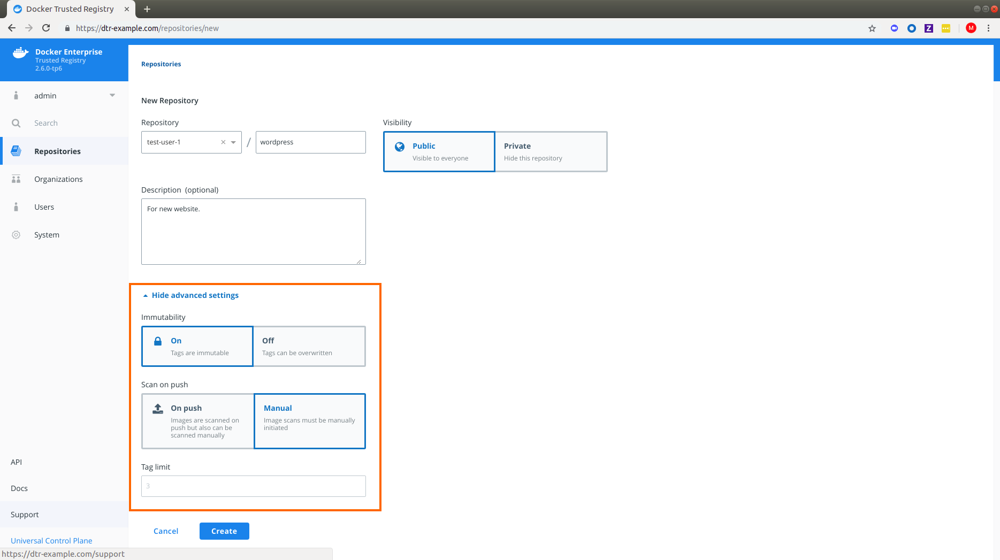

Since DTR is secure by default, you need to create the image repository before
being able to push the image to DTR.

In this example, we'll create the `wordpress` repository in DTR.

## Create a repository

1. To create an image repository for the first time, log in to `https://<dtr-url` with your UCP credentials.

2. Select **Repositories** from the left navigation pane and click **New repository** on the upper right corner of the Repositories page.

    {: .with-border}

3. Select your namespace and enter a name for your repository. You can optionally add a description.

4.  Choose whether your repository is `public` or `private`:

    * Public repositories are visible to all users, but can only be changed by
  users with write permissions to them.
    * Private repositories can only be seen by users that have been granted
  permissions to that repository.

    {: .with-border}

5. Click **Create** to create the repository. 

   When creating a repository in DTR, the full name of the repository becomes
`<dtr-domain-name>/<user-or-org>/<repository-name>`. In this example, the full
name of our repository will be `dtr-example.com/test-user-1/wordpress`.

6. Optional: Click **Show advanced settings** to make your tags immutable or set your image scanning trigger.

    {: .with-border}

> Immutable Tags and Tag Limit
>
> Starting in DTR 2.6, repository admins can enable tag pruning by [setting a tag limit](../tag-pruning/#set-a-tag-limit). This can only be set if you turn off **Immutability** and allow your repository tags to be overwritten. 

> Image name size for DTR
>
> When creating an image name for use with DTR ensure that the organization and repository name has less than 56 characters and that the entire image name which includes domain, organization and repository name does not exceed 255 characters.
>
> The 56-character `<user-or-org/repository-name>` limit in DTR is due to an underlying limitation in how the image name information is stored within DTR metadata in RethinkDB.  RethinkDB currently has a Primary Key length limit of 127 characters.
>
> When DTR stores the above data it appends a sha256sum comprised of 72 characters to the end of the value to ensure uniqueness within the database.  If the `<user-or-org/repository-name>` exceeds 56 characters it will then exceed the 127 character limit in RethinkDB (72+56=128).
{: .important}

## Where to go next

- [Review repository info](review-repository-info.md)
