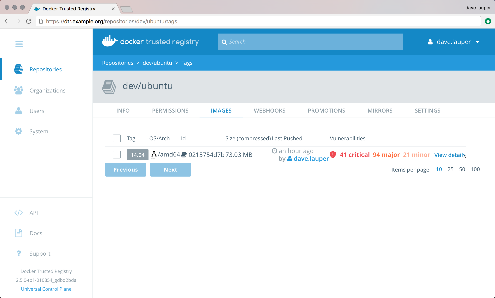
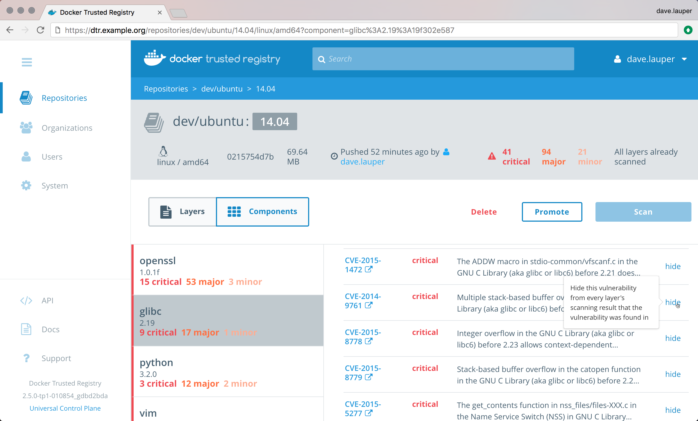

DTR scans your images for vulnerabilities but sometimes it can report that
your image has vulnerabilities you know have been fixed. If that happens you
can dismiss the warning.

In the **DTR web UI**, navigate to the repository that has been scanned.

{: .with-border}

Click **View details** for the image you want to see the scan results, and
choose **Components** to see the vulnerabilities for each component packaged
in the image.

Select the component with the vulnerability you want to ignore, navigate to the
vulnerability, and click **hide**.

{: .with-border}

The vulnerability is hidden system-wide and will no longer be reported as a vulnerability
on other affected images with the same layer IDs or digests.

After dismissing a vulnerability, DTR will not reevaluate the promotion policies
you have set up for the repository.

If you want the promotion policy to be reevaluated for the image after hiding
a particular vulnerability, click **Promote**.

## Where to go next

* [Scan images for vulnerabilities](scan-images-for-vulnerabilities.md)
