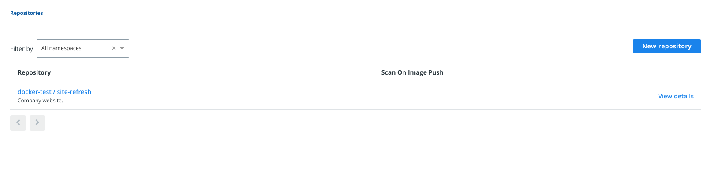
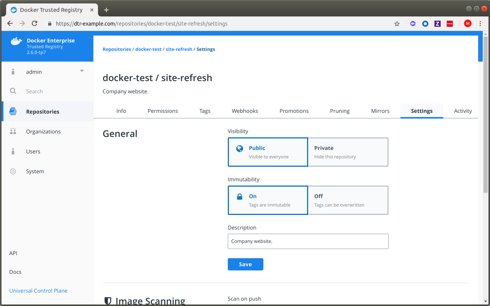






By default, users with [read and write access](../../admin/manage-users/permission-levels/) to a repository can push the same tag
multiple times to that repository. For example, when ***user A*** pushes an image to `{{ org }}/{{ repo }}:{{ tag }}`, there is no preventing ***user B***
from pushing an image with the same name but a completely different functionality. This can make it difficult to trace the image back to the build that generated	
it.

To prevent tags from being overwritten, you can configure a repository to be immutable.
Once configured, DTR will not allow anyone else to push another image tag with the same name.

## Make tags immutable

You can enable tag immutability on a repository when you create it, or at any time after.

### New Repository


If you're not already logged in, navigate to `https://<dtr-url>`and log in with your UCP credentials. To make tags immutable on a new repository, do the following:

1.  Follow the steps in [Create a repository](../manage-images/).

2.  Click **Show advanced settings**, and turn on **Immutability**. Note that tag limits are enabled when immutability is enabled for a repository.

### Existing Repository

1.  Select **Repositories** on the left navigation pane, and then click on the name of the repository that you want to view. Note that you will have to click on the repository name following the `/` after the specific namespace for your repository.
    
     {: .img-fluid .with-border}

2.  Select the **Settings** tab, and turn on **Immutability**.
    
     {: .with-border}


From now on, you will get an error message when trying to push a tag
that already exists:

```bash
docker push {{ domain }}/{{ org }}/{{ repo }}:{{ tag }}
unknown: tag={{ tag }} cannot be overwritten because {{ domain }}/{{ org }}/{{ repo }} is an immutable repository
```

## Where to go next

- [Sign images](sign-images/index.md)
