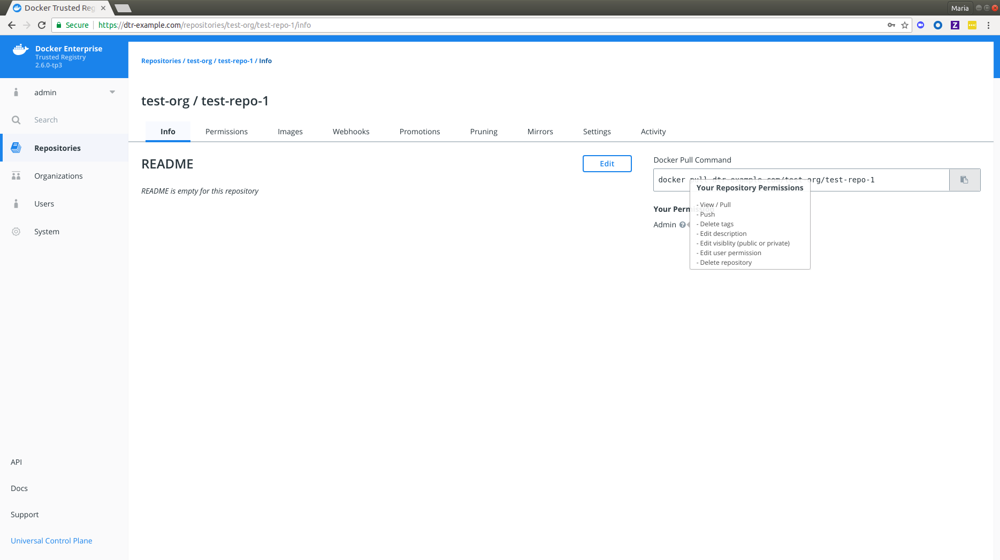

The **Repository Info** tab includes the following details:
   *  README (which you can [edit if you have admin rights to the repository](../../admin/manage-users/permission-levels/#team-permission-levels))
   *  Docker Pull Command
   *  Your repository permissions

To learn more about pulling images, see [Pull and Push Images](pull-and-push-images.md). To review your repository permissions, do the following:

1.  Navigate to `https://<dtr-url>`and log in with your UCP credentials. 

2. Select **Repositories** on the left navigation pane, and then click on the name of the repository that you want to view. Note that you will have to click on the repository name following the `/` after the specific namespace for your repository.
    
    {: .img-fluid .with-border}

3. You should see the **Info** tab by default. Notice **Your Permission** under **Docker Pull Command**. 

4. Hover over the question mark next to [your permission level](../../admin/manage-users/permission-levels/) to view the list of repository events you have access to.
	   
    {: .img-fluid .with-border}

> Limitations
>
> Your permissions list may include repository events that are not displayed in the **Activity** tab. It is also not an exhaustive list of event types displayed on your activity stream. To learn more about repository events, see [Audit Repository Events](../audit-repository-events).

## Where to go next

- [Pull and push images](pull-and-push-images.md)
