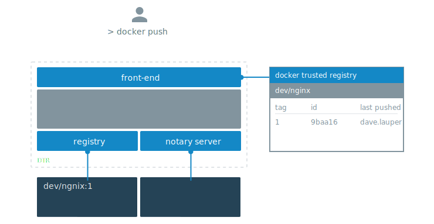
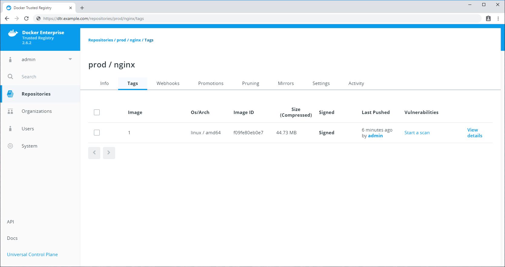

2 Key components of the Docker Trusted Registry is the Notary Server and Notary
Signer. These 2 containers give us the required components to use Docker Content
Trust right out of the box. [Docker Content
Trust](/engine/security/trust/content_trust/) allows us to sign image tags,
therefore whoever pulls the image can validate that they are getting the image
you create, or a forged one. 

As part of Docker Trusted Registry both the Notary server and the Registry
server are accessed through a front end Proxy, with both components sharing the
UCP's RBAC Engine. Therefore no additional configuration of the Docker Client
is required to use trust.

Docker Content Trust is integrated into the Docker CLI, allowing you to
configure repositories, add signers and sign images all through the `$ docker
trust` command.



## Sign images that UCP can trust

UCP has a feature which will prevent [untrusted
images](/ee/ucp/admin/configure/run-only-the-images-you-trust/) from being
deployed on the cluster. To use this feature, we first need to upload and sign
images into DTR. To tie the signed images back to UCP, we will actually sign the
images with private keys of UCP users. Inside of a UCP Client bundle the
`key.pem` can be used a User's private key, with the `cert.pem` being a public
key within a x509 certificate. 

To sign images in a way that UCP trusts them, you need to:

1. Download a Client Bundle for a User you want to use to sign the images. 
2. Load the private key of the User into your workstations trust store.
3. Initialize trust metadata for the repository. 
4. Delegate signing for that repository to the UCP User.
5. Sign the Image. 

In this example we're going to pull a nginx image from the Docker Hub, re-tag it
as `dtr.example.com/dev/nginx:1`, push the image to DTR and sign it in a way
that is trusted by UCP. If you manage multiple repositories, you'll have to do
the same procedure for each repository.

### Import a UCP User's Private Key

Once you have download and extracted a UCP User's client bundle into your local
directory, you need to load the Private key into the local Docker trust store
`(~/.docker/trust)`. The name used here is purely metadata to help keep track of
which keys you have imported.

```bash
$ docker trust key load --name jeff key.pem
Loading key from "key.pem"...
Enter passphrase for new jeff key with ID a453196:
Repeat passphrase for new jeff key with ID a453196:
Successfully imported key from key.pem
```

### Initialize the trust metadata and add the Public Key

Next, we need to initiate trust metadata for a DTR repository. If you have not
done so already, navigate to the **DTR web UI**, and create a repository for
your image. In this example we've created the `prod/nginx` repository.

As part of initiating the repository, we will add the public key of the UCP User
as a signer. You will be asked for a number of passphrases to protect the keys.
Make a note of these passphrases, and see [Managing Delegations in a Notary Server](/engine/security/trust/trust_delegation/#managing-delegations-in-a-notary-server) 
to learn more about managing keys.


```bash
$ docker trust signer add --key cert.pem jeff dtr.example.com/prod/nginx
Adding signer "jeff" to dtr.example.com/prod/nginx...
Initializing signed repository for dtr.example.com/prod/nginx...
Enter passphrase for root key with ID 4a72d81:
Enter passphrase for new repository key with ID e0d15a2:
Repeat passphrase for new repository key with ID e0d15a2:
Successfully initialized "dtr.example.com/prod/nginx"
Successfully added signer: jeff to dtr.example.com/prod/nginx
```

We can inspect the trust metadata of the repository to make sure the User has
been added correctly.

```bash
$ docker trust inspect --pretty dtr.example.com/prod/nginx

No signatures for dtr.example.com/prod/nginx

List of signers and their keys for dtr.example.com/prod/nginx

SIGNER              KEYS
jeff                927f30366699

Administrative keys for dtr.example.com/prod/nginx

  Repository Key:       e0d15a24b741ab049470298734397afbea539400510cb30d3b996540b4a2506b
  Root Key:     b74854cb27cc25220ede4b08028967d1c6e297a759a6939dfef1ea72fbdd7b9a
```

### Sign the Image

Finally, we will sign an image tag. These steps download the Image from the
Docker Hub, retag the Image to the DTR repository, push the image up to DTR, as
well as signing the tag with the UCP User's keys. 

```bash
$ docker pull nginx:latest

$ docker tag nginx:latest dtr.example.com/prod/nginx:1

$ docker trust sign dtr.example.com/prod/nginx:1
Signing and pushing trust data for local image dtr.example.com/prod/nginx:1, may overwrite remote trust data
The push refers to repository [dtr.example.com/prod/nginx]
6b5e2ed60418: Pushed
92c15149e23b: Pushed
0a07e81f5da3: Pushed
1: digest: sha256:5b49c8e2c890fbb0a35f6050ed3c5109c5bb47b9e774264f4f3aa85bb69e2033 size: 948
Signing and pushing trust metadata
Enter passphrase for jeff key with ID 927f303:
Successfully signed dtr.example.com/prod/nginx:1
```

We can inspect the trust metadata again to make sure the image tag has been
signed successfully. 

```bash
$ docker trust inspect --pretty dtr.example.com/prod/nginx:1

Signatures for dtr.example.com/prod/nginx:1

SIGNED TAG          DIGEST                                                             SIGNERS
1                   5b49c8e2c890fbb0a35f6050ed3c5109c5bb47b9e774264f4f3aa85bb69e2033   jeff

List of signers and their keys for dtr.example.com/prod/nginx:1

SIGNER              KEYS
jeff                927f30366699

Administrative keys for dtr.example.com/prod/nginx:1

  Repository Key:       e0d15a24b741ab049470298734397afbea539400510cb30d3b996540b4a2506b
  Root Key:     b74854cb27cc25220ede4b08028967d1c6e297a759a6939dfef1ea72fbdd7b9a
```

Or we can have a look at the signed image from within the **DTR UI**. 

{: .with-border}

### Adding Additional Delegations

If you wanted to sign this image with multiple UCP Users, maybe if you had a use
case where an image needed to be signed by a member of the `Security` team and a
member of the `Developers` team. Then you can add multiple signers to a
repository. 

To do so, first load a private key from a UCP User of the Security Team's in to
the local Docker Trust Store. 

```bash
$ docker trust key load --name security key.pem
Loading key from "key.pem"...
Enter passphrase for new security key with ID 5ac7d9a:
Repeat passphrase for new security key with ID 5ac7d9a:
Successfully imported key from key.pem
```

Upload the Public Key to the Notary Server and Sign the Image. You will be asked
for both the Developers passphrase, as well as the Security Users passphrase to
sign the tag. 

```bash
$ docker trust signer add --key cert.pem security dtr.example.com/prod/nginx
Adding signer "security" to dtr.example.com/prod/nginx...
Enter passphrase for repository key with ID e0d15a2:
Successfully added signer: security to dtr.example.com/prod/nginx

$ docker trust sign dtr.example.com/prod/nginx:1
Signing and pushing trust metadata for dtr.example.com/prod/nginx:1
Existing signatures for tag 1 digest 5b49c8e2c890fbb0a35f6050ed3c5109c5bb47b9e774264f4f3aa85bb69e2033 from:
jeff
Enter passphrase for jeff key with ID 927f303:
Enter passphrase for security key with ID 5ac7d9a:
Successfully signed dtr.example.com/prod/nginx:1
```

Finally, we can check the tag again to make sure it is now signed by 2
signatures. 

```bash
$ docker trust inspect --pretty dtr.example.com/prod/nginx:1

Signatures for dtr.example.com/prod/nginx:1

SIGNED TAG          DIGEST                                                             SIGNERS
1                   5b49c8e2c890fbb0a35f6050ed3c5109c5bb47b9e774264f4f3aa85bb69e2033   jeff, security

List of signers and their keys for dtr.example.com/prod/nginx:1

SIGNER              KEYS
jeff                927f30366699
security            5ac7d9af7222

Administrative keys for dtr.example.com/prod/nginx:1

  Repository Key:       e0d15a24b741ab049470298734397afbea539400510cb30d3b996540b4a2506b
  Root Key:     b74854cb27cc25220ede4b08028967d1c6e297a759a6939dfef1ea72fbdd7b9a
```

For more advanced use cases like this, see [Delegations for content trust](/engine/security/trust/trust_delegation/).

## Delete trust data

If an Administrator wants to delete a DTR repository that contains Trust
metadata, they will be prompted to delete the trust metadata first before the
repository can be removed. 

To delete trust metadata we need to use the Notary CLI. For information on how
to download and configure the Notary CLI head
[here](/engine/security/trust/trust_delegation/#configuring-the-notary-client)


```bash
$ notary delete dtr.example.com/prod/nginx --remote
Deleting trust data for repository dtr.example.com/prod/nginx
Enter username: admin
Enter password:
Successfully deleted local and remote trust data for repository dtr.example.com/prod/nginx
```

If you don't include the `--remote` flag, Notary deletes local cached content
but will not delete data from the Notary server.

## Where to go next

* [Automating Docker Content
  Trust](/engine/security/trust/trust_automation/)
* [Using Docker Content Trust with a Remote UCP](./trust-with-remote-ucp/)
