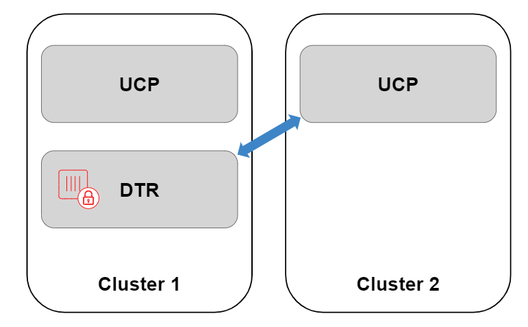
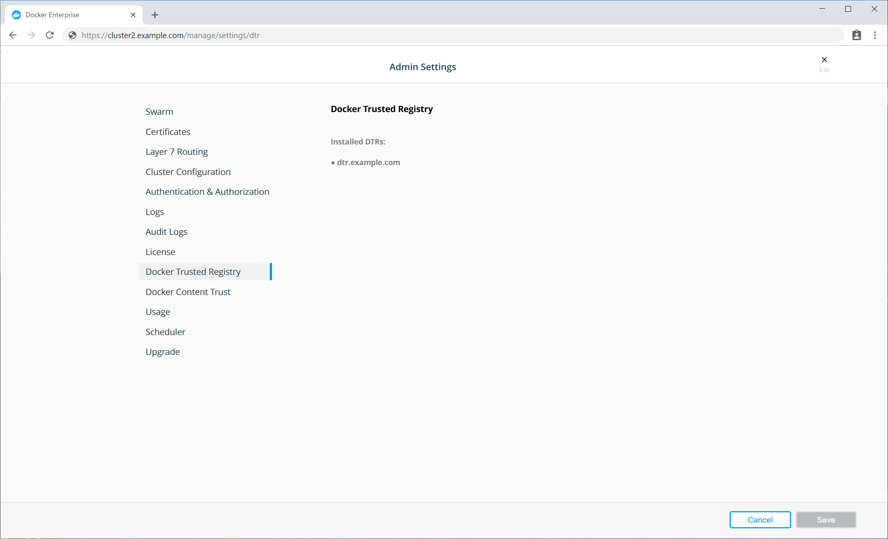
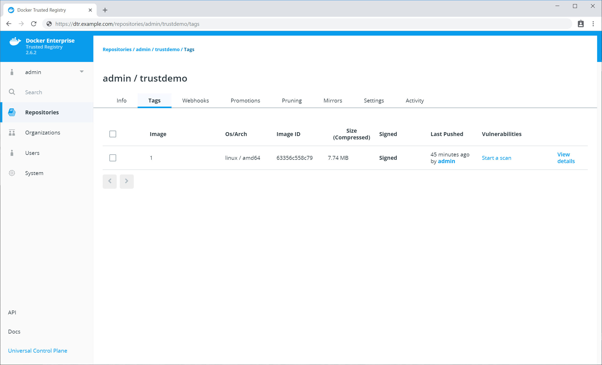
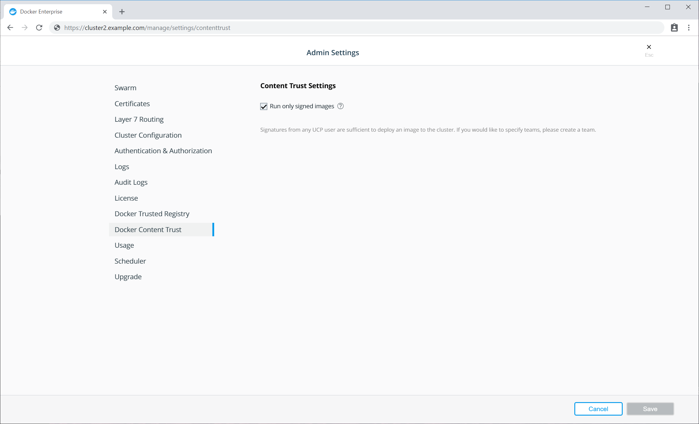

For more advanced deployments, you may want to share one Docker Trusted Registry
across multiple Universal Control Planes. However, customers wanting to adopt
this model alongside the [Only Run Signed
Images](/ee/ucp/admin/configure/run-only-the-images-you-trust.md) UCP feature, run into problems as each UCP operates an independent set of users.

Docker Content Trust (DCT) gets around this problem, since users from
a remote UCP are able to sign images in the central DTR and still apply runtime
enforcement.

In the following example, we will connect DTR managed by UCP cluster 1 with a remote UCP cluster which we are calling UCP cluster 2, sign the
image with a user from UCP cluster 2, and provide runtime enforcement
within UCP cluster 2. This process could be repeated over and over,
integrating DTR with multiple remote UCP clusters, signing the image with users
from each environment, and then providing runtime enforcement in each remote UCP
cluster separately.



> Before attempting this guide, familiarize yourself with [Docker Content
> Trust](engine/security/trust/content_trust/#signing-images-with-docker-content-trust)
> and [Only Run Signed
> Images](/ee/ucp/admin/configure/run-only-the-images-you-trust.md) on a
> single UCP. Many of the concepts within this guide may be new without that
> background. 

## Prerequisites

- Cluster 1, running UCP 3.0.x or higher, with a DTR 2.5.x or higher deployed
  within the cluster.
- Cluster 2, running UCP 3.0.x or higher, with no DTR node.
- Nodes on Cluster 2 need to trust the Certificate Authority which signed DTR's
  TLS Certificate. This can be tested by logging on to a cluster 2 virtual
  machine and running `curl https://dtr.example.com`.
- The DTR TLS Certificate needs be properly configured, ensuring that the
  **Loadbalancer/Public Address** field has been configured, with this address
  included [within the
  certificate](/ee/dtr/admin/configure/use-your-own-tls-certificates/).
- A machine with the [Docker Client](/ee/ucp/user-access/cli/) (CE 17.12 /
  EE 1803 or newer) installed, as this contains the relevant `$ docker trust`
  commands. 

## Registering DTR with a remote Universal Control Plane

As there is no registry running within cluster 2, by default UCP will not know
where to check for trust data. Therefore, the first thing we need to do is
register DTR within the remote UCP in cluster 2. When you normally
install DTR, this registration process happens by default to
a local UCP, or cluster 1.

> The registration process allows the remote UCP to get signature data from DTR,
> however this will not provide Single Sign On (SSO). Users on cluster 2 will not be
> synced with cluster 1's UCP or DTR. Therefore when pulling images, registry
> authentication will still need to be passed as part of the service definition
> if the repository is private. See
> [Kubernetes](https://kubernetes.io/docs/tasks/configure-pod-container/pull-image-private-registry/#create-a-secret-in-the-cluster-that-holds-your-authorization-token)
> or [Docker
> Swarm](/engine/swarm/services/#create-a-service-using-an-image-on-a-private-registry) examples.

To add a new registry, retrieve the Certificate
Authority (CA) used to sign the DTR TLS Certificate through the DTR URL's
`/ca` endpoint.

```bash
$ curl -ks https://dtr.example.com/ca > dtr.crt
```

Next, convert the DTR certificate into a JSON configuration file
for registration within the UCP for cluster 2.

You can find a template of the `dtr-bundle.json` below. Replace the host address with your DTR URL, and enter the contents of the DTR CA certificate between the new line commands `\n and \n`.

> ### JSON Formatting
> Ensure there are no line breaks between each line
> of the DTR CA certificate within the JSON file. Use your favorite JSON formatter for validation.

```bash
$ cat dtr-bundle.json
{
  "hostAddress": "dtr.example.com",
  "caBundle": "-----BEGIN CERTIFICATE-----\n<contents of cert>\n-----END CERTIFICATE-----"
}
```

Now upload the configuration file to cluster 2's UCP
through the UCP API endpoint, `/api/config/trustedregistry_`. To authenticate
against the API of cluster 2's UCP, we have downloaded a [UCP client
bundle](/ee/ucp/user-access/cli/#download-client-certificates/), extracted it in
the current directory, and will reference the keys for authentication. 

```bash
$ curl --cacert ca.pem --cert cert.pem --key key.pem \
    -X POST \
    -H "Accept: application/json" \
    -H "Content-Type: application/json" \
    -d @dtr-bundle.json \
    https://cluster2.example.com/api/config/trustedregistry_
```

Navigate to the UCP web interface to verify that the JSON file was imported successfully, as the UCP endpoint will not
output anything. Select **Admin > Admin Settings > Docker
Trusted Registry**. If the registry has been added successfully, you should see
the DTR listed. 

{: .with-border}


Additionally, you can check the full [configuration
file](/ee/ucp/admin/configure/ucp-configuration-file/) within cluster 2's UCP.
Once downloaded, the `ucp-config.toml` file should now contain a section called
`[registries]`

```bash
$ curl --cacert ca.pem --cert cert.pem --key key.pem https://cluster2.example.com/api/ucp/config-toml > ucp-config.toml
```

If the new registry isn't shown in the list, check the `ucp-controller` container logs on cluster 2.

## Signing an image in DTR

We will now sign an image and push this to DTR. To sign images we need a user's public private
key pair from cluster 2.  It can be found in a client bundle, with 
`key.pem` being a private key and `cert.pem` being the public key on an **X.509**
certificate.

First, load the private key into the local Docker trust store
`(~/.docker/trust)`. The name used here is purely metadata to help keep track of
which keys you have imported.

```
$ docker trust key load --name cluster2admin key.pem
Loading key from "key.pem"...
Enter passphrase for new cluster2admin key with ID a453196:
Repeat passphrase for new cluster2admin key with ID a453196:
Successfully imported key from key.pem
```

Next initiate the repository, and add the public key of cluster 2's user
as a signer. You will be asked for a number of passphrases to protect the keys.
Keep note of these passphrases, and see [Docker Content Trust documentation]
(/engine/security/trust/trust_delegation/#managing-delegations-in-a-notary-server) to learn more about managing keys.


```
$ docker trust signer add --key cert.pem cluster2admin dtr.example.com/admin/trustdemo
Adding signer "cluster2admin" to dtr.example.com/admin/trustdemo...
Initializing signed repository for dtr.example.com/admin/trustdemo...
Enter passphrase for root key with ID 4a72d81:
Enter passphrase for new repository key with ID dd4460f:
Repeat passphrase for new repository key with ID dd4460f:
Successfully initialized "dtr.example.com/admin/trustdemo"
Successfully added signer: cluster2admin to dtr.example.com/admin/trustdemo
```

Finally, sign the image tag. This pushes the image up to DTR, as well as
signs the tag with the user from cluster 2's keys.

```
$ docker trust sign dtr.example.com/admin/trustdemo:1
Signing and pushing trust data for local image dtr.example.com/admin/trustdemo:1, may overwrite remote trust data
The push refers to repository [dtr.olly.dtcntr.net/admin/trustdemo]
27c0b07c1b33: Layer already exists
aa84c03b5202: Layer already exists
5f6acae4a5eb: Layer already exists
df64d3292fd6: Layer already exists
1: digest: sha256:37062e8984d3b8fde253eba1832bfb4367c51d9f05da8e581bd1296fc3fbf65f size: 1153
Signing and pushing trust metadata
Enter passphrase for cluster2admin key with ID a453196:
Successfully signed dtr.example.com/admin/trustdemo:1
```

Within the DTR web interface, you should now be able to see your newly pushed tag with the **Signed** text next to the size. 

{: .with-border}


You could sign this image multiple times if required, whether it's multiple
teams from the same cluster wanting to sign the image, or you integrating DTR with more remote UCPs so users from clusters 1,
2, 3, or more can all sign the same image. 

## Enforce Signed Image Tags on the Remote UCP 

We can now enable **Only Run Signed Images** on the remote UCP. To do this,
login to cluster 2's UCP web interface as an admin. Select **Admin > Admin Settings > Docker Content
Trust**. 

See [Run only the images you trust](/ee/ucp/admin/configure/run-only-the-images-you-trust/) for more information on only running signed images in UCP.


{: .with-border}


Finally we can now deploy a workload on cluster 2, using a signed
image from a DTR running on cluster 1. This workload could be a simple `$ docker
run`, a Swarm Service, or a Kubernetes workload. As a simple test, source a
client bundle, and try running one of your signed images. 

```
$ source env.sh

$ docker service create dtr.example.com/admin/trustdemo:1
nqsph0n6lv9uzod4lapx0gwok
overall progress: 1 out of 1 tasks
1/1: running   [==================================================>]
verify: Service converged

$ docker service ls
ID                  NAME                    MODE                REPLICAS            IMAGE                                   PORTS
nqsph0n6lv9u        laughing_lamarr         replicated          1/1                 dtr.example.com/admin/trustdemo:1
```

## Troubleshooting

If the image is stored in a private repository within DTR, you need to pass credentials to the
Orchestrator as there is no SSO between cluster 2 and DTR. See the relevant
[Kubernetes](https://kubernetes.io/docs/tasks/configure-pod-container/pull-image-private-registry/#create-a-secret-in-the-cluster-that-holds-your-authorization-token) or [Docker Swarm](/engine/swarm/services/#create-a-service-using-an-image-on-a-private-registry) documentation for more details.

### Example Errors

#### Image or trust data does not exist
```
image or trust data does not exist for dtr.example.com/admin/trustdemo:1
```

This means something went wrong when initiating the repository or signing the
image, as the tag contains no signing data. 

#### Image did not meet required signing policy

```
Error response from daemon: image did not meet required signing policy

dtr.example.com/admin/trustdemo:1: image did not meet required signing policy 
```

This means that the image was signed correctly, however the user who signed the
image does not meet the signing policy in cluster 2. This could be because you
signed the image with the wrong user keys.

#### DTR URL must be a registered trusted registry

```
Error response from daemon: dtr.example.com must be a registered trusted registry. See 'docker run --help'.
```

This means you have not registered DTR to work with a remote UCP instance yet, as outlined in [Registering DTR with a Remote Universal Control Plane](#registering-dtr-with-a-remote-universal-control-plane).

## Where to go next

- [Learn more about Notary](/notary/advanced_usage.md)
- [Notary architecture](/notary/service_architecture.md)
