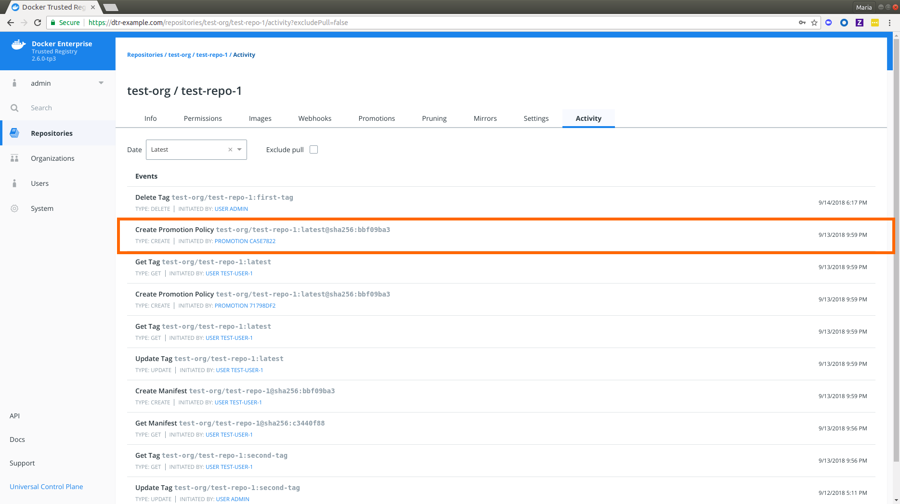

> BETA DISCLAIMER
>
> This is beta content. It is not yet complete and should be considered a work in progress. This content is subject to change without notice.

## Overview 

Actions are events which happen to a particular image within a particular repository. To provide better visibility into these events, DTR 2.6 now includes an **Activity** tab on each repository displaying a sortable paginated list of the most recent events. Event types listed will vary according to your [repository permission level](../admin/manage-users/permission-levels/). Additionally, DTR administrators can [enable auto-deletion of repository events](../admin/configure/auto-delete-repo-events/) as part of maintenance and cleanup.
  
In the following section, we will show you how to:

* View the list of events in a repository, including <a href="#event-types">event types</a> associated with your permission level
* Review actions or events type that you have access to

## View List of Events

To view the list of events within a repository, do the following:
1. Navigate to `https://<dtr-url>`and log in with your UCP credentials. 

2. Select **Repositories** on the left navigation pane, and then click on the name of the repository that you want to view. Note that you will have to click on the repository name following the `/` after the specific namespace for your repository.

{: .img-fluid .with-border}
	
3. Select the **Activity** tab. You should see a paginated list of the latest events based on your repository permission level. By default, **Activity** shows the latest `10` events and excludes pull events, which are only visible to repository and DTR administrators. 
   * If you're a repository or a trusted admin, uncheck "Exclude pull" to view pull events. 
   * To update your event view, select a different time filter from the drop-down list.  

{: .img-fluid .with-border}

### Activity Stream
 
First, let's break down the data included in an event. We will use the highlighted "Create Promotion Policy" event as our example.

| Event Detail          | Description                                        | Example |
|:----------------|:-------------------------------------------------|:--------|
| Label        |  Friendly name of the event. | `Create Promotion Policy`
| Repository  | This will always be the repository in review following the `<user-or-org>/<repository_name>` convention outlined in [Create a Repository](../user/manage-images/#create-a-repository). | `test-org/test-repo-1` |
| Tag        | Tag affected by the event, when applicable. | `test-org/test-repo-1:latest` where `latest` is the affected tag| 
| SHA | SHA digest value for **CREATE** operations such as creating a new image tag or a promotion policy. | `sha256:bbf09ba3` |
| Type | Event type. Possible values are: `CREATE`, `GET`, `UPDATE`, `DELETE`, `SEND`, `FAIL` and `SCAN` | `CREATE` |
| Initiated by | Links to the profile of the user who initiated the event, where applicable. For image promotion events, this will reflect the promotion ID and link to the **Promotions** page of the repository. | `PROMOTION CA5E7822` |
| Date and Time | When the event happened in your configured time zone. | `9/13/2018 9:59 PM` |  

### Events and Permissions
For more details on different permission levels within DTR, see [Authentication and authorization in DTR](../admin/manage-users/) to understand the minimum level required to view the different repository events.  

| Repository Event          | Description                                        | Minimum Permission Level        |
|:----------------|:---------------------------------------------------| :----------------|
| Push        |  Refers to "Create Manifest" and "Update Tag" events. Learn more about [pushing images](../user/manage-images/pull-and-push-images/#push-the-image). | Authenticated Users |
| Scan        | Requires [security scanning to be set up](../admin/configure/set-up-vulnerability-scans/) by a DTR admin. Once enabled, this will display as a `SCAN` event type.  | Authenticated Users |
| Promotion        |  Refers to a "Create Promotion Policy" event which links to the **Promotions** tab of the repository where you can edit the existing promotions. See [Promotion Policies](../user/promotion-policies/) for different ways to promote an image. | Repository Admin |
| Delete        |  Refers to "Delete Tag" events. Learn more about [deleting images](../user/manage-images/pull-and-push-images/#delete-images). | Authenticated Users |
| Pull        | Refers to "Get Tag" events. Learn more about [pulling images](../Learn more about [pulling images](../user/manage-images/pull-and-push-images/#pull-the-image). | Repository Admin |
| Mirror        |Refers to ______  | Repository Admin |
| Create repo        | Refers to "Create Repository" events. See [Create a repository](../user/manage-images/) for more details. | Authenticated Users |

## Review Repository Permissions

To review the type of events you have access to, do the following:
1. Navigate to the **Info** tab. 
2. Notice **Your Permission** under **Docker Pull Command**. 
3. Hover over the question mark next to [your permission level](../admin/manage-users/permission-levels/) to view the list of repository events you have access to.
	   
{: .img-fluid .with-border}

> KNOWN LIMITATIONS
>
> Your repository permissions list may include events that are not displayed in the **Activity** tab. It is also not an exhaustive list of event types on your activity stream.

## Where to go next

- [Enable auto-deletion of repository events](../admin/auto-delete-repo-events.md)
