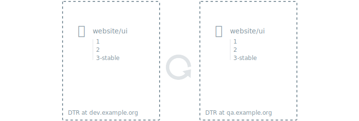

Docker Trusted Registry allows you to set up a mirror of a repository by
constantly polling it and pulling new images that get pushed into it.

This way you can ensure your images are persisted across different DTR
deployments for high availability.
It also makes it easy to create a development pipeline that allows different
users access to an image without having to grant them access to a DTR deployment
they should not have access to.



To mirror a repository, start by [creating a repository](../manage-images/index.md)
in the DTR deployment that will serve as the mirror.

Setting up a mirror is only available from the DTR API.

The easiest way to use the DTR API is to use the interactive documentation
that's available in the DTR web UI. In the left navigation bar of the
**DTR web UI**, click **API**.

Search for the endpoint:

```
POST /api/v0/repositories/{namespace}/{reponame}/pollMirroringPolicies
```

Click **Try it out** and fill-in the details. 'Namespace' and 'reponame' refer
to the repository that will be the mirror.
The other fields are the remote repository to poll from and the credentials
to use. As a best practice, use a service account just for this purpose. Instead
of providing the password for that account, you should pass a
[authentication token](../access-tokens.md)

If the DTR deployment to mirror images from is using self-signed certificates or
certificates signed by your own certificate authority, you also need to provide
the public key certificate for that certificate authority.
You can get it by accessing `https://<dtr-domain>/ca`.

Click **execute** and make sure you got an HTTP 201 response, signaling that the
the repository is polling the source repository every couple of minutes

## Where to go next

* [Mirror images to another registry](push-mirror.md)
