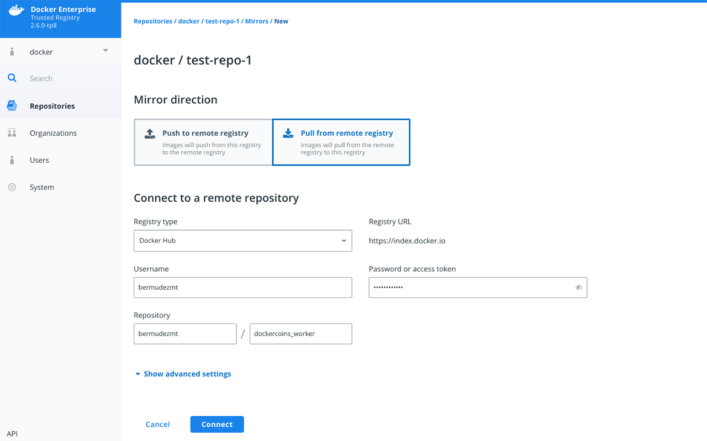

Docker Trusted Registry allows you to set up a mirror of a repository by
constantly polling it and pulling new image tags as they are pushed. This ensures your images are replicated across different registries for high availability. It also makes it easy to create a development pipeline that allows different
users access to a certain image without giving them access to everything in the remote registry.


To mirror a repository, start by [creating a repository](../manage-images/index.md)
in the DTR deployment that will serve as your mirror. Previously, you were only able to set up pull mirroring from the API. Starting in DTR 2.6, you can also mirror and pull from a remote DTR or Docker Hub repository. 

## Pull mirroring on the web interface

To get started:

1.  Navigate to `https://<dtr-url>` and log in with your UCP credentials. 

2.  Select **Repositories** on the left navigation pane, and then click on the name of the repository that you want to view. Note that you will have to click on the repository name following the `/` after the specific namespace for your repository.

3.  Select the **Mirrors** tab and click **New mirror policy**.

4. In the ***New Mirror*** page, specify the following details:
   * Mirror direction: Choose "Pull from remote registry"
   * Registry type: You can choose between **Docker Trusted Registry** and **Docker Hub**. If you choose DTR, enter your DTR URL. Otherwise, **Docker Hub** defaults to `https://index.docker.io`.
   * Username and Password or access token: Your credentials in the remote repository you wish to poll from. To use an access token instead of your password, see [authentication token](../access-tokens.md).
   * Repository: Enter the `namespace` and the `repository_name` after the `/`.
   * Show advanced settings: Enter the TLS details for the remote repository or check `Skip TLS verification`. If the DTR remote repository is using self-signed certificates or certificates signed by your own certificate authority, you also need to provide the public key certificate for that CA. You can retrieve the certificate by accessing `https://<dtr-domain>/ca`. "Remote certificate authority" is optional for a remote repository in Docker Hub.


    {: .img-fluid .with-border}


5. Click **Connect**.

6. Once you have successfully connected to the remote repository, click **Save** to mirror future tags. To mirror all tags, click **Save & Apply** instead.


    {: .img-fluid .with-border}

## Pull mirroring on the API

There are different ways to send your DTR API requests. To explore the different API resources and endpoints from the web interface, click **API** on the bottom left navigation pane.

Search for the endpoint:

```
POST /api/v0/repositories/{namespace}/{reponame}/pollMirroringPolicies
```

Click **Try it out** and enter your HTTP request details. `namespace` and `reponame` refer
to the repository that will be poll mirrored. The boolean field, `initialEvaluation`, corresponds to **Save** when set to `false` and will only mirror images created after your API request. Setting it to `true` corresponds to **Save & Apply** which means all tags in the remote repository will be evaluated and mirrored. The other body parameters correspond to the relevant remote repository details that you can [see on the DTR web interface](#pull-mirroring-on-the-web-interface). As a best practice, use a service account just for this purpose. Instead of providing the password for that account, you should pass an
[authentication token](../access-tokens.md).

If the DTR remote repository is using self-signed certificates or
certificates signed by your own certificate authority, you also need to provide
the public key certificate for that CA.
You can get it by accessing `https://<dtr-domain>/ca`. The `remoteCA` field is optional for mirroring a Docker Hub repository.

Click **Execute**. On success, the API returns an `HTTP 201` response. 

> Known Issues
>
> For issues related to pull mirroring, see Known Issues section of [DTR 2.6.0 release notes](../../release-notes).

## Review the poll mirror job log

Once configured, the system polls for changes in the remote repository and runs the `poll_mirror` job every 30 minutes. On success, the system will pull in new images and mirror them in your local repository. Starting in DTR 2.6, you can filter for `poll_mirror` jobs to review when it was last ran. To manually trigger the job and force pull mirroring, use the `POST /api/v0/jobs` API endpoint and specify `poll_mirror` as your action.

```
curl -X POST "https:/<dtr-url>/api/v0/jobs" -H "accept: application/json" -H "content-type: application/json" -d "{ \"action\": \"poll_mirror\"}"
```

See [Manage Jobs](../../admin/manage-jobs/job-queue/) to learn more about job management within DTR.


## Where to go next

* [Mirror images to another registry](push-mirror.md)
