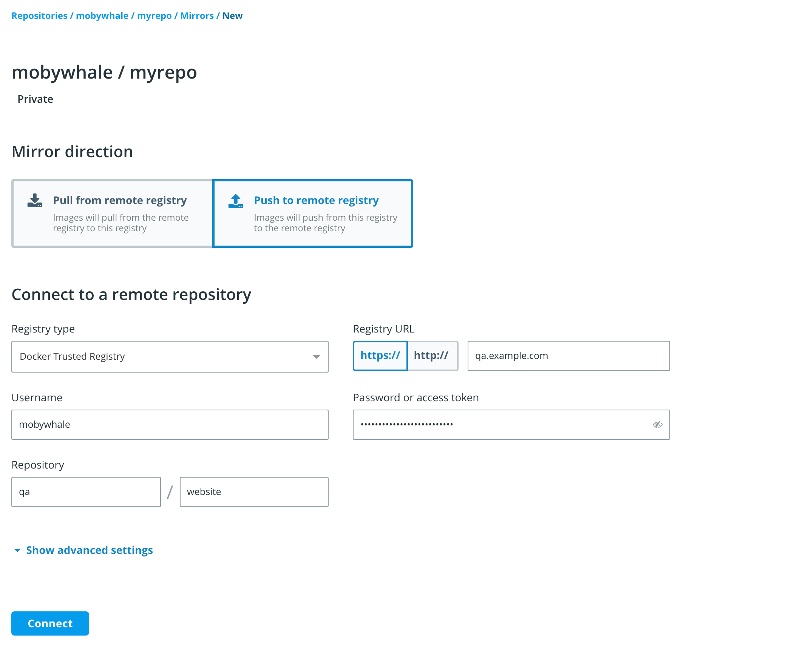

>

Docker Trusted Registry allows you to create mirroring policies for a repository.
When an image gets pushed to a repository and meets the mirroring criteria,
DTR automatically pushes it to a repository in a remote Docker Trusted or Hub registry.

This not only allows you to mirror images but also allows you to create
image promotion pipelines that span multiple DTR deployments and datacenters.

In this example we will create an image mirroring policy such that:

1. Developers iterate and push their builds to `dtr-example.com/dev/website` &endash; the
repository in the DTR deployment dedicated to development.
2. When the team creates a stable build, they make sure their image is tagged
with `-stable`.
3. When a stable build is pushed to `dtr-example.com/dev/website`, it will
automatically be pushed to `qa-example.com/qa/website`, mirroring the image and
promoting it to the next stage of development.

With this mirroring policy, the development team does not need access to the
QA cluster, and the QA team does not need access to the development
cluster.

You need to have permissions to push to the destination repository in order to set up the mirroring policy.

## Configure your repository connection

Once you have [created the repository](../manage-images/index.md), navigate to
the repository page on the web interface, and select the **Mirrors** tab.

  

Click **New mirror** to define where the image will be pushed if it meets the mirroring criteria.

Under **Mirror direction**, choose **Push to remote registry**. Specify the following details:

| Field                | Description                                   |
|:---------------------|:----------------------------------------------|
| Registry type  | You can choose between **Docker Trusted Registry** and **Docker Hub**. If you choose DTR, enter your DTR URL. Otherwise, **Docker Hub** defaults to `https://index.docker.io`. |
| Username and password or access token | Your credentials in the remote repository you wish to push to. To use an access token instead of your password, see [authentication token](../access-tokens.md). |
| Repository | Enter the `namespace` and the `repository_name` after the `/`.|
| Show advanced settings | Enter the TLS details for the remote repository or check `Skip TLS verification`. If the DTR remote repository is using self-signed TLS certificates or certificates signed by your own certificate authority, you also need to provide the public key certificate for that CA. You can retrieve the certificate by accessing `https://<dtr-domain>/ca`. "Remote certificate authority" is optional for a remote repository in Docker Hub. |

> Note: Make sure the account you use for the integration
> has permissions to write to the remote repository.

Click **Connect** to test the integration.

  

In this example, the image gets pushed to the `qa/example` repository of a
DTR deployment available at `qa-example.com` using a service account
that was created just for mirroring images between repositories.

Next, set your push triggers. DTR allows you to set your mirroring policy based on the following image attributes:

| Name            | Description                              | Example           |
|:----------------|:-----------------------------------------| :----------------|
| Tag name        | Whether the tag name equals, starts with, ends with, contains, is one of, or is not one of your specified string values | Copy image to remote repository if Tag name ends in `stable`|
| Component name  | Whether the image has a given component and the component name equals, starts with, ends with, contains, is one of, or is not one of your specified string values | Copy image to remote repository if Component name starts with `b` |
| Vulnerabilities | Whether the image has vulnerabilities &ndash; critical, major, minor, or all &ndash; and your selected vulnerability filter is greater than or equals, greater than, equals, not equals, less than or equals, or less than your specified number | Copy image to remote repository if Critical vulnerabilities = `3` |
| License         | Whether the image uses an intellectual property license and is one of or not one of your specified words | Copy image to remote repository if License name = `docker` |

You can choose to keep the image tag, or transform the tag into
something more meaningful in the remote registry by using a tag template.

  

In this example, if an image in the `dev/website` repository is tagged with
a word that ends in "stable", DTR will automatically push that image to
the DTR deployment available at `qa-example.com`. The image is pushed to the
`qa/example` repository and is tagged with the timestamp of when the image
was promoted.

Everything is set up! Once the development team pushes an image that complies
with the policy, it automatically gets promoted to `qa/example` in the remote trusted registry at `qa-example.com`.

## Metadata persistence

When an image is pushed to another registry using a mirroring policy, scanning
and signing data is not persisted in the destination repository.

If you have scanning enabled for the destination repository, DTR is going to scan
the image pushed. If you want the image to be signed, you need to do it manually.

## Where to go next

* [Mirror images from another registry](pull-mirror.md)
