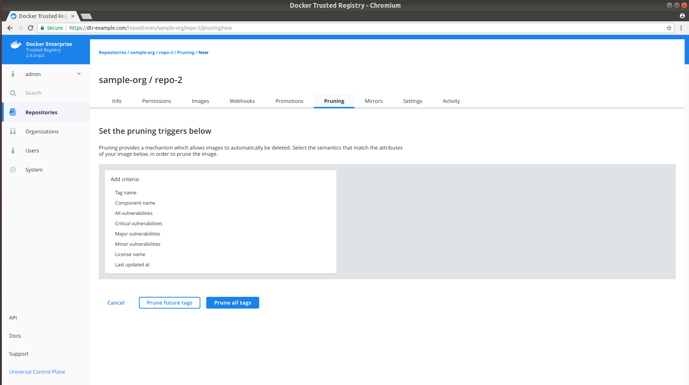
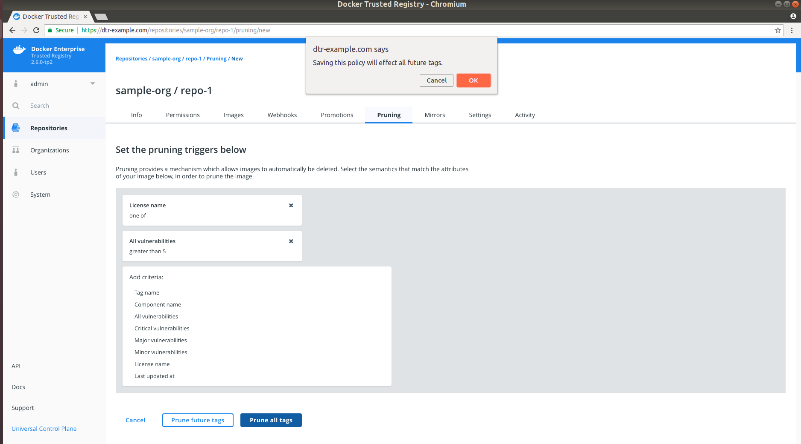
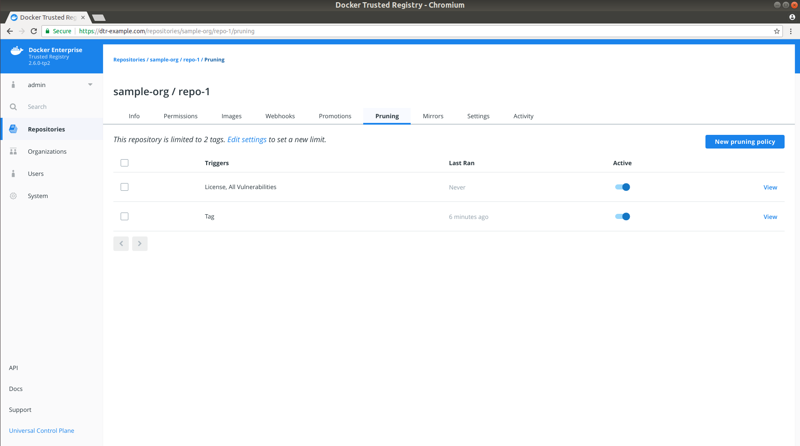
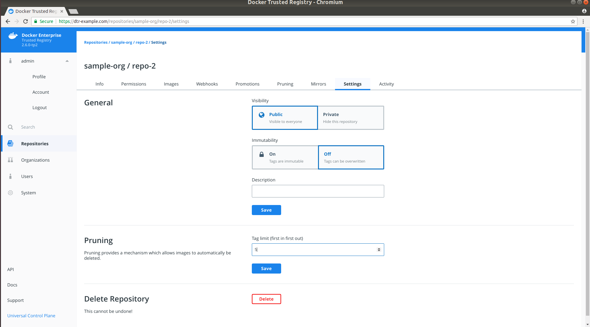
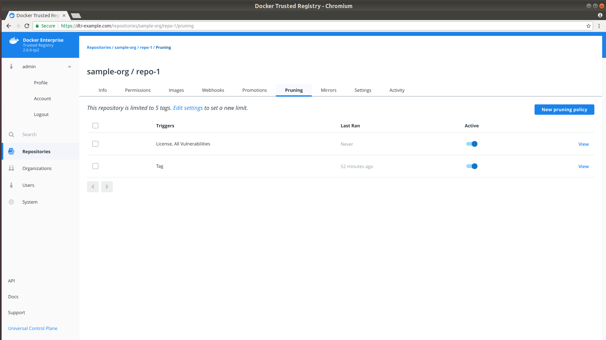

## Overview

Tag pruning is the process of cleaning up unnecessary or unwanted repository tags. As of v2.6, you can configure the Docker Trusted Registry (DTR) to automatically perform tag pruning on repositories that you manage by:

* specifying a tag pruning policy or alternatively,
* setting a tag limit 

> Tag Pruning
>
> When run, tag pruning only deletes a tag and does not carry out any actual blob deletion. For actual blob deletions, see [Garbage Collection](../../admin/configure/garbage-collection.md).

> Known Issue
>
> While the tag limit field is disabled when you turn on immutability for a new repository, this is currently [not the case with **Repository Settings**](/ee/dtr/release-notes/#known-issues). As a workaround, turn off immutability when setting a tag limit via **Repository Settings > Pruning**. 

In the following section, we will cover how to specify a tag pruning policy and set a tag limit on repositories that you manage. It will not include modifying or deleting a tag pruning policy.

## Specify a tag pruning policy

As a repository administrator, you can now add tag pruning policies on each repository that you manage. To get started, navigate to `https://<dtr-url>` and log in with your credentials.
 
Select **Repositories** on the left navigation pane, and then click on the name of the repository
that you want to update. Note that you will have to click on the repository name following
the `/` after the specific namespace for your repository.

{: .with-border}

Select the **Pruning** tab, and click **New pruning policy** to specify your tag pruning criteria:

{: .with-border}

DTR allows you to set your pruning triggers based on the following image attributes:

| Name            | Description                                        | Example           |
|:----------------|:---------------------------------------------------| :----------------|
| Tag name        | Whether the tag name equals, starts with, ends with, contains, is one of, or is not one of your specified string values | Tag name = `test`|
| Component name  | Whether the image has a given component and the component name equals, starts with, ends with, contains, is one of, or is not one of your specified string values | Component name starts with `b` |
| Vulnerabilities | Whether the image has vulnerabilities &ndash; critical, major, minor, or all &ndash; and your selected vulnerability filter is greater than or equals, greater than, equals, not equals, less than or equals, or less than your specified number | Critical vulnerabilities = `3` |
| License         | Whether the image uses an intellectual property license and is one of or not one of your specified words | License name = `docker` | 
| Last updated at | Whether the last image update was before your specified number of hours, days, weeks, or months. For details on valid time units, see [Go's ParseDuration function](https://golang.org/pkg/time/#ParseDuration). |  Last updated at: Hours = `12` |

Specify one or more image attributes to add to your pruning criteria, then choose:

- **Prune future tags** to save the policy and apply your selection to future tags. Only matching tags after the policy addition will be pruned during garbage collection.
- **Prune all tags** to save the policy, and evaluate both existing and future tags on your repository. 

Upon selection, you will see a confirmation message and will be redirected to your newly updated **Pruning** tab. 

{: .with-border}

If you have specified multiple pruning policies on the repository, the **Pruning** tab will display a list of your prune triggers and details on when the last tag pruning was performed based on the trigger, a toggle for deactivating or reactivating the trigger, and a **View** link for modifying or deleting your selected trigger.

{: .with-border}

All tag pruning policies on your account are evaluated every 15 minutes. Any qualifying tags are then deleted from the metadata store. If a tag pruning policy is modified or created, then the tag pruning policy for the *affected* repository will be evaluated.

## Set a tag limit

In addition to pruning policies, you can also set tag limits on repositories that you manage to restrict the number of tags on a given repository. Repository tag limits are processed in a first in first out (FIFO) manner. For example, if you set a tag limit of 2, adding a third tag would push out the first.

{: .with-border}

To set a tag limit, do the following:
1. Select the repository that you want to update and click the **Settings** tab. 
2. Turn off immutability for the repository. 
3. Specify a number in the **Pruning** section and click **Save**. The **Pruning** tab will now display your tag limit above the prune triggers list along with a link to modify this setting.

{: .with-border}

## Where to go next

- [Garbage collection](../admin/configure/garbage-collection.md)
