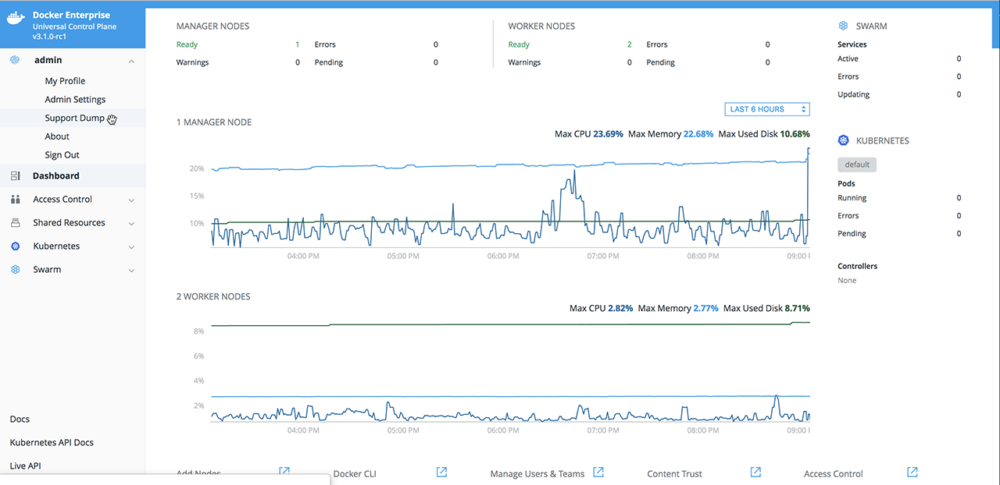

Your Docker Enterprise Edition subscription gives you access to prioritized
support. The service levels depend on your subscription.

Before reaching out to Docker Support, make sure you're listed as an authorized
support contact for your account. If you're not listed as an authorized
support contact, find a person who is, and ask them to open a case with
Docker Support in your behalf.

You can open a new support case at the [Docker support page](https://support.docker.com/).
If you're unable to submit a new case using the support page, fill in the
[Docker account support form](https://success.docker.com/support) using your
company email address.

Docker Support engineers may ask you to provide a UCP support dump, which is an
archive that contains UCP system logs and diagnostic information. To obtain a
support dump:

1. Log into the UCP web UI with an administrator account.
2. In the top-left menu, click your username and choose
   **Support Dump**. It may take a few minutes for the download to complete.

{: .with-border}

## Use the CLI to get a support dump (single node)

To get the support dump from the CLI for a single node, use SSH to log into a UCP manager node
and run:

```bash
docker container run --rm \
  --name ucp \
  -v /var/run/docker.sock:/var/run/docker.sock \
  --log-driver none \
  {{ page.ucp_org }}/{{ page.ucp_repo }}:{{ page.ucp_version }} \
  support > docker-support.tgz
```

This support dump only contains logs for the node where you're running the
command. If your UCP is highly available, you should collect support dumps
from all of the manager nodes.

## Use the CLI to get a support dump (multiple nodes)

The below variables need to be set initially and folders created prior to running the command. Please note the variables can be changed to fit your environment:

``` 
 SUPPORT_DUMP_DIR=<^>/opt<^^>
 SUPPORT_DUMP_TEMPDIR=${SUPPORT_DUMP_DIR}/support_dump_temp
 DUMP_DATE=$(date +%Y%m%d-%H_%M_%S)
 mkdir -p ${SUPPORT_DUMP_TEMPDIR}
 UCP_VERSION=$(docker service inspect ucp-agent --format '{{index .Spec.TaskTemplate.ContainerSpec.Labels "com.docker.ucp.version"}}')
```
The below command creates a zip file that contains support details (dsinfo) for each host in your cluster:

```$ for node in $(docker node ls --format '{{if eq .Status "Ready"}}{{.Hostname}}{{end}}'); do echo timing support dump on $node; time docker container run --rm -e constraint:node==$node -v /boot:/boot -v /proc/:/host/proc:ro -v /var/run/docker.sock:/var/run/docker.sock -v /var/run/docker.pid:/var/run/docker.pid:ro -v /var/run/docker:/var/run/docker -v /var/lib/docker:/var/lib/docker -v /var/log:/var/log -v /etc:/etc:ro --privileged --pid=host --network=host --log-driver=json-file docker/ucp-dsinfo:${UCP_VERSION} > ${SUPPORT_DUMP_TEMPDIR}/support_dump_${node}.tgz; mkdir ${SUPPORT_DUMP_TEMPDIR}/${node}; tar -xf ${SUPPORT_DUMP_TEMPDIR}/support_dump_${node}.tgz -C ${SUPPORT_DUMP_TEMPDIR}/${node}; rm -f ${SUPPORT_DUMP_TEMPDIR}/support_dump_${node}.tgz; cd ${SUPPORT_DUMP_TEMPDIR} ; zip -q -r ${SUPPORT_DUMP_DIR}/docker-support-${DUMP_DATE}.zip . *; cd ..; done
```

## Use PowerShell to get a support dump

On Windows worker nodes, run the following command to generate a local support dump:

```powershell
docker container run --name windowssupport -v 'C:\ProgramData\docker\daemoncerts:C:\ProgramData\docker\daemoncerts' -v 'C:\Windows\system32\winevt\logs:C:\eventlogs:ro' {{ page.ucp_org }}/ucp-dsinfo-win:{{ page.ucp_version }}; docker cp windowssupport:'C:\dsinfo' .; docker rm -f windowssupport
```

This command creates a directory named `dsinfo` in your current directory.
If you want an archive file, you need to create it from the `dsinfo` directory.

