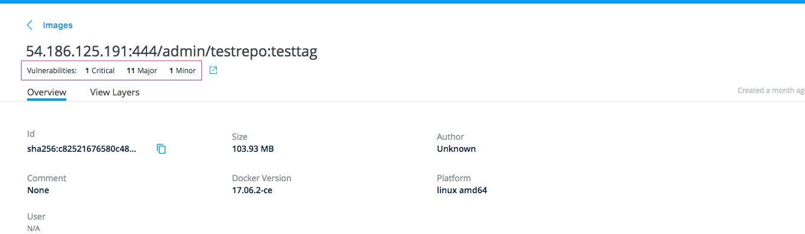

As of EE 2.1, UCP displays image vulnerability data from DTR. If DTR's image scanning feature detects a vulnerability 
in a Docker image, the image's known vulnerabilities count now appears in the UCP web UI. 

Limitations

* This feature will only work with DTRs that have UCP single sign-on enabled
* UCP only displays vulnerabilities for containers, Swarm services, pods, and images

Requirements

* An EE advanced license
* DTR version 2.6.0 or higher

To access vulnerability data on UCP, complete the following steps:

1. (Deploy UCP)[https://docs.docker.com/ee/ucp/admin/install/]
2. (Deploy DTR on the same UCP cluster)[https://docs.docker.com/ee/dtr/admin/install/]
3. (Enable single-sign on DTR)[/datacenter/dtr/2.4/guides/admin/configure/enable-single-sign-on.md]
3. (Upload an advanced license in UCP)[https://docs.docker.com/ee/ucp/admin/configure/license-your-installation/]
4. (Push some images to DTR)[https://docs.docker.com/datacenter/dtr/2.1/guides/repos-and-images/push-an-image/] 
5. (Scan the images)[https://docs.docker.com/datacenter/dtr/2.2/guides/user/manage-images/scan-images-for-vulnerabilities/]

The UCP web UI will display image vulnerabilities

