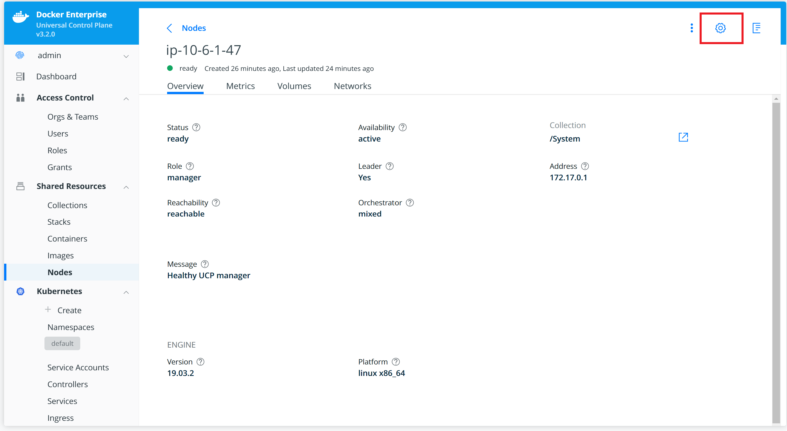
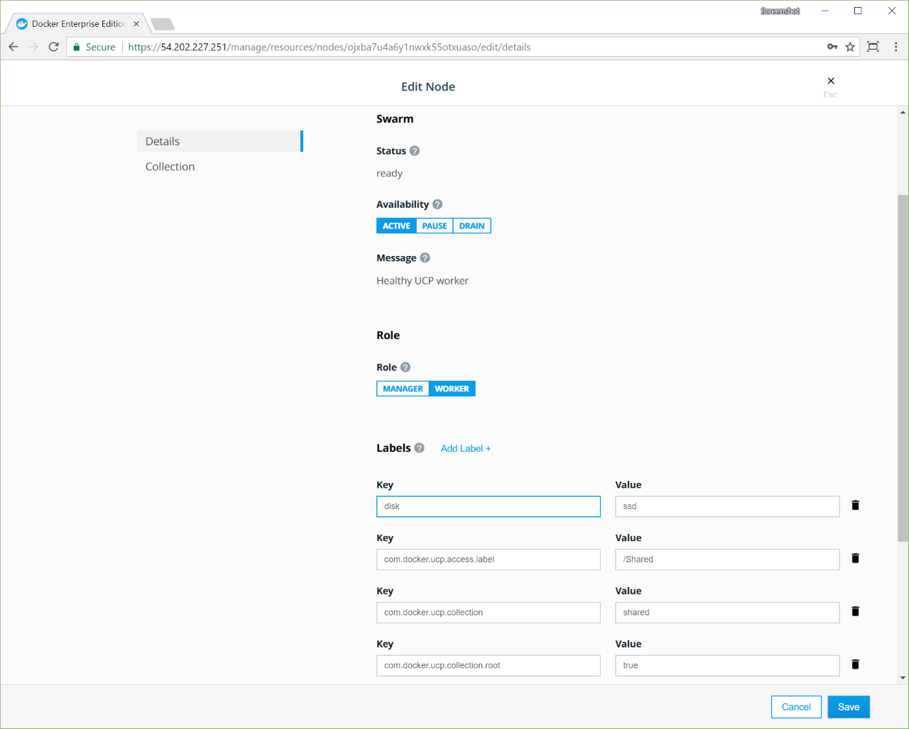
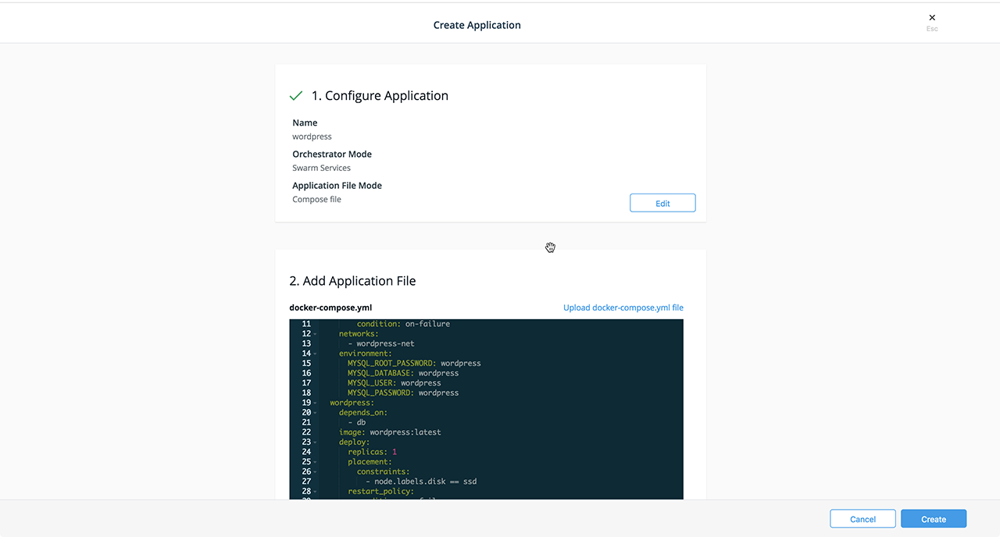
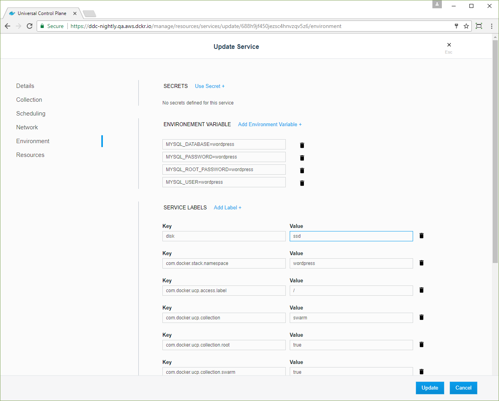

>

You can use UCP to to add labels to your nodes. Labels are metadata that
describe the node, such as its role (development, QA, production), region
(US, EU, APAC), or disk type (HDD, SSD). Once you have labeled your
nodes, you can add deployment constraints to your services, to ensure they
are scheduled on a node with a specific label.

For example, you can apply labels based on their role in the development
lifecycle, or the hardware resources they have.

{: .with-border}

> **Note**
> 
> Do not create labels for authorization and permissions to resources. Instead, use resource sets, either UCP collections or Kubernetes namespaces, to organize access to your cluster. [Learn about managing access with resource sets](../../authorization/group-resources.md).

## Apply labels to a node

In this example, we'll apply the `ssd` label to a node. Next, we'll deploy
a service with a deployment constraint to make sure the service is always
scheduled to run on a node that has the `ssd` label.

1. Log in with administrator credentials in the UCP web interface.
2. Select **Nodes** in the left navigation menu.
3. From the nodes list, select the node to which you want to apply labels.
4. From the details pane, select the edit node icon in the upper-right corner to edit the node.

    

5. From the **Edit Node** page, scroll to the **Labels** section.
6. Select **Add Label**.
7. Add a label with the key `disk` and a value of `ssd`.

   {: .with-border}

8. Click **Save** then dismiss the **Edit Node** page.
9. From the node's details pane, select **Labels** to view the labels that are applied to the node.

You can also apply labels to a node from the CLI:

```bash
docker node update --label-add <key>=<value> <node-id>
```

## Deploy a service with constraints

When deploying a service, you can specify constraints, so that the service is only scheduled on a node that has a label that fulfills all of the constraints you specify.

In this example, when users deploy a service, they can add a constraint for the
service to be scheduled only on nodes that have SSD storage:
`node.labels.disk == ssd`.

1. Browse to the **Stacks** page.
2. Name the new stack "wordpress".
3. Under **Orchestrator Mode**, select **Swarm Services**.
4. Paste the following stack file in the **docker-compose.yml** editor: 

   ```
   version: "3.1"

   services:
     db:
       image: mysql:5.7
       deploy:
         placement:
           constraints:
             - node.labels.disk == ssd
         restart_policy:
           condition: on-failure
       networks:
         - wordpress-net
       environment:
         MYSQL_ROOT_PASSWORD: wordpress
         MYSQL_DATABASE: wordpress
         MYSQL_USER: wordpress
         MYSQL_PASSWORD: wordpress
     wordpress:
       depends_on:
         - db
       image: wordpress:latest
       deploy:
         replicas: 1
         placement:
           constraints:
             - node.labels.disk == ssd
         restart_policy:
           condition: on-failure
           max_attempts: 3
       networks:
         - wordpress-net
       ports:
         - "8000:80"
       environment:
         WORDPRESS_DB_HOST: db:3306
         WORDPRESS_DB_PASSWORD: wordpress

   networks:
     wordpress-net:
   ```

5. Click **Create** to deploy the stack, and when the stack deploys,
click **Done**.

   

6. Browse to the **Nodes** page, and click the node that has the
`disk` label. In the details pane, click the **Inspect Resource**
drop-down list and select **Containers**.

   

7. Dismiss the filter and browse to the **Nodes** page. 
8. Click a node that doesn't have the `disk` label. 
9. From the details pane, click the **Inspect Resource** drop-down list and select **Containers**. There are no WordPress containers scheduled on the node. 
10. Dismiss the filter.

## Add a constraint to a service using the UCP web UI

You can declare the deployment constraints in your docker-compose.yml file or
when you're creating a stack. You can also apply constraints when creating a service.

To check if a service has deployment constraints, browse to the **Services** page and choose the service that you want to check. From the details pane, click **Constraints** to list the constraint labels.

To edit the constraints on the service, click **Configure** and select **Details** to open the **Update Service** page. Click **Scheduling** to view the constraints. You can add or remove deployment constraints from this page.




## Where to go next

- [Collect UCP cluster metrics with Prometheus](collect-cluster-metrics.md)
- [Enable audit logging on UCP](create-audit-logs.md)
