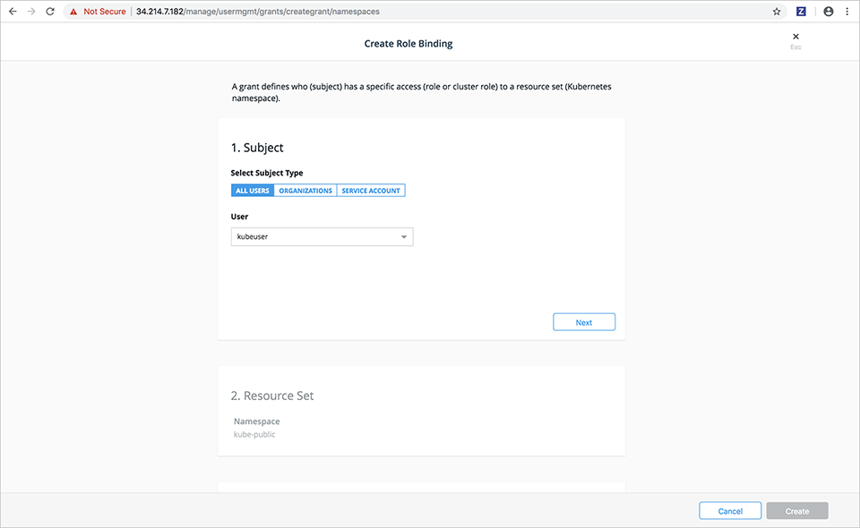

UCP 3.0 used its own role-based access control (RBAC) for Kubernetes clusters. New in UCP 3.1 is the ability to use native Kubernetes RBAC. The benefits of doing this are:

- Many ecosystem applications and integrations expect Kubernetes RBAC as a part of their YAML files to provide access to service accounts.
- Organizations planning to run UCP both on-premises as well as in hosted cloud services want to run Kubernetes applications on both sets of environments, without manually changing RBAC in their YAML file.

Kubernetes RBAC is turned on by default for Kubernetes clusters when customers upgrade to UCP 3.1. See [Using RBAC Authorization](https://kubernetes.io/docs/reference/access-authn-authz/rbac/) in the v1.11 documentation for more information about Kubernetes role-based access control.

Starting with UCP 3.1, Kubernetes & Swarm roles have separate views. You can view all the roles for a particular cluster under **Access Control** then **Roles**. Select Kubernetes or Swarm to view the specific roles for each.

## Creating roles

You create Kubernetes roles either through the CLI using `kubectl` or through the UCP web interface.

To create a Kuberenetes role in the UCP web interface:

1. Go to the UCP web interface.

2. Navigate to the **Access Control**.

3. In the lefthand menu, select **Roles**.

    

4. Select the **Kubernetes** tab at the top of the window.
5. Select **Create** to create a Kubernetes role object in the following dialog:

    

6. Select a namespace from the **Namespace** dropdown list. Selecting a specific namespace creates a role for use in that namespace, but selecting all namespaces creates a `ClusterRole` where you can create rules for cluster-scoped Kubernetes resources as well as namespaced resources.
7. Provide the YAML for the role, either by entering it in the **Object YAML** editor or select **Click to upload a .yml file** to choose and upload a .yml file instead.
8. When you have finished specifying the YAML, Select **Create** to complete role creation.

## Creating role grants

Kubernetes provides 2 types of role grants:

- `ClusterRoleBinding` which applies to all namespaces
- `RoleBinding` which applies to a specific namespace

To create a grant for a Kuberenetes role in the UCP web interface:

1. Go to the UCP web UI.
2. Navigate to the **Access Control**.
3. In the lefthand menu, select  **Grants**.

    

4. Select the **Kubernetes** tab at the top of the window. All grants to Kubernetes roles can be viewed in the Kubernetes tab.
5. Select **Create New Grant** to start the Create Role Binding wizard and create a new grant for a given user, team or service.

    

6. Select the subject type. Your choices are:
-  **All Users**
-  **Organizations**
-  **Service account**
7. To create a user role binding, select a username from the **Users** dropdown list then select **Next**.
8. Select a resource set for the subject. The **default** namespace is automatically selected. To use a different namespace, select the **Select Namespace** button next to the desired namespace. For `Cluster Role Binding`, slide the **Apply Role Binding to all namespaces** selector to the right.

    

9. Select **Next** to continue.
10. Select the **Cluster Role** from the dropdown list. If you create a `ClusterRoleBinding` (by selecting **Apply Role Binding to all namespaces**) then you may only select ClusterRoles. If you select a specific namespace, you can choose any role from that namespace or any ClusterRole.

    

11. Select **Create** to complete creating the grant.
