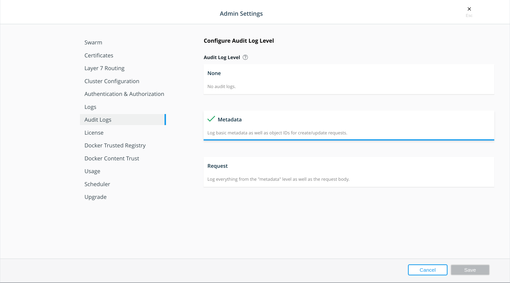

>

Audit logs are a chronological record of security-relevant activities by 
individual users, administrators, or software components that have affected the 
system. They are focused on external user/agent actions and security rather than 
understanding state or events of the system itself.

Audit logs capture all HTTP actions (GET, PUT, POST, PATCH, DELETE) to all UCP 
API, Swarm API, and Kubernetes API endpoints that are invoked (except for the 
ignored list) and sent to Docker Engine through standard output (stdout). Creating audit logs is a UCP component that integrates with Swarm, Kubernetes, and UCP APIs.

## Logging levels

Three audit logging levels are provided to give administrators more control: 

- **None:** Audit logging is disabled. 
- **Metadata:** Includes the following:
    - Method and API endpoint for the request
    - UCP user who made the request
    - Response Status (success or failure)
    - Timestamp of the call
    - Object ID of any created or updated resource (for create or update API 
    calls). The names of created or updated resources are not included.
    - License Key
    - Remote Address
- **Request:** Includes all fields from the Metadata level as well as the 
request payload.

> Note
>
> Once UCP audit logging has been enabled, audit logs can be found within the 
> container logs of the `ucp-controller` container on each UCP manager node. 
> Ensure that you have a [logging  driver](../../../../config/containers/logging/configure/) 
> configured appropriately with log rotation set, as audit logging can generate a large amount of data. 

## Benefits of audit logging

Audit logs can be of help with historical troubleshooting, security analysis and auditing, generating chargeback information, and creating useful alerts.

## Enabling UCP audit logging

Enable audit logging using either the UCP UI, the UCP API, or the UCP configuration file.

### Enabling UCP audit logging through the UI

1. Access the UCP UI and browse to the Admin Settings page.
2. Select **Audit Logs.**
3. In the **Configure Audit Log Level** section, select the relevant logging
level. 

    {: .with-border}

4. Click **Save.**

### Enabling UCP audit logging using the API

1. Download the UCP Client bundle [from the command line](https://success.docker.com/article/download-client-bundle-from-the-cli).

2. Retrieve the JSON file for the current audit log configuration.

    ```
    export DOCKER_CERT_PATH=~/ucp-bundle-dir/
    curl --cert ${DOCKER_CERT_PATH}/cert.pem --key ${DOCKER_CERT_PATH}/key.pem --cacert ${DOCKER_CERT_PATH}/ca.pem -k -X GET https://ucp-domain/api/ucp/config/logging > auditlog.json
    ```

3. Open auditlog.json to modify the `auditlevel` field to `metadata` or `request`.

    ```
    {
    	"logLevel": "INFO",
    	"auditLevel": "metadata",
    	"supportDumpIncludeAuditLogs": false
    }
    ```

4. Send the JSON request for the auditlog config with the same API path but with the `PUT` method.

    ```
    curl --cert ${DOCKER_CERT_PATH}/cert.pem --key ${DOCKER_CERT_PATH}/key.pem --cacert ${DOCKER_CERT_PATH}/ca.pem -k -H "Content-Type: application/json" -X PUT --data $(cat auditlog.json) https://ucp-domain/api/ucp/config/logging
    ```

### Enabling UCP audit logging using the configuration file

Enabling UCP audit logging through the UCP configuration file can be done before 
or after a UCP installation. Refer to the [UCP configuration file](./ucp-configuration-file/) topic for more information. 

The section of the UCP configuration file that controls UCP auditing logging is:

```
[audit_log_configuration]
  level = "metadata"
  support_dump_include_audit_logs = false
```

The supported variables for `level` are `""`, `"metadata"` or `"request"`.

> Important
> 
> The `support_dump_include_audit_logs` flag specifies whether user identification information from the ucp-controller container logs is included in the support dump. To prevent this information from being sent with the support dump, make sure that `support_dump_include_audit_logs` is set to `false`.  When disabled, the support dump collection tool filters out any lines from the `ucp-controller` container logs that contain the substring `auditID`.
{: .important} 

## Accessing audit logs

The audit logs are exposed through the `ucp-controller` logs. You can 
access these logs locally through the Docker CLI or through an external 
container logging solution, such as [ELK](https://success.docker.com/article/elasticsearch-logstash-kibana-logging).

### Accessing audit logs using the Docker CLI

1. Source a UCP client bundle.
2. Run `docker logs` to obtain audit logs. In the following example,
we are tailing the command to show the last log entry.

```
$ docker logs ucp-controller --tail 1
{"audit":{"auditID":"f8ce4684-cb55-4c88-652c-d2ebd2e9365e","kind":"docker-swarm","level":"metadata","metadata":{"creationTimestamp":null},"requestReceivedTimestamp":"2019-01-30T17:21:45.316157Z","requestURI":"/metricsservice/query?query=(%20(sum%20by%20(instance)%20(ucp_engine_container_memory_usage_bytes%7Bmanager%3D%22true%22%7D))%20%2F%20(sum%20by%20(instance)%20(ucp_engine_memory_total_bytes%7Bmanager%3D%22true%22%7D))%20)%20*%20100\u0026time=2019-01-30T17%3A21%3A45.286Z","sourceIPs":["172.31.45.250:48516"],"stage":"RequestReceived","stageTimestamp":null,"timestamp":null,"user":{"extra":{"licenseKey":["FHy6u1SSg_U_Fbo24yYUmtbH-ixRlwrpEQpdO_ntmkoz"],"username":["admin"]},"uid":"4ec3c2fc-312b-4e66-bb4f-b64b8f0ee42a","username":"4ec3c2fc-312b-4e66-bb4f-b64b8f0ee42a"},"verb":"GET"},"level":"info","msg":"audit","time":"2019-01-30T17:21:45Z"}
```

## Sample logs

Here is a sample audit log for a Kubernetes cluster.

```
{"audit"; {
      "metadata": {...},
      "level": "Metadata",
      "timestamp": "2018-08-07T22:10:35Z",
      "auditID": "7559d301-fa6b-4ad6-901c-b587fab75277",
      "stage": "RequestReceived",
      "requestURI": "/api/v1/namespaces/default/pods",
      "verb": "list",
      "user": {"username": "alice",...},
      "sourceIPs": ["127.0.0.1"],
      ...,
      "requestReceivedTimestamp": "2018-08-07T22:10:35.428850Z"}}
```
Here is a sample audit log for a Swarm cluster.

```
{"audit"; {
      "metadata": {...},
      "level": "Metadata",
      "timestamp": "2018-08-07T22:10:35Z",
      "auditID": "7559d301-94e7-4ad6-901c-b587fab31512",
      "stage": "RequestReceived",
      "requestURI": "/v1.30/configs/create",
      "verb": "post",
      "user": {"username": "alice",...},
      "sourceIPs": ["127.0.0.1"],
      ...,
      "requestReceivedTimestamp": "2018-08-07T22:10:35.428850Z"}}
```

## API endpoints ignored

The following API endpoints are ignored since they are not considered security 
events and may create a large amount of log entries.

- /_ping
- /ca
- /auth
- /trustedregistryca
- /kubeauth
- /metrics
- /info
- /version*
- /debug
- /openid_keys
- /apidocs
- /kubernetesdocs
- /manage

## API endpoint information redacted

Information for the following API endpoints is redacted from the audit logs for security purposes.

- `/secrets/create` (POST)
- `/secrets/{id}/update` (POST)
- `/swarm/join` (POST)
- `/swarm/update` (POST)
-`/auth/login` (POST)
- Kubernetes secrete create/update endpoints

## Where to go next

- [Collect UCP cluster metrics with Prometheus](collect-cluster-metrics.md)
- [Learn more about the UCP Configuration File](ucp-configuration-file.md)
