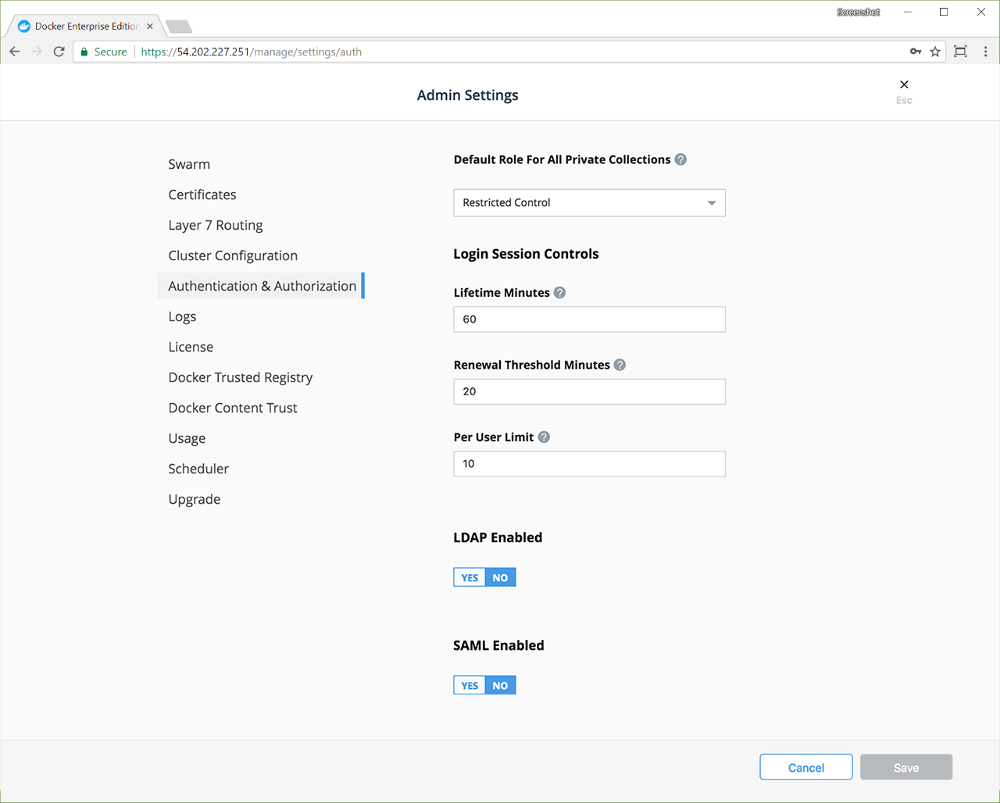

SAML is commonly supported by enterprise authentication systems. SAML-based single sign-on (SSO) gives you access to UCP through a SAML 2.0-compliant identity provider.

SAML-based single sign-on (SSO) gives you access to UCP through a SAML 2.0-compliant identity provider. UCP supports SAML for authentication as a service provider integrated with your identity provider.

For more information about SAML, see the [SAML XML website](http://saml.xml.org/).

UCP supports these identity providers:

- [Okta](https://www.okta.com/)
- [ADFS](https://docs.microsoft.com/en-us/windows-server/identity/active-directory-federation-services)

## Configure identity provider integration

There are values your identity provider needs for successful integration with UCP, as follows. These values can vary between identity providers. Consult your identity provider documentation for instructions on providing these values as part of their integration process.

### Okta integration values

Okta integration requires these values:

- URL for single signon (SSO). This value is the URL for UCP, qualified with `/enzi/v0/saml/acs`. For example, `https://111.111.111.111/enzi/v0/saml/acs`.
- Service provider audience URI. This value is the URL for UCP, qualified with `/enzi/v0/saml/metadata`. For example, `https://111.111.111.111/enzi/v0/saml/metadata`.
- NameID format. Select Unspecified.
- Application username. Email (For example, a custom `${f:substringBefore(user.email, "@")}` specifies the username portion of the email address.
- Attribute Statements:
    - Name: `fullname`, Value: `user.displayName`.
    - Group Attribute Statement:
Name: `member-of`, Filter: (user defined) for associate group membership. The group name is returned with the assertion.
Name: `is-admin`, Filter: (user defined) for identifying if the user is an admin.

### ADFS integration values

ADFS integration requires these values:

- Service provider metadata URI. This value is the URL for UCP, qualified with `/enzi/v0/saml/metadata`. For example, `https://111.111.111.111/enzi/v0/saml/metadata`.
- Attribute Store: Active Directory.
    - Add LDAP Attribute = Email Address; Outgoing Claim Type: Email Address
    - Add LDAP Attribute = Display-Name; Outgoing Claim Type: Common Name
- Claim using Custom Rule. For example, `c:[Type == "http://schemas.xmlsoap.org/claims/CommonName"]
 => issue(Type = "fullname", Issuer = c.Issuer, OriginalIssuer = c.OriginalIssuer, Value = c.Value, ValueType = c.ValueType);`
- Outgoing claim type: Name ID
- Outgoing name ID format: Transient Identifier
- Pass through all claim values

## Configure the SAML integration

To enable SAML authentication:

1. Go to the UCP web interface.
2. Navigate to the **Admin Settings**.
3. Select **Authentication & Authorization**.

    

4. In the **SAML Enabled** section, select **Yes** to display the required settings. The settings are grouped by those needed by the identity provider server and by those needed by UCP as a SAML service provider.

    

5. In **IdP Metadata URL** enter the URL for the identity provider's metadata.
6. If the metadata URL is publicly certified, you can leave **Skip TLS Verification** unchecked and **Root Certificates Bundle** blank, which is the default. Skipping TLS verification is not recommended in production environments. If the metadata URL cannot be certified by the default certificate authority store, you must provide the certificates from the identity provider in the **Root Certificates Bundle** field.
7. In **UCP Host** enter the URL that includes the IP address or domain of your UCP installation. The port number is optional. The current IP address or domain appears by default.

    

8. To customize the text of the sign-in button, enter your button text in the **Customize Sign In Button Text** field. The default text is 'Sign in with SAML'.
9. The **Service Provider Metadata URL** and **Assertion Consumer Service (ACS) URL** appear in shaded boxes. Select the copy icon at the right side of each box to copy that URL to the clipboard for pasting in the identity provider workflow.
9. Select **Save** to complete the integration.

## Security considerations

You can download a client bundle to access UCP. A client bundle is a group of certificates downloadable directly from UCP web interface that enables command line as well as API access to UCP. It lets you  authorize a remote Docker engine to access specific user accounts managed in Docker EE, absorbing all associated RBAC controls in the process. You can now execute docker swarm commands from your remote machine that take effect on the remote cluster. You can download the client bundle in the **Admin Settings** under **My Profile**.

> Caution
>
>Users who have been previously authorized using a Client Bundle will continue to be able to access UCP regardless of the newly configured SAML access controls. To ensure that access from the client bundle is synced with the identity provider, we recommend the following steps. Otherwise, a previously-authorized user could get access to UCP through their existing client bundle.
>
> - Remove the user account from UCP that grants the client bundle access.
> - If group membership in the identity provider changes, replicate this change in UCP.
> - Continue to use LDAP to sync group membership.
